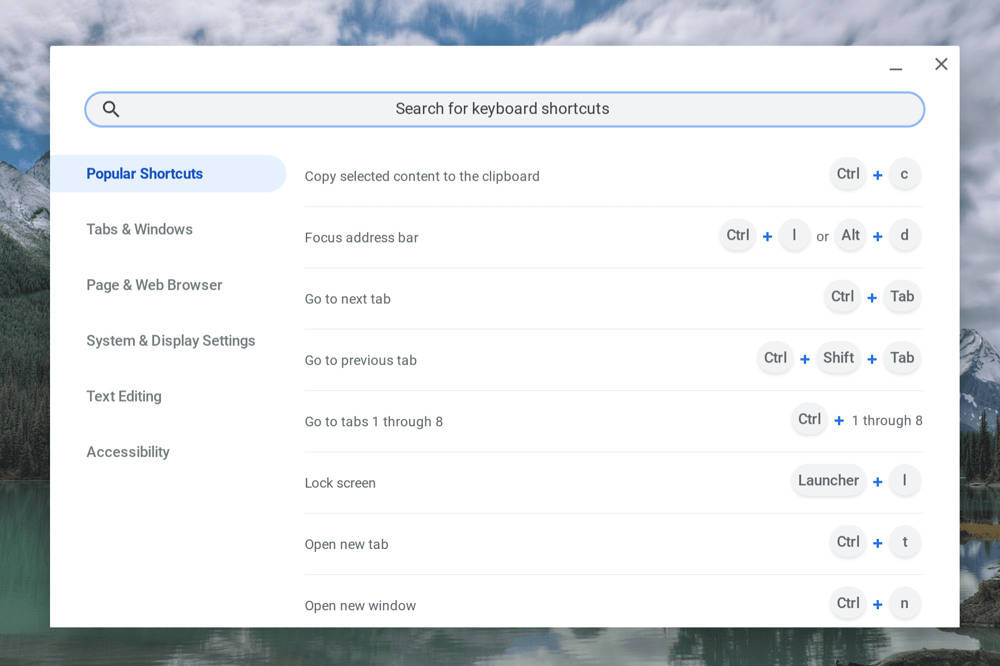
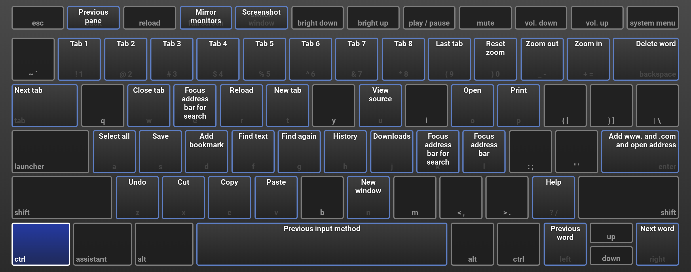

Recently, Google has modified the keyboard shortcuts help screen and some folks don't care for the look. You'll know if you have the new, searchable shortcuts helper if you see this when pressing _ctrl + alt + /_ on your hardware keyboard:

The old, original keyboard shortcuts helper showed a virtual keyboard on your screen and would dynamically change when you pressed a modifier key, such as _shift, ctrl_, or _alt_ to name a few. I found it pretty useful although the ability to search for shortcuts in the new version is admittedly helpful for new users.

It turns out that if you preferred the old, original keyboard shortcuts overlay, its not really gone. At least not yet. To see it, just type _chrome://keyboardoverlay_ in your browser and it will appear, complete with the dynamic changes for the modifier keys.

I've actually bookmarked it so I don't have to keep typing it when I want to see it.

For a more permanent change, there is currently an option to disable the new shortcuts display. Type _chrome://flags#ash-enable-keyboard-shortcut-viewer_ in your browser and change the setting to Disabled. This will use the original shortcut viewer instead of the new one. You can always revert back to the current shortcut helper by setting this flag to Enabled or Default.
