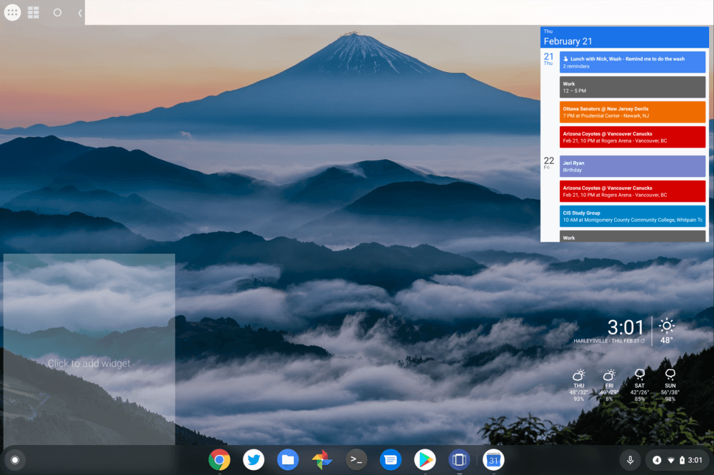
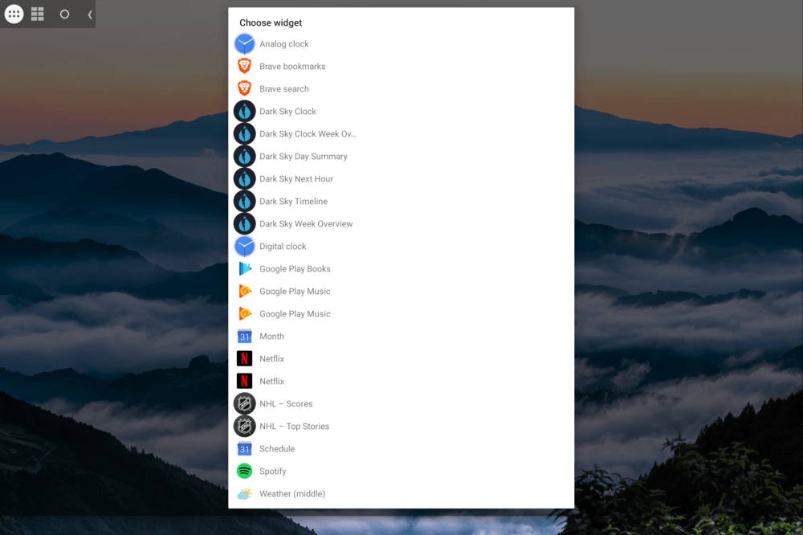

Although I don't see the desktop of my Pixel Slate too much, I've long hoped Google would bring Android widget support to Chrome OS. That hasn't happened yet, however, there is a way to install widgets on a Chromebook running Android 9 Pie, thanks to [a free Android app called Taskbar](https://play.google.com/store/apps/details?id=com.farmerbb.taskbar).

[Redditor salmon\_01 wrote up the instructions for using Taskbar for widgets on a Chromebook](https://www.reddit.com/r/chromeos/comments/aslxme/how_to_use_android_widgets_on_the_chrome_os/) and I ran through the steps yesterday on my Pixel Slate. His desktop image above looks much nicer than mine, but that's because he took the optional step of adding a separate widget customization app. As a result, I have a more "blocky" look since each widget takes up one-eighth of my display:

This isn't a perfect solution, but I'll get into some of the issues after sharing the install instructions from salmon\_01:

1. Install Taskbar app from the Google Play store.
    
2. Play around with general settings and appearance settings until you get the look you want. Specifically, I would recommend making the translucent elements actually transparent. I would also hide the carrot button when not enabled and set its position to the top left.
    
3. Go to advanced settings within the app, enable "replace home screen" and "enable widget support." This will allow you to actually use widgets.
    
4. Download widgets from the Google Play store that you want.
    
5. Enjoy customizing your layout! The setup I am running in the screenshot is using "Pixxy KWGT" widgets.
    

So it's quite easy to install Taskbar and add widgets.

However, this is essentially installing a second launcher; dedicated to your Android apps. You can see it on my desktop up at the top left; note that you can configure where this appears in any of the four desktop corners. Next to the launcher button is the widgets button. I haven't found a way to view the widgets without tapping this button. It's also how you add new widgets.

You can also see that the Taskbar buttons add a sort of blank space to the right of them. That's the long horizontal strip along the top of my Pixel Slate desktop. It's possible I've missed a setting to mitigate this. The buttons can be moved offscreen by tapping the left arrow; move your cursor to the screen corner, tap and it will reappear.

I've also noticed some odd behavior from Android app notifications -- particularly the ones with widgets I've installed -- in the native Chrome OS notification stripe. Sometimes after dismissal, half of the notification stays. And if the Taskbar app isn't running -- it's the second from the right end in my Chrome OS Shelf -- you won't see the buttons or the widgets, so after a reboot, you may want to open the app. There is a setting to run Taskbar upon bootup but I don't reboot my Slate all that often.

Again, native widget functionality is something I'd like to see Google add in the future, but for now, I'm finding this approach using Taskbar a nice option.
