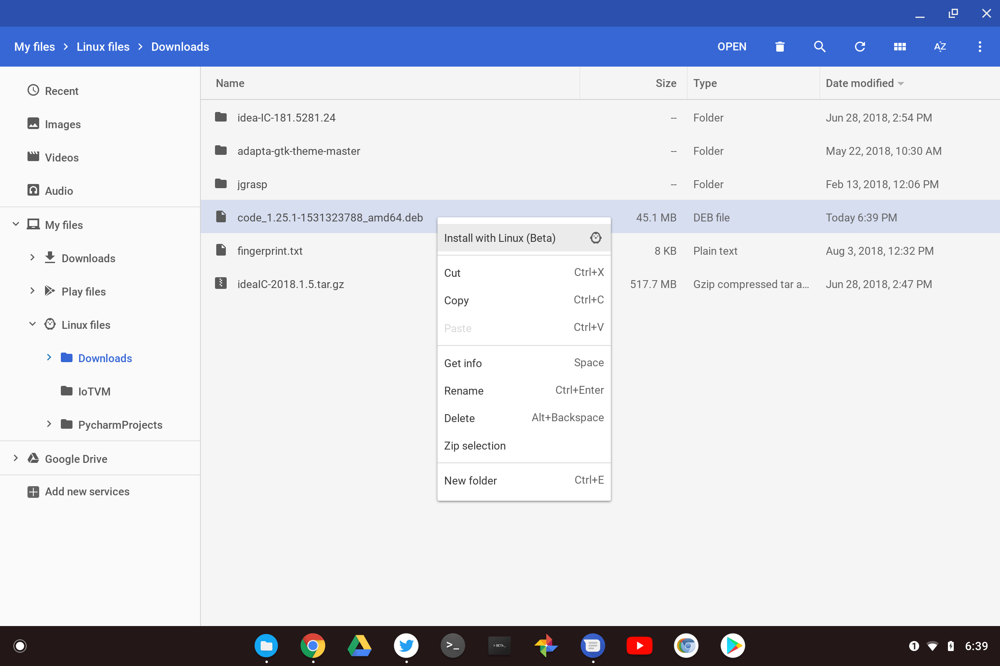
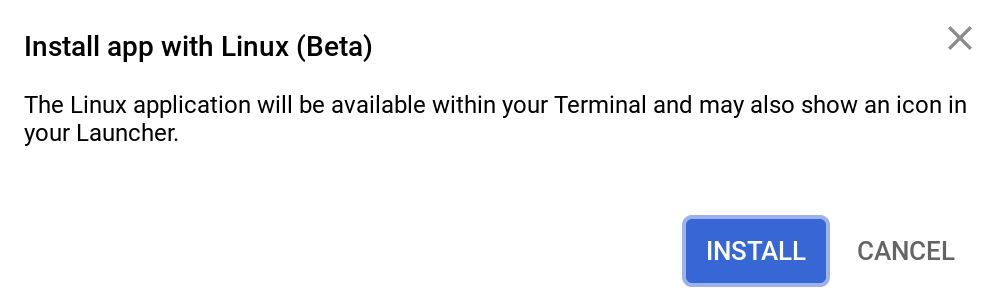
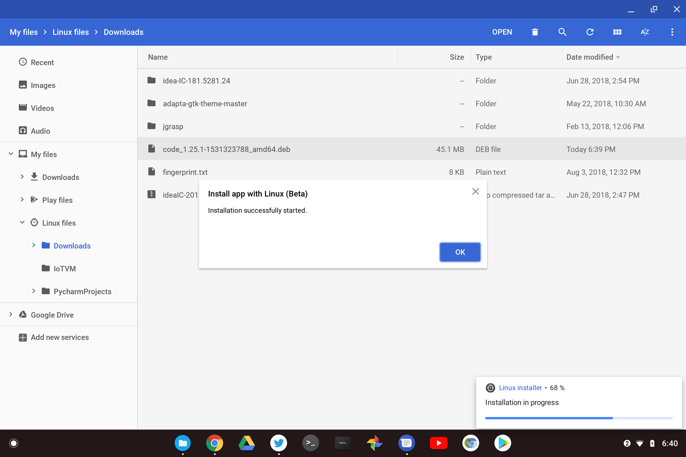
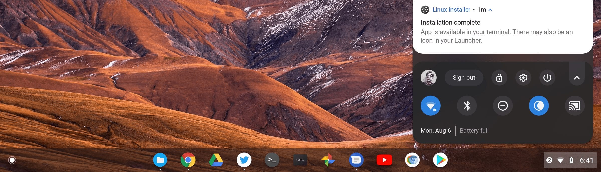
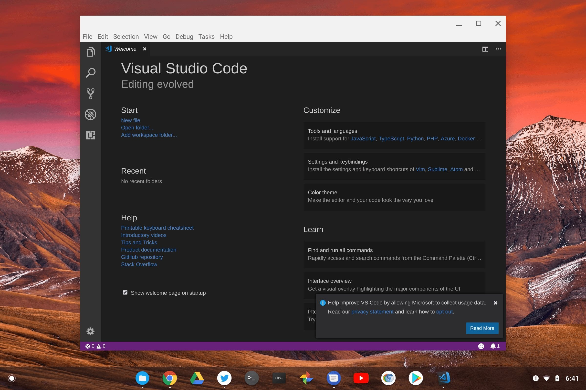

We knew that it was going to get easier to [install Debian packages on Chromebooks directly in the Files app](https://www.aboutchromebooks.com/news/chromebooks-project-crostini-install-debian-apps-packages-in-chrome-os/) of Chrome OS, but we didn't know when. Now we know. [Chrome Unboxed tried the feature on Monday using the Canary Channel](https://chromeunboxed.com/news/chrome-os-linux-debian-packages-chromebook-crostini) of Chrome OS but I just tested in on the Dev Channel and it worked perfectly. It's likely this feature will arrive in version 69 of the Chrome OS Stable Channel, pending any bugs or issues as the code progresses through the Dev and Beta channels.

Here's how it works, using Microsoft Visual Code as the example I tested. First, I hit up the [Visual Code site](https://code.visualstudio.com/) using Chrome on my Pixelbook and downloaded the .deb file. Since I was in Chrome OS, the package file was saved to my Pixelbook's Downloads folder. I navigated to the file and right clicked to see the "Install with Linux (beta)" option, which I chose.

Chrome OS then surfaces an option to Install the package, explaining what's about to happen.

After choosing Install option, Chrome OS began to install the package directly to my Linux container and showed the progress.

Once the package is installed, the Files app lets you know. I also saw a notification in my System Tray.

In many cases (I did for this example), you'll see a new icon for the package in the Chrome OS Launcher; click the icon and the Linux Terminal will spin up within a few seconds -- if you already had it running, this should be fairly instant -- and open up the newly installed Linux app.

Of course, you can still manually install Linux packages from directly within the Terminal app using the command lines. In some cases, where a .deb package download isn't available, you'll likely have to.

But package installations within the Chrome OS Files app is a smart move by Google because it doesn't assume any familiarity with the Linux command line nor with any Linux package installers: Everything happens within the native Chrome OS environment from a user perspective.
