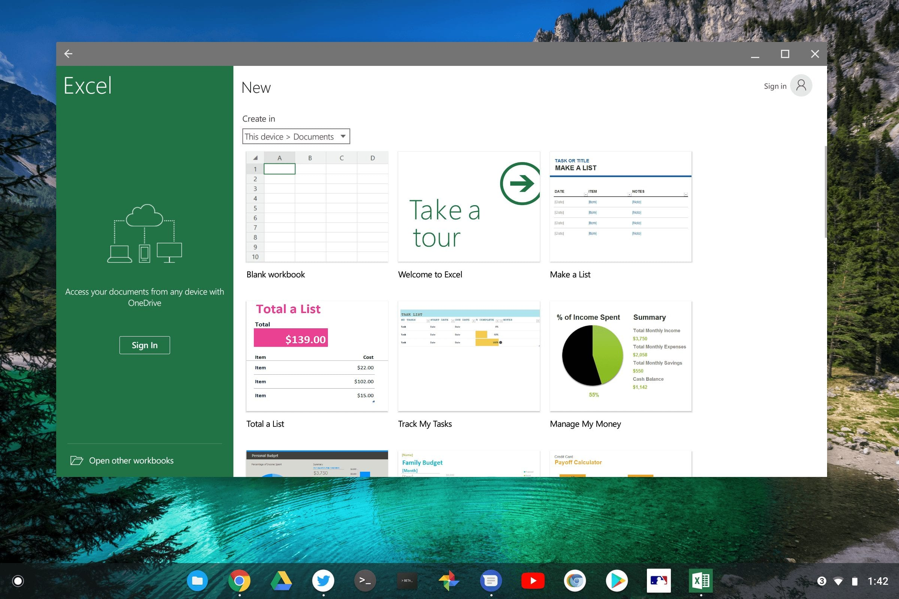

After digging around, reaching out to many folks and researching the strange issue that [doesn't allow Excel for Android installations on some Chromebooks](https://www.aboutchromebooks.com/opinion/android-microsoft-excel-incompatible-chromebooks-wont-install/), there's positive news. Microsoft has been working on a fix which is available in a beta version of Excel for Android. And it appears that some Chrome OS devices are no longer seeing the app incompatibility message in the Google Play Store.

Here's what I found out. Roughly three weeks ago, Microsoft explained it knew about the issue and created a beta version of Excel for Android to fix the Chromebook installation issues. I don't know the root cause of the problem but I can tell you that the beta version installed fine on my Pixelbook.

So it appears that when the beta app is added to the Google Play Store, the problem should be fully resolved.

Indeed, some Chromebook owners who originally couldn't install Excel are today reporting that they can today:

https://twitter.com/KeithIMyers/status/1029751754282418176

Clearly if you need to install Excel on your Chromebook, you should first try the Google Play Store at this point. If you still see the incompatibility message and want to install the beta version of Excel, here's what to do:

1. Visit the [Office Insider for Android Google+ group](https://go.microsoft.com/fwlink/?linkid=847786) and join it.
2. Then visit [this Microsoft page specifically for Excel beta testing](https://go.microsoft.com/fwlink/p/?LinkID=722565) and opt in.
3. You should then be able to view and install the Excel beta app in the Google Play Store.

To opt out of the beta in the future, simply visit the same page as in step 2 above and uninstall the Excel beta. At that point, you'll see the generally available version of Excel in Google Play.

One way or another then, you should be able to get Excel for Android working on your Chrome OS device.

I'm a bit disappointed that I had to spend hours contacting people and figuring this all out when I asked the Microsoft Helps Twitter account for assistance over a week and a half ago. I even repeated and retweeted my request but I never heard from them at all. I understand they have a massive user base to support, but an issue like this could cause lost revenues: If you're a paying Office 365 customer but can't access the Office apps you need on your device, that's a good reason to consider canceling the subscription, or at least considering other options.

Regardless, between the short term and long term fix, we should all be able to enjoy "spreadsheeting" again!
