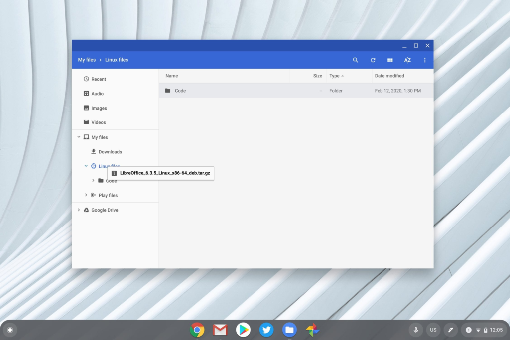
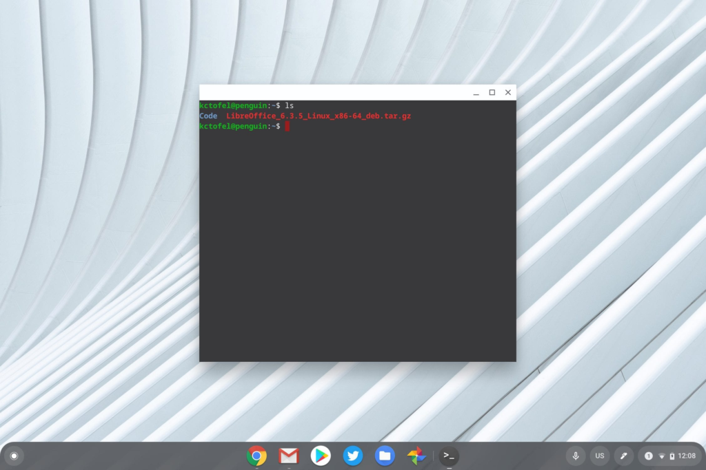
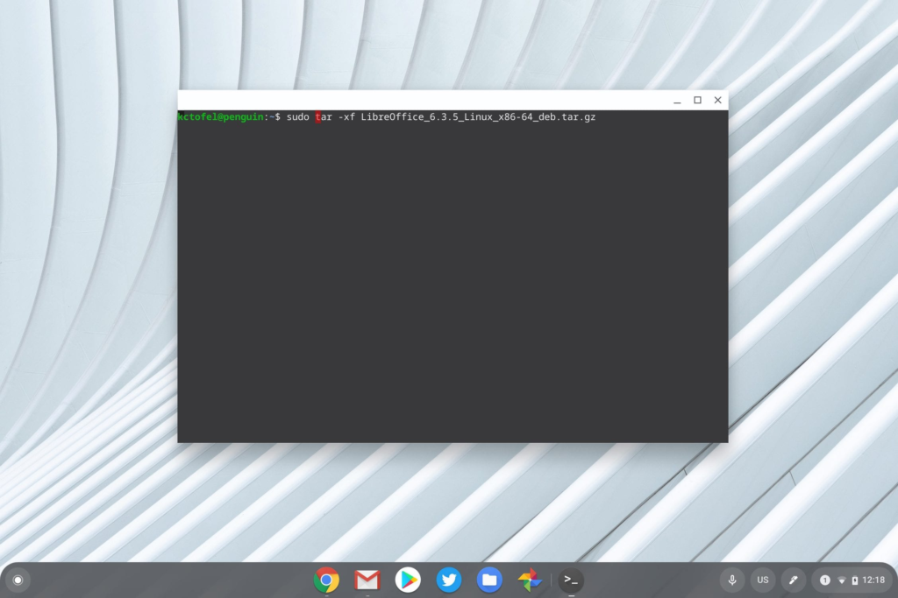
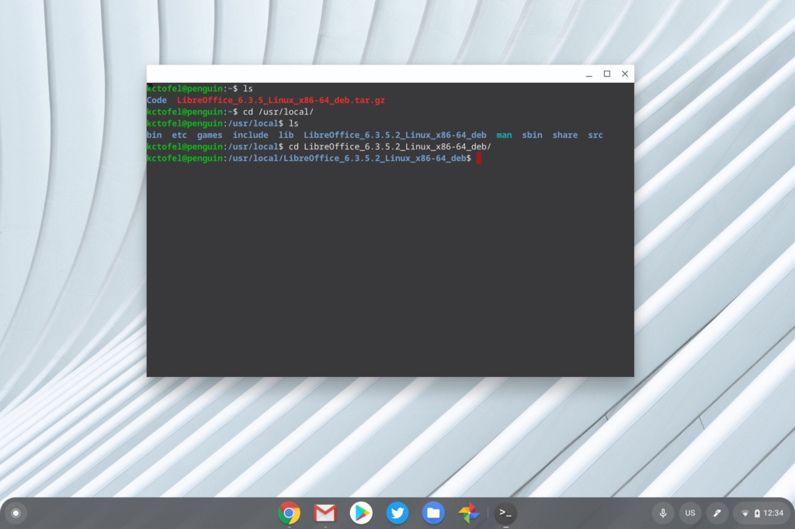
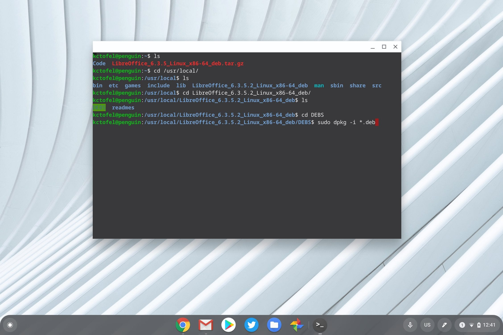
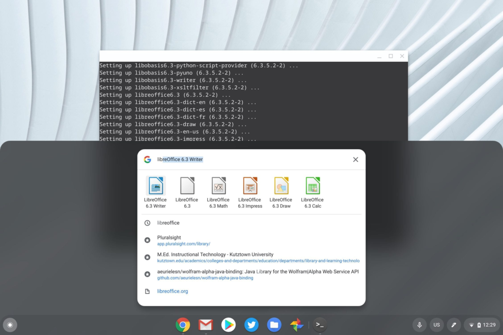

Last week, I showed how [easy it is to install a Linux .deb file to a Chromebook](https://www.aboutchromebooks.com/news/how-to-install-linux-apps-on-a-chromebook-without-ever-touching-linux/), but as I noted, the process won't work if the Linux app is downloaded as another type of file. Today, I'll explain how to install a downloaded Linux app with a .tar.gz file extension; [LibreOffice](https://www.libreoffice.org/) in this case.

I actually received an email about this specific file type over the weekend from reader, Eric:

> Saw your link on how to install Linux apps on Chromebook, and it worked when I downloaded Steam's .deb installer, but when I found LibreOffice .deb file (LibreOffice\_6.3.5\_Linux\_x86-64\_deb.tar.gz), it's tagged with tar.gz which I guess I need to unpack before I can install it....
> 
> ...do you know the command line command that I would need to use to install this? 

Technically, the LibreOffice download isn't a .deb file. Yes, it does have "deb" in the file name but that's simply an identifier to specify which Linux distro the build is for; Debian in this case.

Before the solution steps to install LibreOffice in this case (the same process generally applies to any .tar.gz file), a little background.

.tar indicates this is an archive of files and -- this goes way back in computer history -- was used for magnetic tape archives. Hence the "t" for tape and "ar" for archive. But that's not all since there's also a .gz extension. This means that the .tar file is compressed using GZip, which is a way to zip or compress files and folders.

History lesson aside, there's a one line command in the Linux terminal on a Chromebook to uncompress and unpack a .tar.gz file.

You'll first need to have the Linux file copied over to the Linux container on your Chromebook. So if you downloaded it in the Chrome OS browser, you need to drop and drag it from your Downloads to the Linux files location, using the Files app:

Once the file is copied, open up the Terminal app and type the "_ls_" command as shown below; this lists any folders or files in the current directory:

You can now see the LibreOffice installation file

Now that we have the file in the right place, it's just one more command to unpack it.

Type "_sudo_ _tar -xf nameofthefile.tar.gz_" to extract it; the _\-x_ is the extract option. Note that proper case matters here; the easiest way to avoid any typing errors for the filename is to type the first two or three, and then press the Tab key on your Chromebook keyboard. That will auto populate the rest of the file name.

Here's what it looks like for LibreOffice:

Note that running this command above will unpack the LibreOffice folders and files in the current directory. If you want to unpack it to another folder, you have to add that folder path to the command. In my case, I'll unpack it to /usr/local by using the "_\-C_" option along with the location I want the files to be in, although you don't have to do this.

Now that the LibreOffice files are unpacked, the package has to be installed.

There's one more command needed in order to do this but you first have to go to the location of the folders and files that were unpacked. If you didn't specify a location when unpacking, you skip this step; in my case, I need to navigate to the /usr/local directory as shown:

To view the contents of the LibreOffice folder, type "_cd /LibreOffice\_6.3.5.2\_Linux\_x86-64\_deb/_" as I did, followed by the "_ls_" command.

You should see two folders here; one called DEBS and one called readmes. Move into the DEBS folder by typing "_cd /DEBS_". Finally, type the following command to install the LibreOffice package: "_sudo dpkg -i \*.deb_":

At this point, you'll see a large number of file information as LibreOffice is installed. Be patient and once the installation is complete, you're all set.

You should see the LibreOffice suite in your Chrome OS Launcher by searching as well:

Additionally, the desktop shortcuts will be in the Linux apps folder of the Chrome OS Launcher too.

While this may sound like a lengthy, complicated process, it really only takes a few minutes. I explained the process with a bit of verbosity, so don't let the length of this post scare you away.

Also, there are other, easier methods to install LibreOffice and/or other Linux apps that use the Terminal command line much less, if at all. I'll outline some of those methods in a future post.
