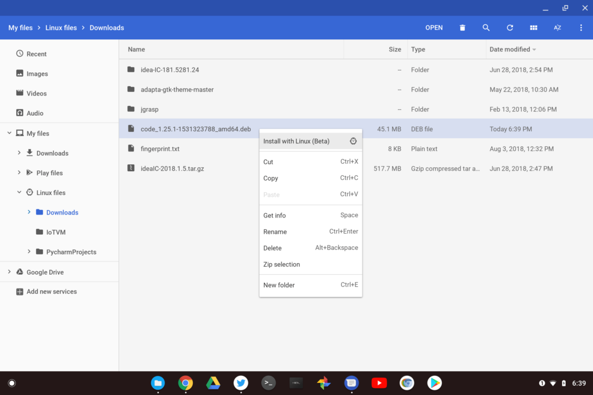
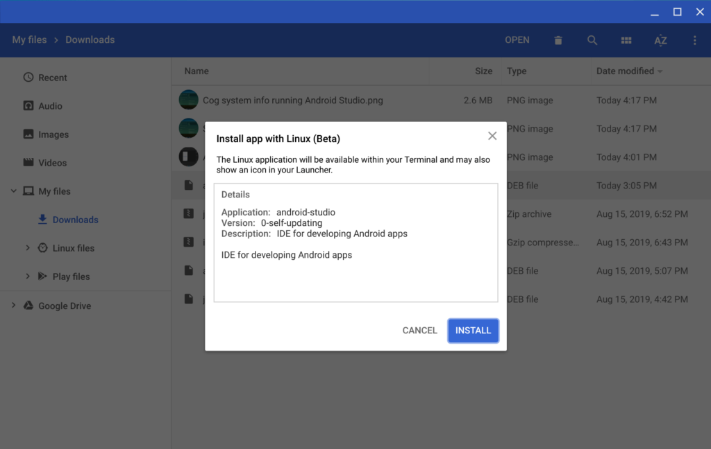
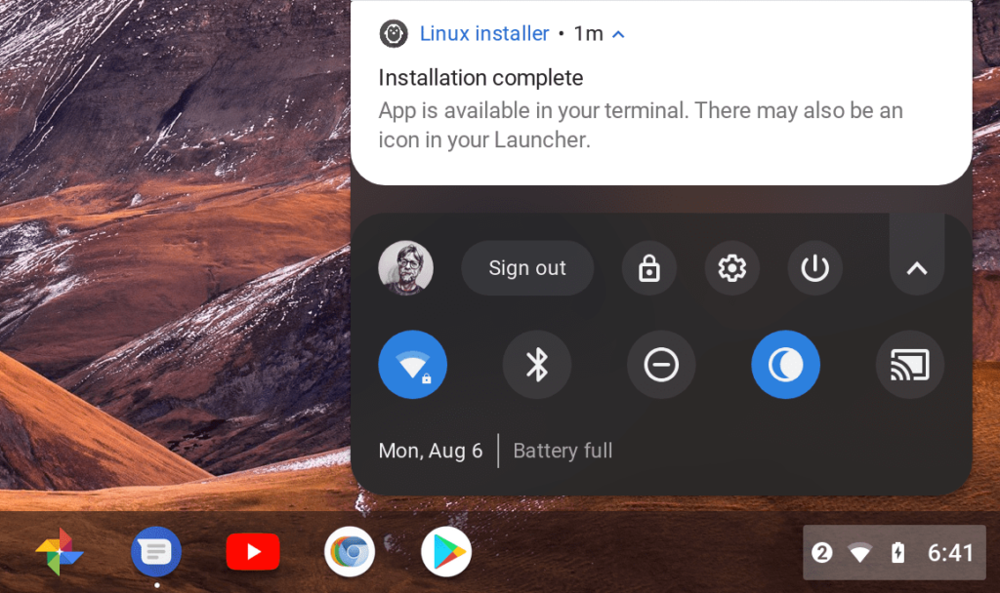

Earlier this week, I got the opportunity to be a guest on the [This Week in Google video podcast](https://twit.tv/shows/this-week-in-google/episodes/547?autostart=false). And of course, whenever that happens, I use that opportunity to talk about Chromebooks, hoping to inspire a wider audience of Chrome OS users.

Some of the discussion led into installing Linux apps on a Chromebook, which the other hosts thought might be a barrier to entry for the many people who aren't familiar with Linux.

That's a valid point but amazingly, none of the hosts knew that you can _install certain Linux files natively in Chrome OS_, without any need to be in the Linux environment.

Here's that particular section of the show:

<iframe width="560" height="315" src="https://www.youtube.com/embed/bJdGPKVycrw?start=1419" frameborder="0" allow="accelerometer; autoplay; encrypted-media; gyroscope; picture-in-picture" allowfullscreen></iframe>

You can hear the shocked reactions when I explained the native Chrome OS install process. That actually surprised me since [the feature I'm talking about has been around since August of 2018](https://www.aboutchromebooks.com/news/how-to-install-debian-linux-packages-in-project-crostini-chrome-os-files-app/).

I suspect many other Chromebook users aren't aware of this simple Linux application installation process so I'm resurfacing the method.

There is one _very_ large caveat: The program you want to install must be available as a .deb file to download. If it isn't you'll need to roll up your sleeves and learn a little Linux. And I do mean very little, but that's another post for another time.

If your app can be downloaded as a .deb file, then use Chrome OS to download it, like you would for any other file.

Next, open the Chrome OS Files app, find the file you just downloaded and right click it. You should see an "Install with Linux (beta)" option appear. Click that and you'll see information about the application.

Click the "install" button and your Linux app will install without you ever touching the Linux command line.

Chrome OS will also provide notifications during the installation process. And you should even see a Launcher shortcut for the application installed to start up your app. Easy peasy!
