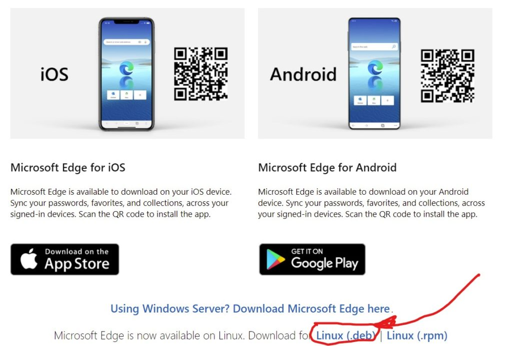

I know that most Chromebook users stick with Chrome for their browser choice. After all, it's the default browser and interface on a Chromebook. But some folks like alternative browsers ([like the one that's coming to Chrome OS](https://www.aboutchromebooks.com/news/lacros-vs-chrome-and-chrome-os-on-chromebooks/)) that are either for Android or Linux. Today there's a new one, at least officially. [Microsoft Edge for Linux is now out of beta status](https://blogs.windows.com/msedgedev/2021/11/02/edge-ignite-nov-2021/) and generally available for Linux. Here's how to install that version of Microsoft Edge on a Chromebook.

To use Microsoft Edge for Linux on your Chromebook, you'll obviously need to have Linux enabled. To do this, go to Settings in Chrome OS and look for the Developers menu under Advanced.

Below, I have an image of what this screen looks like if you have Linux installed already. If you don't, just follow the prompts on your Chromebook to enable Linux. It should only take a minute or two.

Once Linux is enabled on your Chromebook, [navigate to this Microsoft link on your Chromebook](https://www.microsoft.com/en-us/edge#platform). You'll want to scroll down below the Edge downloads for Windows, macOS, Android, and iOS. There you'll see options for Linux. I've highlighted the one you want to click, which is for the .deb installation package.

Once you click the .deb link, you'll need to accept the license agreement and then the Edge browser for Linux will be downloaded to your Chromebook.

After the download is complete, open your Files app on your Chromebook and look for the just downloaded .deb file. Right-click it and choose the "Install to Linux" option to begin the installation process.

Once that completes, you should have an Edge icon in your Chrome OS launcher and you've got Microsoft Edge on a Chromebook!

I'm sure some folks will ask "why even do this?", which is a valid question. Developers often test web apps across multiple browsers or use different developer tools in various browsers.

More importantly though, Microsoft Edge supports IE Mode for legacy web apps built specifically for Internet Explorer. If you use one of those apps, you'll appreciate having Microsoft Edge on a Chromebook.

_**Update**: Thanks to Ondřej in the comments for explaining IE Mode only works on Windows with Edge. I did find some browser extensions that attempt to replicate IE mode, so there may be hope if you need this functionality. But natively, there's no IE Mode in Edge for Linux._
