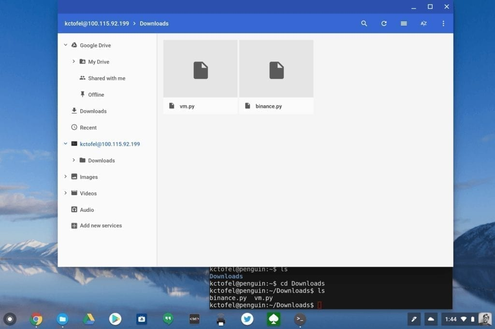

We already know that Google is working on a simple, behind-the-scenes method to [show files from a Linux container on Chrome OS](https://www.aboutchromebooks.com/news/how-the-chrome-os-files-app-will-support-linux-files-for-project-crostini/). Until that's ready though, how can you see or move files between Chrome OS and Linux if you've [enabled Project Crostini](https://www.aboutchromebooks.com/news/linux-apps-project-crostini-option-appears-in-chrome-os-settings-on-dev-channel/)? It's pretty easy and is just [a manual implementation](https://developer.android.com/topic/arc/studio#mount_linux_files) of what Google plans to bring to the Files app on a Chromebook.

I ran through the steps in about five minutes and it works perfectly. Not only can I see the files in the Linux container on my Pixelbook in the Chrome OS Files app, but I can move files between Linux and Chrome OS: I dragged the vm.py file -- a Python script I used with Twilio to [build a voicemail server on a Raspberry Pi for the IoT Podcast](https://staceyoniot.com/how-to-create-a-voicemail-server-with-raspberry-pi-python-and-twilio/) -- from my Chrome OS Downloads folder to my Linux Downloads folder:

The "manual implementation" link above contains the steps to mount Linux files to the Chrome OS Files app but I'm replicating them here if you need them:

1. Set a password for your user account inside Linux by running `sudo passwd $USER`. Do not use your Google password.
2. Install openssh-server: `sudo apt-get install openssh-server`
3. Run the command `hostname -I` to get the IP address for your Linux VM.
4. Install the [Secure Shell](https://chrome.google.com/webstore/detail/secure-shell-app/pnhechapfaindjhompbnflcldabbghjo?hl=en) app and open it.
5. Type in your username and the Linux IP address.
6. Click **SFTP Mount** and respond to the prompts to confirm the connection and enter your password.
7. Your Linux machine will appear in the sidebar of the Files app.

This is really no different from how I used to SFTP mount a Raspberry Pi to my Pixelbook for [remotely programming in Python on the Pi](https://www.aboutchromebooks.com/how-to/how-to-code-on-a-chromebook-using-python-and-a-raspberry-pi/). Now that Project Crostini officially brings Linux app support to Chrome OS on the Pixelbook, at least in beta form, I don't need to do that any more. I've since installed the Linux versions of Eclipse, Android Studio and Sublime Text, to name a few, on the Pixelbook.

Keep in mind that the SFTP mount is not persistent when using Secure Shell: You'll need to open both Terminal and Secure Shell to remount the Linux files after each reboot, although Secure Shell will save your username and IP address to save some time.
