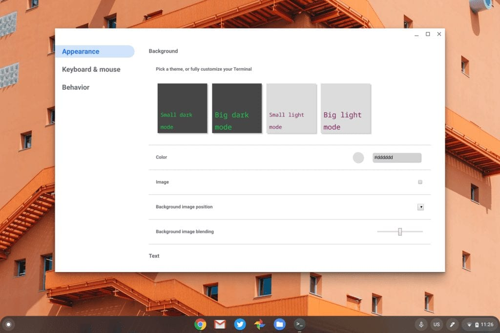

Back in September, I noted that the Chrome OS team was working on [improving the Linux Terminal for Crostini users](https://www.aboutchromebooks.com/news/chrome-os-78-expected-to-elevate-terminal-to-a-system-app-with-tabs/), including customization options and multiple Terminal tabs. That work is still going on but if you're curious to see all of the upcoming, new options in the Terminal, you can actually preview them now in the Chrome OS 81 Stable Channel.

All it takes is one experimental flag setting at _chrome://flags#terminal-system-app_: Enable this flag and restart your browser.

Note that while your Terminal will now have a three dot menu option at the top right which gets you into the options, this Terminal app does _not_ work at this time.

This is strictly a preview to show you what options you'll be able to customize. Once you've noodled around, you'll want to disable the flag setting and restart your browser again for the current, working Terminal app.

You'll see that there are currently three different groups of settings you can modify: Appearance, Keyboard & mouse, and Behavior.

You'll be able to use standard light or dark themes but also customize text colors, fonts, sizes and more, along with a background image if you choose.

The Keyboard & mouse settings have a plethora of options ranging from keyboard shortcuts, copy & paste commands and useful functions such as automatic scrolling to the bottom after new Terminal output.

I doubt the Behavior settings will get much use but this is where you can modify or add notifications or change your character encoding.

Note that while this work began months ago, [the updated Terminal with settings isn't expected until Chrome OS 84](https://bugs.chromium.org/p/chromium/issues/detail?id=999950&q=label%3AHotlist-Crostini-Terminal%20m%3D84). I did see some code updates tagged with Chrome OS 83, but most of these were pushed back a full release when Google decided to skip the Chrome OS 82 release and recalibrate the update schedule.
