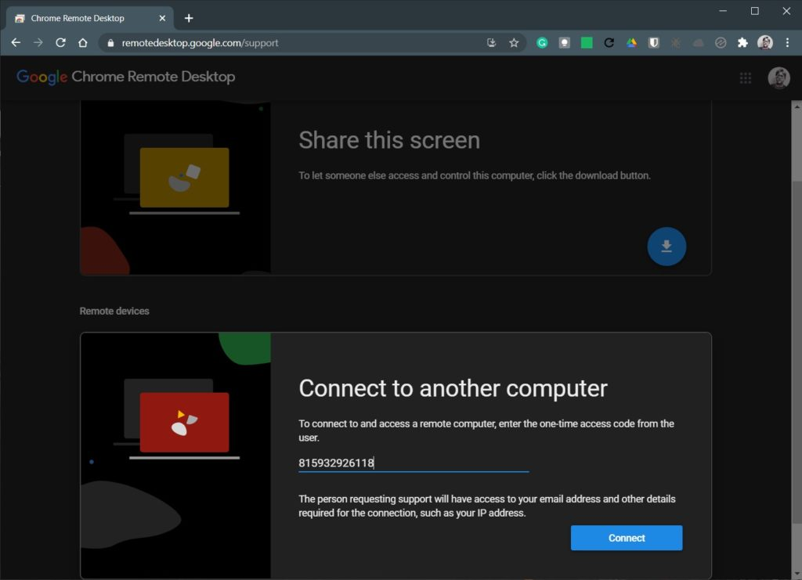

Chromebooks have long supported remote desktop access to other computers. You just install the [Chrome Remote Desktop extension](https://chrome.google.com/webstore/detail/chrome-remote-desktop/inomeogfingihgjfjlpeplalcfajhgai?hl=en), follow the directions and you're off. But a common question I get, mainly for troubleshooting reasons is: How can I remotely control a Chromebook **_from_** another computer?

Chrome Remote Desktop is still part of the equation here. But so too is a special URL if you don't have or want to install the extension. Technically, I believe the extension is a Progressive Web App using this URL.

Just head to [https://remotedesktop.google.com](https://remotedesktop.google.com) using the Chrome browser from a computer and you'll see a web version of the extension.

Here I'm doing this on a Windows PC. The person with a Chromebook wants to replicate your steps here and view the same URL.

PC view

You're greeted with two menu options and you'd _think_ you want Remote Access.

Instead, choose Remote Support to see this screen. Note that the remote Chromebook should also take this step.

PC view

See the "Connect to another computer" section?

That's what you want on your non-Chromebook. And the Chromebook user wants to click the "Share this screen" option, which generates a one-time access code on their Chromebook, as shown in the below image.

Chromebook view

The code generated on the Chromebook is the key to the kingdom here.

The Chromebook user should provide that code to the PC user, who then enters the code on the computer:

PC view

Once the code is entered on the computer, click the Connect button.

That will generate a request to the Chromebook; once the access request is accepted on the Chromebook, you'll have remote control access to it.

Chromebook view

Either user can terminate remote control access at any time. And if a new session is required, the same steps apply. Of course, the access code will be different for each session.

A PC on Wi-Fi controlling a Chromebook on an LTE connection

Note that I tested this between a Windows PC and a Chromebook that I was signed in with on Chrome and Chrome OS.

I also tested this with a Chromebook my wife uses, illustrating that you don't need to have or share the same Google account. Additionally, I tested with a Chromebook connected over an LTE hotspot and my computer on Wi-Fi.

It worked perfectly in every situation and is a great way to remotely troubleshoot Chromebook issues or educate Chrome OS users on how to use a Chromebook.

One last thing to mention: I had occasional success using this method remotely controlling one Chromebook from another Chromebook. If that's the problem you're looking to solve, it _may_ work for you. Unfortunately, my success rate was about 50-50, so let me know if you have better results.
