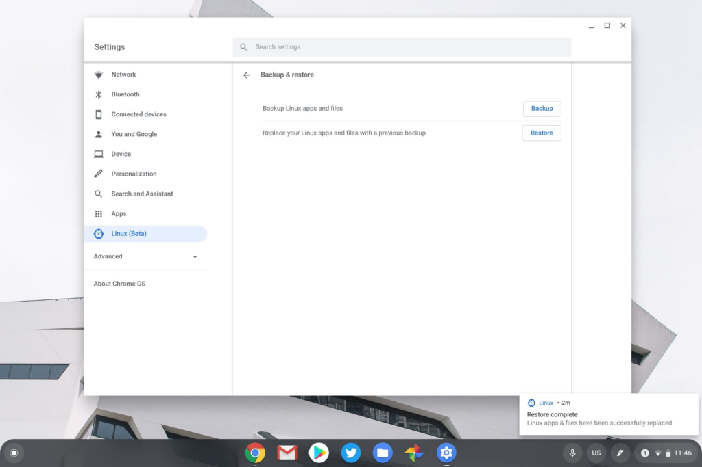

**Updated below but the short version is that while the new container was Buster, restoring a Stretch backup reverted the system back to Stretch.**

Now that [Chrome OS 80 Stable Channel is generally available](https://www.aboutchromebooks.com/news/chrome-os-80-stable-channel-release-pulled-8-hours-after-being-deployed/), there's [a key feature you should know about if you rely heavily on Crostini containers to run Linux](https://www.aboutchromebooks.com/news/chrome-os-80-stable-channel-arrives-heres-what-you-need-to-know/). Any new container created in Chrome OS 80 will use Debian Buster, not the prior version of Debian, known as Stretch.

I do know that Google is working on [an automated existing container upgrade from Stretch to Debian and it's currently planned for Chrome OS 81](https://crbug.com/1058220).

Frankly, I think nearly everyone should wait for that solution to arrive in the Stable Channel. [You could manually upgrade](https://www.aboutchromebooks.com/news/linux-debian-10-buster-upgrade-chromebooks-chrome-os-project-crostini-how-to/) but you never know what that might break in the hooks of Project Crostini.

I had a thought though, because I use several Chromebooks, all with different versions or channels of Chrome OS. Some still have the older Debian Stretch containers while one has a new Buster container. I decided to try a container backup and restore from Stretch to Buster.

Long story short, it appears to have worked! The Linux apps I had installed in Stretch are available and working in Buster, and my data files are there too.

However, I can't test for everything so if you decide to go down this path, I'm not responsible for any data loss. And if you're on Chrome OS 80, keep in mind that if you blow away a container, it's coming back with Buster.

Having said that, the process was simple and took about 15 minutes.

I first backed up a Debian Stretch container on my Chromebook with Chrome OS 80.

Then I took the plunge and removed Linux from the same Chromebook. Remember, this Linux container was Debian Stretch.

With Linux disabled, I restarted the Chromebook, and then re-enabled Linux. There was nothing out of the ordinary here, although the container files being downloaded were for Debian Buster, which I confirmed once Linux was ready to go.

Note that at this point, I ran into an unsigned key issue; something that Google has been working on since January.

To resolve this, a simple command line does the trick:

_sudo apt-key adv --refresh-keys --keyserver [keyserver.ubuntu.com](https://keyserver.ubuntu.com/)_

I then ran the typical update and upgrade commands to ensure I had the most recent libraries and packages:

_sudo apt-get update  
sudo apt-get upgrade_

This downloaded and installed or upgraded a large amount of files in about five minutes time. None of my data files, nor my previously installed Linux apps were available, as expected.

At this point, I felt that I had a current container of Debian Buster available, so it was time to try the Stretch container restore.

And it worked. Or at least it worked in my particular case. My Linux apps came back, along with their respective desktop launcher shortcuts and all of my previous user files were available.

Everything seems to be working fine but again, I haven't tested for every possible situation. And I want to reiterate that Google is working on an automated upgrade solution for the Stretch to Debian container situation. I still think most people should wait the six or so weeks for that to arrive in Chrome OS 81.

But if you live on the edge -- and I know some of you do because you've asked me about this upgrade path -- know that this process worked for me and may work for you.

_**Update at 1:34pm ET, 3/5/2020:** Thanks to Levi on Twitter for pointing out one last verification step that I overlooked. Restoring the Stretch container to Buster reverted the container to Stretch, so this is not an option at this time. Although it didn't work, hopefully this saves someone else from going through the process._ _And the good news is that if you wipe your Stretch container and then create a new one, which will be Buster, you can revert it back with this method **if** you have a container backup._
