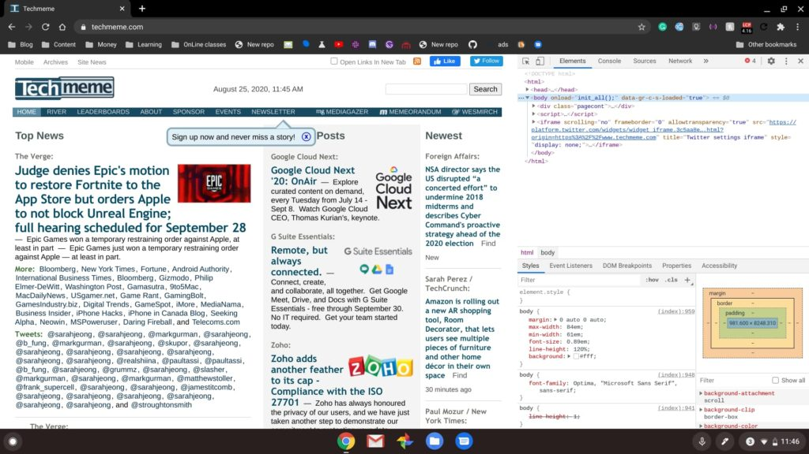
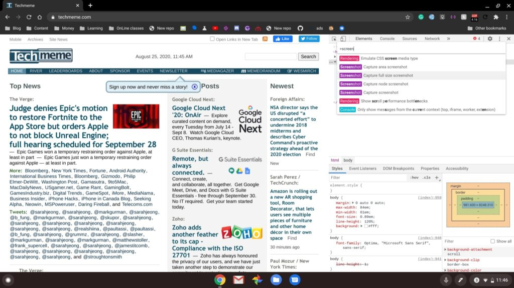
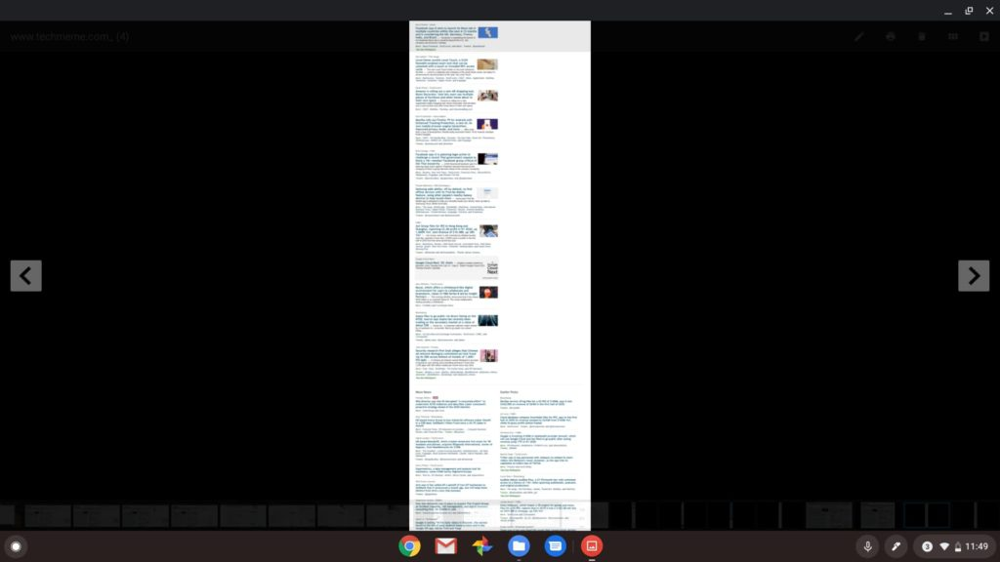

Earlier today I had to file a DMCA takedown request for a site that republished some of the content from this site. All of the links and images were stripped and the copy seemed to have run through a bad rewording script or app. For my records, I wanted a screenshot of the full offending web page instead of capturing each visible screen section piecemeal. I thought other users might want to know how to screencap a full web page in a single image on a Chromebook, which is actually easy to do.

You wouldn't know where this feature is in Chrome OS but it's built in to the Developer Tools of the browser. So first you'll browse to the web site or page on your Chromebook. I'll use [Techmeme.com](http://www.techmeme.com) as an example.

Then, on your keyboard, type the CNTL + SHIFT + I shortcut; that last bit is a capital letter I, as in "Ice". This shortcut opens Developer Tools:

Next is another keyboard shortcut. This time it's CTRL + SHIFT + P, which quickly gets you to a search box for various developer needs. Once you have that search menu open, start typing "screen" to see the below options.

As shown above, I've highlighted the option for a full size screenshot capture. That's the one you want to click. Once you do, it may take a few seconds, but you'll be notified that a PNG file has been saved to your Chromebook in the Downloads folder, assuming you're using the default download settings. That PNG file is a full-length screenshot of the web site or page.

There is one tricky bit though: Viewing that long PNG image in the standard native image viewer of Chrome OS really doesn't work. It won't let you zoom in enough to actually read anything. This is the most I can zoom in on with my example.

However, there is a way to view the entire screenshot by scrolling around; it requires Google Drive. I saved the PNG file in my Google Drive using the Files app and then using the browser went to drive.google.com. If you open your image file this way, you can actually zoom and scroll around with all of the text legible.

It's a bit of a hack, yes, and there _**are**_ Chrome extensions that do the same thing. I personally prefer to use native tools and features when possible so this is my method.
