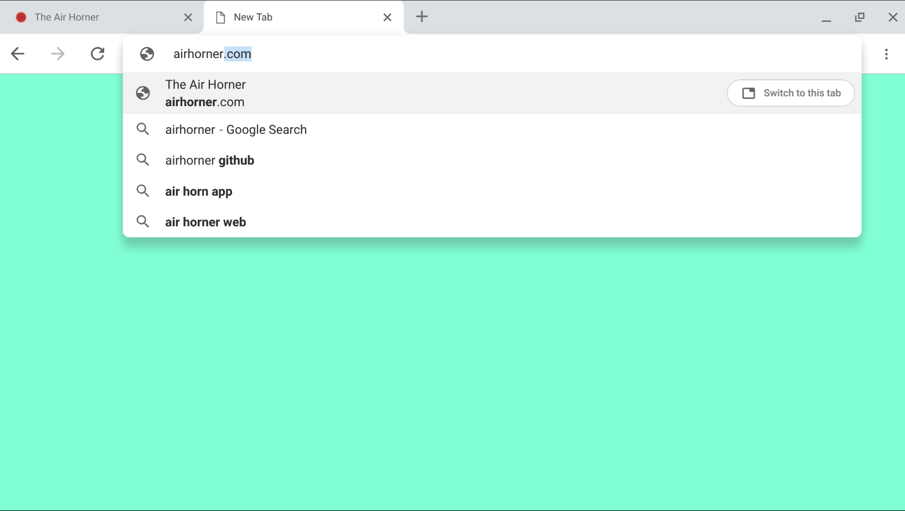
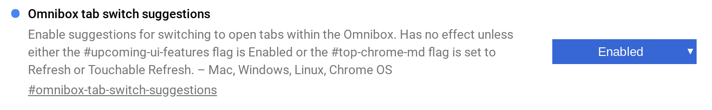

Some folks only have a handful of tabs open on their Chromebook or Chromebox. But others -- and I'm this group -- may have dozens and dozens open. And in that situation, it becomes difficult to find and return to an open tab as you get through your day. Well, it's about to become easier.

Google's François Beaufort shared a new feature that lets you [search for open tabs right on an empty New Tab Page](https://plus.google.com/+FrancoisBeaufort/posts/fcBLzyLxwmx).

Being an experimental feature, this is currently available in the Dev Channel and requires you to enable this flag: _chrome://flags/#omnibox-tab-switch-suggestions_. One thing Beaufort doesn't mention though is that you need at least one other flag enabled, as shown:

Even when I'm not running ten or more tabs, I'm already finding this feature useful. That's because I don't maximize my browser window on my Pixelbook. Instead, I keep the Twitter Progressive Web App (PWA) open on the right side of the display and use the rest of the screen for my browser, which causes me to lose track of open tabs a little quicker.

As much as I like the feature, I'm _**not**_ sold on the fact that you have to open a new tab to find an open tab. That seems like an odd user experience choice. I'd like to see this feature integrated into the Launcher search or perhaps even in Google Assistant. My preference would be the former choice.

Also, although this is currently a Dev Channel flag, [many devices are currently on the same Chrome OS version for both Dev and Beta](https://cros-updates-serving.appspot.com/). So if you're on the Beta channel, give this a whirl and share your results with the group. I suspect it will work on Beta.
