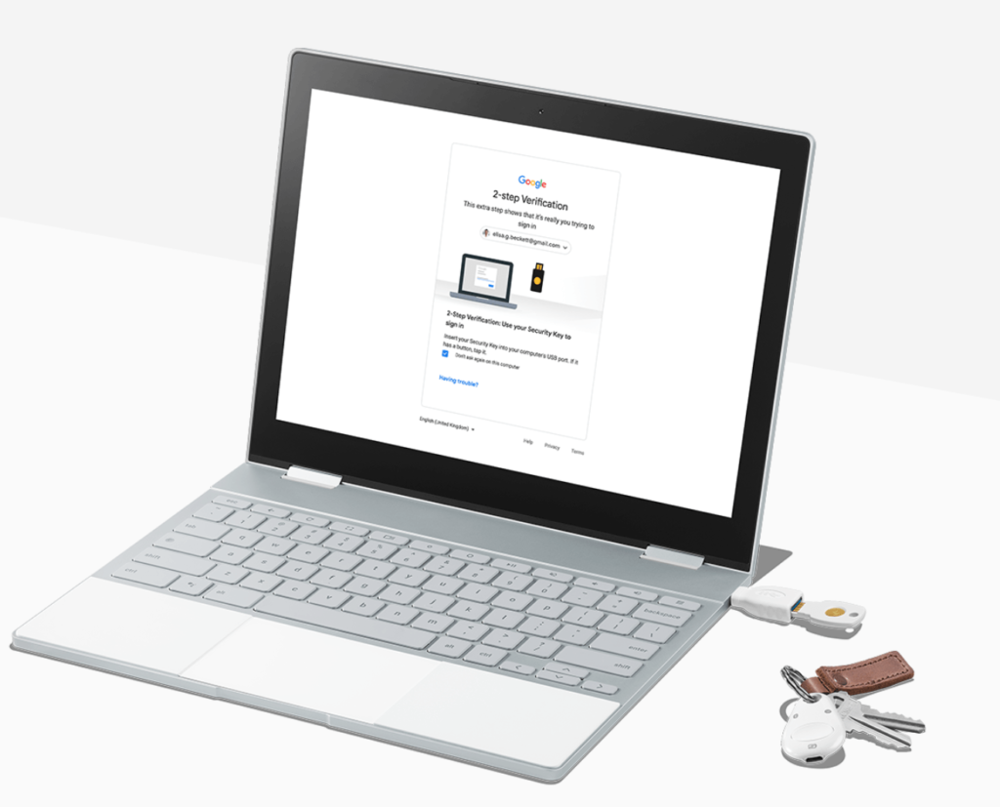
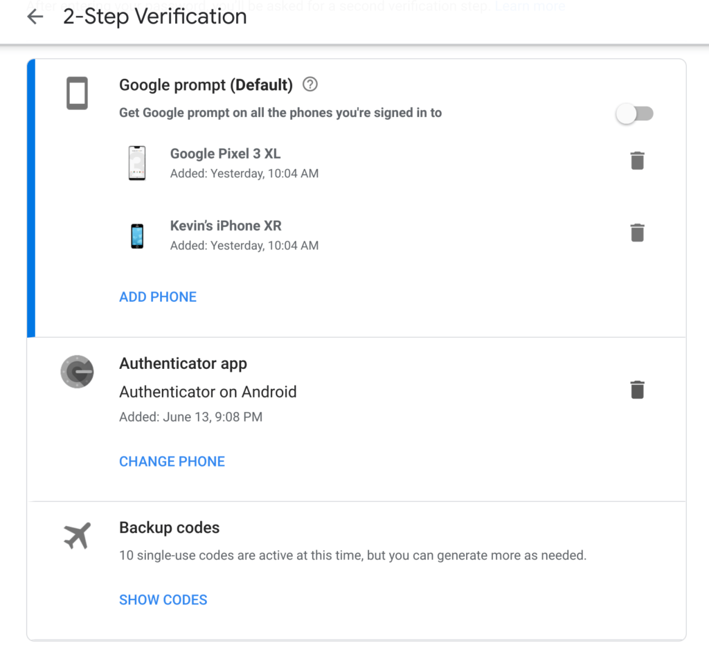
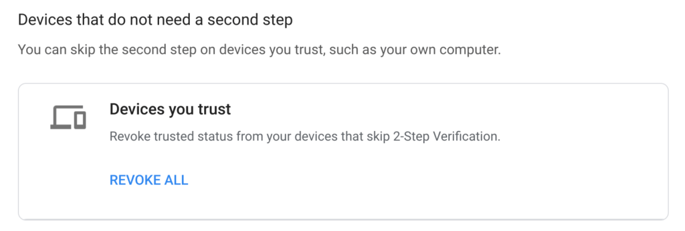

With a simple Google account sign on, a Chromebook is quick to get you working, playing or whatever you want to do. But that Google account is the key to your Chromebook castle, and probably many other services as well, so you want to make sure it's protected at all costs.

My podcast co-host, Matthew Miller found this out the hard way last week when he lost access to his Google account, not to mention many other accounts too. [He has a full write up of what happened](https://www.zdnet.com/article/sim-swap-horror-story-ive-lost-decades-of-data-and-google-wont-lift-a-finger/) - he was SIM-jacked and lost his phone number not once, but twice, in just a few days - that I highly recommend you read.

We also discussed this as the main topic of our last podcast episode, if you'd rather tune in and hear about the experience:

<iframe style="border: none" src="//html5-player.libsyn.com/embed/episode/id/10166399/height/90/theme/custom/thumbnail/yes/direction/backward/render-playlist/no/custom-color/527cdf/" height="90" width="100%" scrolling="no" allowfullscreen webkitallowfullscreen="" mozallowfullscreen="" oallowfullscreen="" msallowfullscreen=""></iframe>

Just to clarify what the root cause of this issue was: A nefarious person contacted Matt's cellular provider - T-Mobile in this case - and impersonated Matt. They then got T-Mobile to move Matt's phone number to their own mobile phone via the SIM card; likely saying they lost their phone and wanted to activate a new device and the SIM inside it.

Armed with Matt's phone number and just knowing his email address, they then had the ability to reset his Google account password using the SMS-code 2FA that Matt had set on the account as a safety precaution. Essentially, they never had to know his Google password, they simply gained the ability to change it. And it all went downhill from there as Matt had stored personal data, bank account information and more on Drive. The hacker attempted to move $25,000 from Matt's bank account but luckily, that transaction was reversed in time.

Obviously, this situation doesn't apply only to a Chromebook since Google accounts are usable on nearly every platform and device. But I'm going to focus on the Chromebook aspect as well as provide tips on how to better protect your Google account.

Although Matt didn't attempt to log in to his Chromebook during this fiasco, he probably wouldn't have been able to. In most cases when you fire up a Chromebook, it's going to connect to the web if possible. Had he booted his Chromebook, he wouldn't have been able to sign in to it because the Google password associated with his account had already been changed. Aside from no access, other than with a Guest account, on the Chromebook, he would have also lost access to any locally stored data on the device.

For this reason, I specifically follow an approach of "if it's important, don't store it locally on the Chromebook." I make sure that if my Chromebook is run over, lost or stolen, all of the important files are in the cloud. In fact, at the end of every day, I delete everything from the Downloads folder unless it's important, in which case, I make sure it's in the cloud. I even use a secondary cloud provider to store key information.

In terms of protection for my Google account and logging into my Chromebook, [I use two-factor authentication or 2FA](https://support.google.com/accounts/answer/185839?co=GENIE.Platform%3DDesktop&hl=en). However, I don't use SMS codes for this because it's the least secure option that Google provides.

You can use the Google Authenticator app or if you have one, a USB key. [I bought a Google Titan Security key for this purpose](https://www.aboutchromebooks.com/news/got-a-chromebook-consider-securing-it-with-a-google-titan-key/) but I also use the Authenticator app for some of my accounts. Authenticator generates one-time codes that change every 30 seconds as the 2FA method. If you lose your phone, you can use one-time backup codes as well; I print these and keep them locked in a safe. Lastly, you can use a Google prompt on your mobile devices too.

Any or all of these methods should help protect your account, even in the case of your phone being stolen or your SIM is jacked.

But you can take this a step further on a Chromebook by setting up 2FA for your login. It's a bit inconvenient but if someone actually does get your Google account password, they won't be able to log in to your device. With 2FA on, you'll be prompted for an authentication code, Google notification on a mobile device or your hardware key, depending on which you have set up, to complete the Chromebook sign-in process. Be sure not to click any options that say "trust this computer" when doing so if you want to get the prompt with every login on your Chromebook.

If setting up 2FA doesn't seem to work with your Chromebook, you may have previously set it up as a trusted device. You can revoke that trust in the 2FA settings of your Google account:

Is it a pain to type in a code, hit an in-app prompt or carry a USB security key for every Chromebook log in? Yup. But I'd rather give up a little bit of convenience for a more secure account considering everything that a Google account or logged in Chromebook can access.
