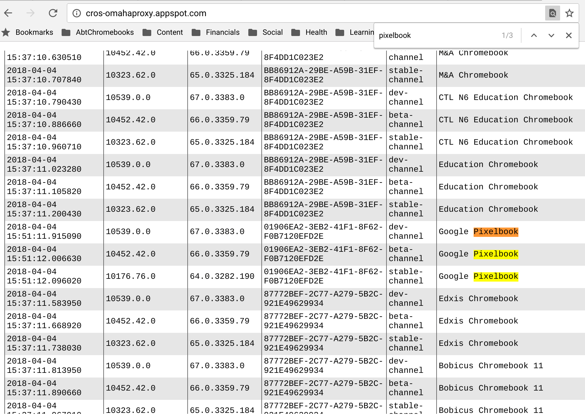

Yesterday, I pointed out the [difference between Developer Mode and the Dev Channel](https://aboutchromebooks.com/qa/whats-the-difference-between-developer-mode-and-the-dev-channel-on-a-chromebook/) on a Chromebook. Today, I wanted to share a useful website that's worth bookmarking because it [displays the current version of the Dev, Beta and Stable Channels of Chrome OS](http://cros-omahaproxy.appspot.com/) for all Chromebooks.

The data is returned in a tabular display which easy to read although the list is long. Have no fear, there's an easy way to get the data for your specific device. Click _ctrl_ + _f_ on your Chromebook to bring up the find feature (which you can use on any website, by the way) and type in the name of your device or the company that built it. Here's what it looks like for me when I searched for my Pixelbook as an example.

You don't really need to worry about these version numbers or channels because Chromebooks automatically update as new software is available. In some cases though, it comes in handy to know what the latest version is for a specific channel or device and this site is a quick way to find out.
