About half of the emails I've received over the past two weeks have been suggestion requests for inexpensive but capable Chromebooks that can be used for remote learning. I've answered those with my recommendations based on budget and use-case requirements but I've also added another suggestion: If you have a Chromebook that you don't use full-time, why not set it up securely for your kids to use?

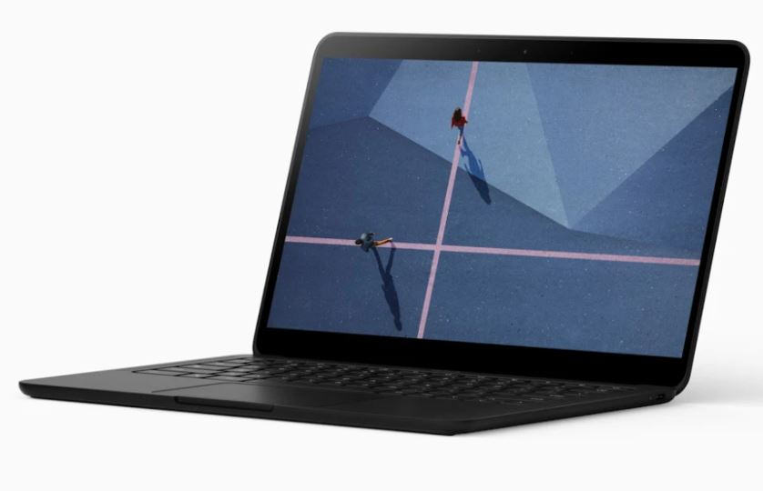

Like macOS and Windows, Chrome OS does support multiple user accounts. And it does this in a secure manner so that user data is protected from other users.

Even better, parents can manage their kid's Chromebook usage much like a school might, although to a lesser extent. You can limit activities and websites, the use of third-party apps and more.

Best of all, it's quite easy to set up in about 10 minutes or less using [Family Link](https://families.google.com/familylink/).

## Guest mode is the simplest option but has limitations

Before I run through the process though, I should also mention another option that could work in certain situations: Enabling Guest Mode on your Chromebook. This provides others to log in and use your Chromebook but all session data is wiped away as soon as the person logs out. Essentially, it's what Google calls an ephemeral mode.

If you go the Guest Mode route, your data is still safe and sound. And your kids can still log in to various educational websites or to their school if they need to. However, any data they store locally during the Guest Mode session will be deleted upon log out. They can store data in the cloud or on external media, however.

I realize that Guest Mode isn't ideal for everyone, so here's how to securely set up your own Chromebook for your kids to use during the current pandemic situation.

## Adding your child's Google Account is a better step

First, sign out of your Chromebook so that you're back to your login screen. Then click the "Add person" option at the bottom of the screen.

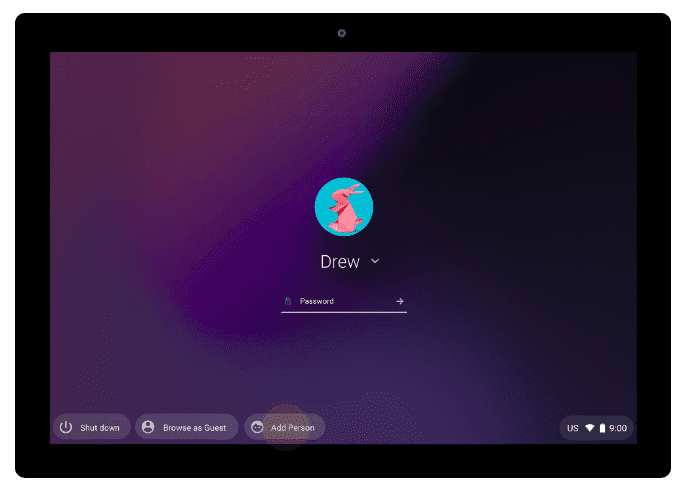

This creates the second account and allocates storage space for it. Next, your child will have to sign in as if it was their Chromebook; if they don't have a Google account, they'll have to create one. They'll then have to accept the standard terms of service for using Chrome and the Google Play Store.

At this point, they're good to go.

## Using Family Link to supervise your child's account may be the best option for some

However, you may want to manage or limit their activities; particularly for younger children.

For those features, you'll need to click the Settings icon when your child is signed in to the Chromebook. Then click the People option in Settings and look for the Parental Controls option: Click the Set up button here to get started:

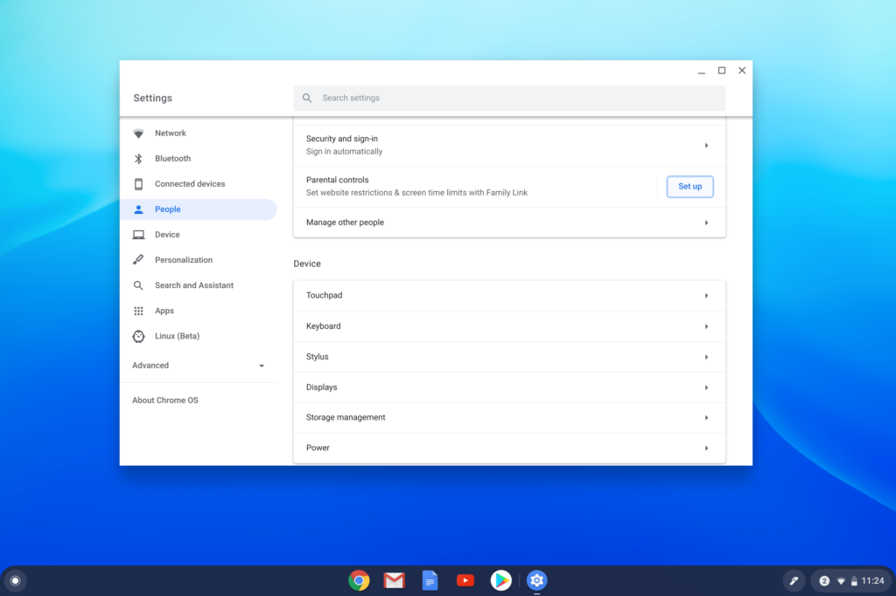

You should be welcomed by the "Set up parental controls with Google's Family Link" page, which provides a high-level overview of what you can manage. Click the Get Started button to continue.

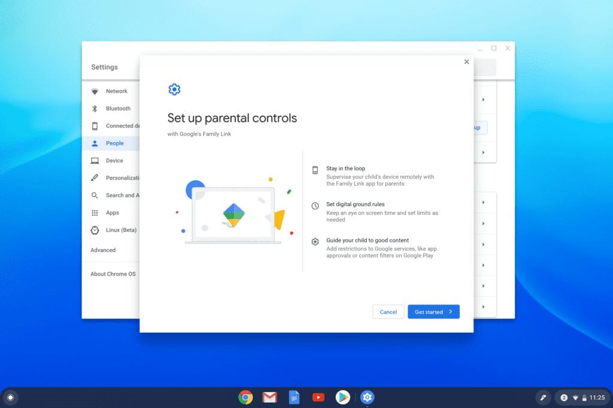

Note that you don't need the Family Link mobile app on your phone unless you want to remotely change these settings. I'd recommend adding it to your [Android](https://play.google.com/store/apps/details?id=com.google.android.apps.kids.familylink&hl=en_US) or [iOS](https://apps.apple.com/us/app/google-family-link-for-parents/id1150085200) device though. You do get prompted for this installation in the middle of the process but here are some screenshots to show you what the app looks like.

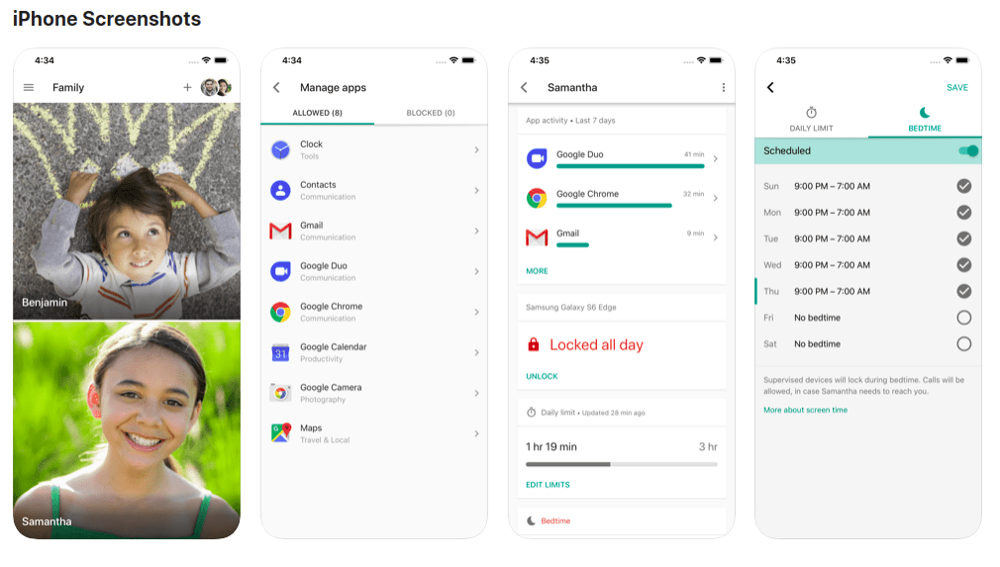

Google Family Link for Parents app on iOS

Next you'll walk through a few more explanatory steps until you see this screen showing what devices you want to manage for your child; the device you have could vary from mine here, of course. Click Next to continue.

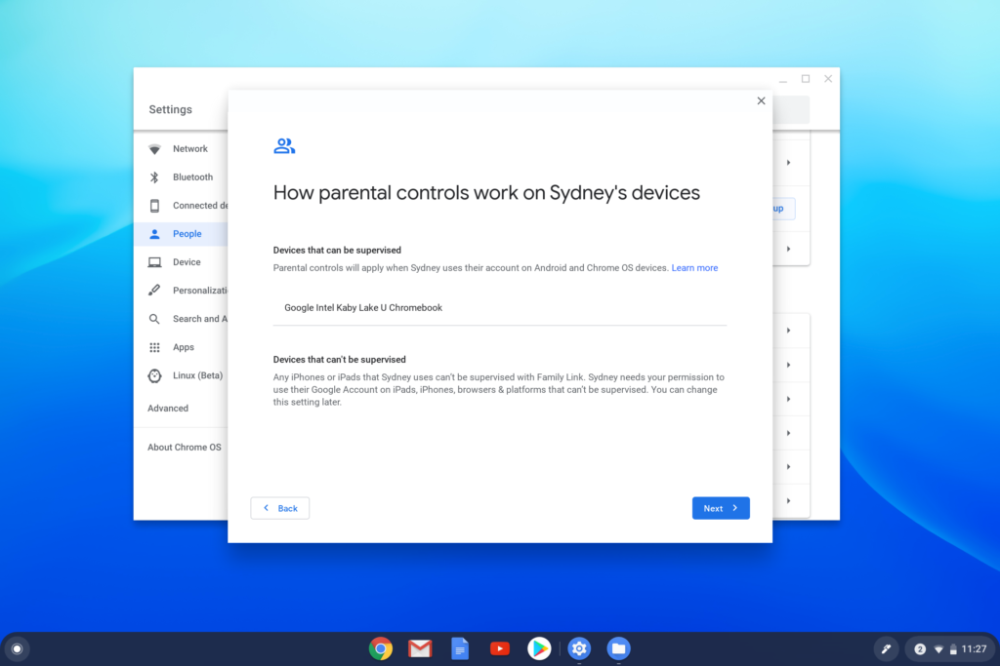

When prompted to sign-in, do so with your own Google account.

Once you're signed in, you'll see a list of what you can manage or limit, ranging from blocking or approving apps, limiting screen time and perhaps most importantly, what data Google can track from use.

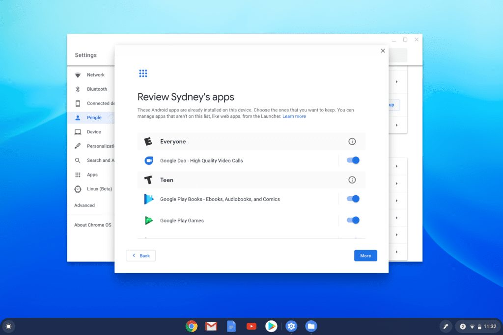

Keep in mind that for Google Accounts of children 13 or older, they can disable this supervision. However, as a parent, you are notified when this happens, so you might consider telling the kids not to do this.

At this point, the child must enter their password to indicate they understand the account is now being supervised. Once they do, the Family Link process is complete.

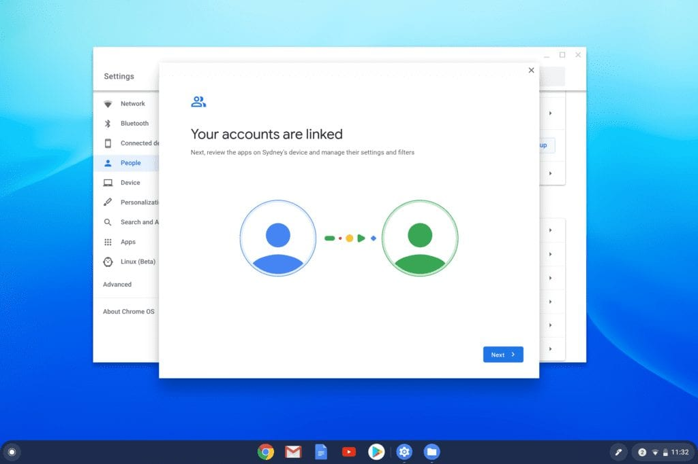

At this point, in order for your child's Google account to be Supervised on your Chromebook, they'll have to log out and then back in again.

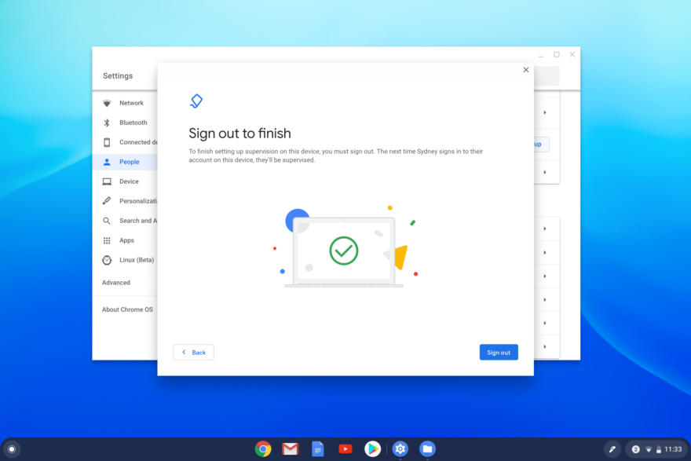

Once they do, they'll see this screen:

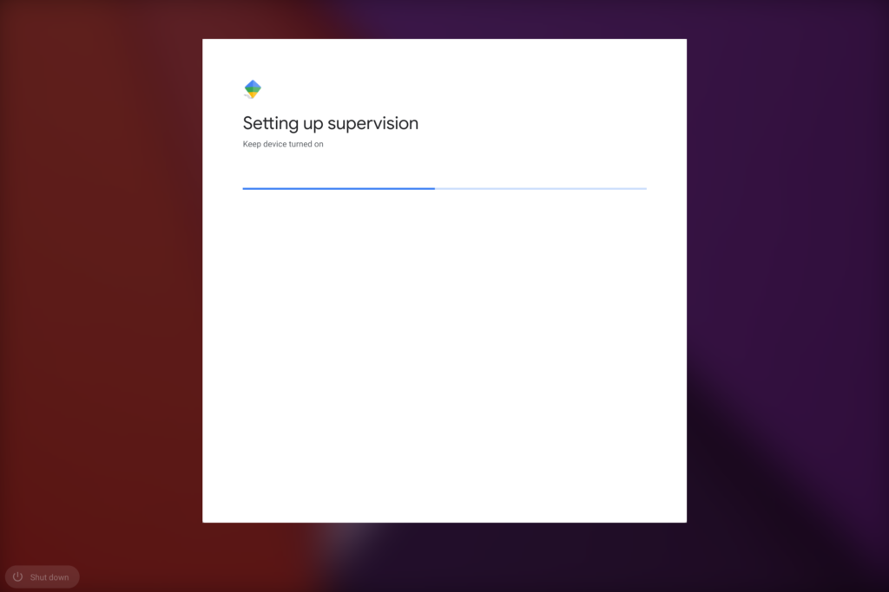

Upon completion of the supervision setup, your child will see that they are a "Supervised user" at the bottom left of the screen and they're good to go.

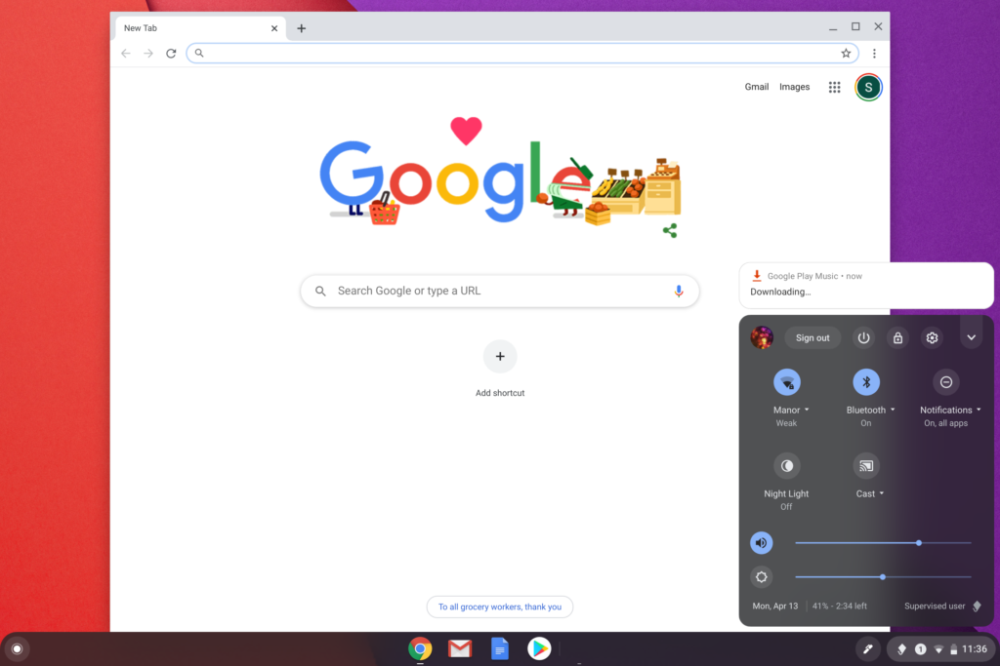

To modify any settings for the supervised account, you can use the Family Link app: Open it, tap on your family members to see the list of member accounts, tap your child's account and then select the "Remove Supervision" option.

Since there are differences for Google accounts with children under the age of 13, [you may want to hit this support page for further explanation of those](https://support.google.com/families/answer/7680868?hl=en).

Now you don't need to purchase another Chromebook and your child can access the sites and services they need for remote learning without any risk to your, or their, data getting co-mingled.

_Note: This post was originally published on April 13, 2020 and has been updated_
