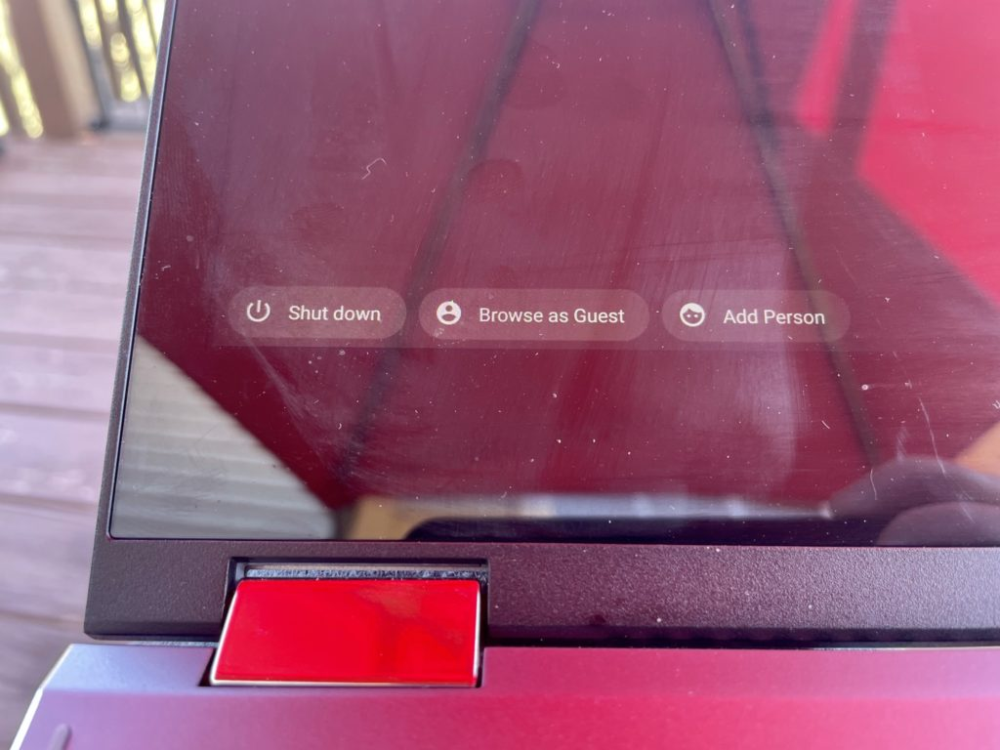
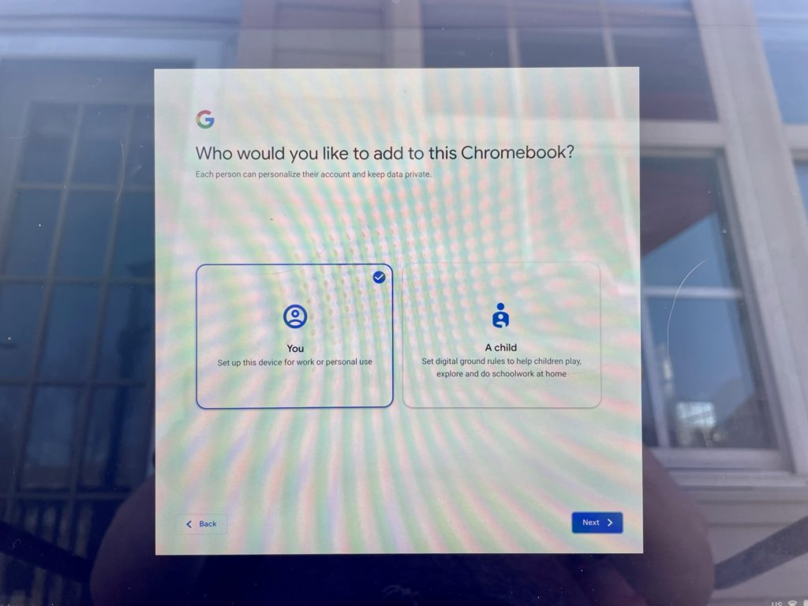

A few days ago, a reader reached out to me with a method to switch between two Chromebooks in the same household. He suggested using a Powerwash, which essentially resets a Chrome OS device to factory settings. Sure that would work if you wanted to, for example, switch two Chromebooks between two family members. But it's not necessary: You can just sign on on the swapped devices and go. That made me realize not everyone knows how to share a Chromebook by [using multiple user accounts](https://support.google.com/chromebook/answer/1059242?hl=en "https://support.google.com/chromebook/answer/1059242?hl=en").

Essentially, this process works the same way as it does on a macOS or Windows machine. So if you're familiar with those, this should be easy to understand.

One person, typically the first one to log in to a Chromebook, has Administrator rights.

That means if you wanted to you, you could actually disable sharing or even Guest logins on your device. But for sharing purposes, you obviously don't want to do that.

Instead, at the main login screen, which shows the primary or only user of a Chromebook, click the "Add Person" option at the bottom right.

You'll be greeted with a setup screen with the option to configure a home/work user or a child account.

Choose the appropriate option for the new user, realizing that child accounts have parental controls and other management options.

Sorry for the glare and moire pattern: I'm working outside today!

Assuming you chose the standard option, all that's left is for the new user to sign in with their Google account. The Chromebook will dedicate an encrypted profile and storage space for that account; users on the same Chromebook can't see each other's files.

After signing in, the second user's data, apps and settings will sync to the Chromebook as if they were the only user on a brand new device. So nearly all of their personal environment will appear on the Chromebook. Local files from any other Chromebook would not actually sync over.

This is one of the methods I suggested [for homes with remote learning students](https://www.aboutchromebooks.com/news/need-a-chromebook-for-elementary-school-remote-learning-consider-this-one-on-sale-for-149-99/ "Need a Chromebook for elementary school remote learning? Consider this one on sale for $149.99") when it was a challenge to find a Chromebook.

One device can work for multiple people in that scenario. Or for one when family members have their own Chromebooks but want to swap devices to try new hardware.

Note that when a Google account is removed from a device, all of the profile information and personal data is removed as well. So there's no worry that someone else will have access to your documents, files and other information if you decide to no longer use the device.
