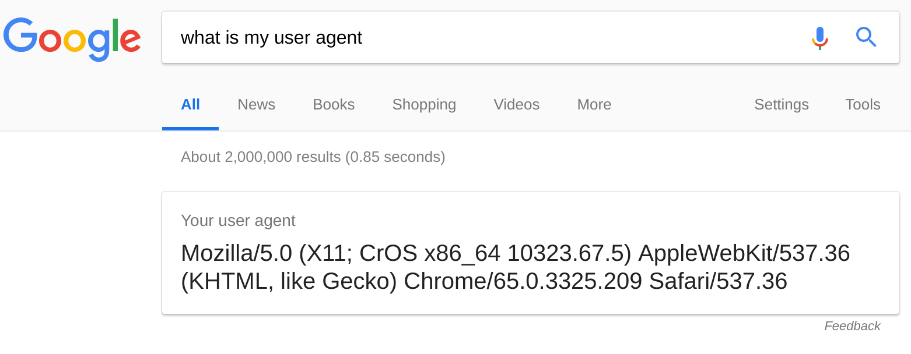
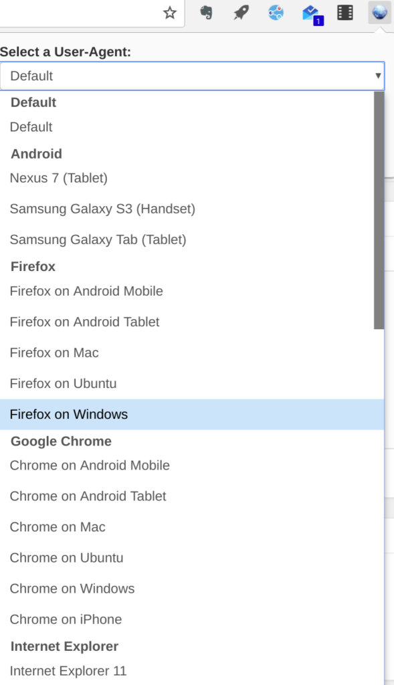

Have you ever used a Chromebook to watch online video or use a web app and it doesn't seem to work even though the same site works on the Chrome browser for Windows or MacOS? Seems strange, but it happens.

Often, the issue has to do with the user-agent text string that identifies your browser and operating system for online services. It's easy to determine your Chromebook's user agent with a Google query of "what is my user agent":

Some web sites are designed to work with specific browsers and platforms so the user agent information tells the service what device and browser you're using. That can cause certain sites and services _not_ to work on a Chromebook. I've seen this a bunch with streaming video services in particular.

But don't worry; you can easily "spoof" or modify the user agent of a Chromebook to make a website think you're using something other than the Chrome browser on Chrome OS.

The easiest way to do this on a Chromebook is to install the [User-Agent Switcher for Google Chrome](https://chrome.google.com/webstore/detail/user-agent-switcher-for-g/ffhkkpnppgnfaobgihpdblnhmmbodake/) extension.  It's easy to use and can help get around limitations for online services that were made or tested specifically for browsers on traditional operating systems.

Once the extension is installed, you simply click on it and choose a different browser, version or even operating system platform.

Want to make it look like you're running Firefox on a Mac or Windows PC? No problem.

Need to use a web app that hasn't been updated in ages and only works on an older version of Internet Explorer? You can do that.

Your Chromebook can even appear to web servers as an iPad running iOS or an Android tablet. There are bunches of choices and you can even create custom user-agent strings if needed.

Note that there is _similar_ extension developed by a third-party and now owned by Google called [User-Agent Switcher for Chrome](https://chrome.google.com/webstore/detail/user-agent-switcher-for-c/djflhoibgkdhkhhcedjiklpkjnoahfmg). It has the same general functionality but I don't recommend it because the user agent strings haven't been updated for some time. There's no support for Microsoft Edge, for example, and the Firefox version shows as 33; the latest is 64!

Regardless, changing the user-agent string can be super handy since many online locations still don't recognize the difference between Chrome on Mac or Windows and Chrome on Chrome OS. Some of them, [such as SlingTV](https://plus.google.com/+JaxonLee/posts/L9mvv9E6CJe), see Chrome OS in the user-agent string and simply don't work because the platform shown isn't supported.
