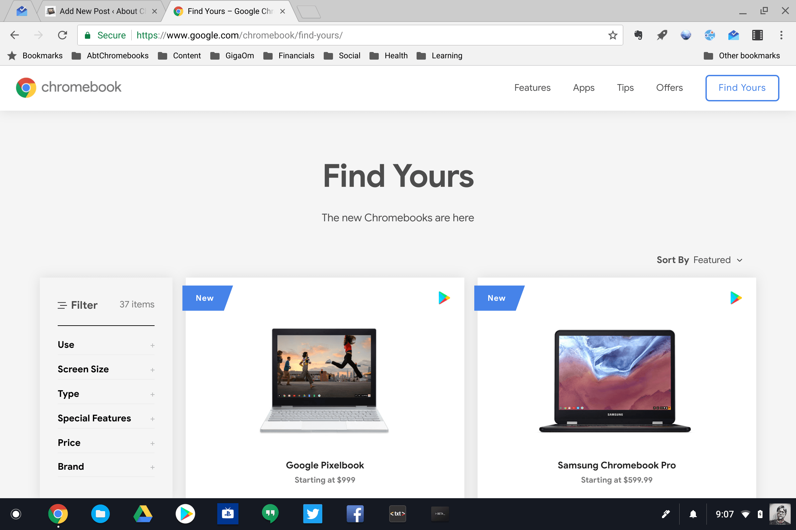
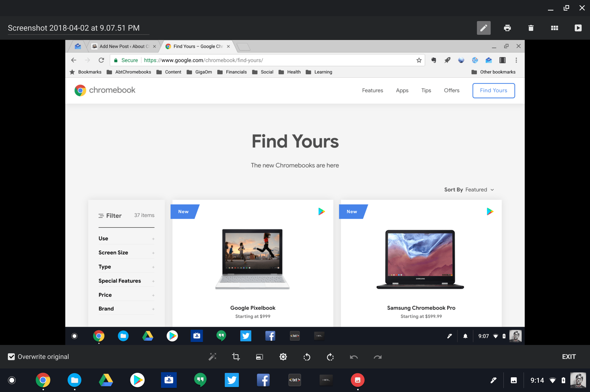

Taking a screenshot on a Chromebook isn't the most intuitive action to find but it's a simple shortcut away. Or rather one of two simple shortcuts, depending on if you want to snap a full image of your screen or a partial image.

To capture the full screen, just press the _ctrl_ and _switch window_ (typically above the number 5 key) keys on your keyboard at the same time. Alternatively, you can bypass the hardware keyboard altogether and click More Tools --> Take screenshot from the upper right Chrome menu. In either case, the screenshot will be saved as .png file on your local storage; you can find it in the Files app.

Here's an example of my full desktop on the Pixelbook:

Now what if you want to capture just part of the screen?

For this, you'll need to use a keyboard combination. In fact, it's the same _ctrl_ + _switch windows_ key combo but with the addition of pressing a _shift_ key. Doing this creates a little cross-hair style cursor, similar to a mouse cursor, on your screen. By left-clicking on your trackpad and moving the cursor, you can dynamically select which section of the screen you want captured.

Here's an example of a partial screen shot from the same web page in my above example:

This image also gets saved to your local storage and can be found in the Chrome OS Files apps.

Once you have your screenshot captured, it's easy to do basic edits by opening the image file from the Files app.

Using the options at the bottom of the screen, you can crop, resize, adjust brightness and contrast, or rotate the image. Keep in mind that if you took a full screenshot and meant to take a partial one, you can just use the crop tool in the native editor. There's no need to go back and take another screenshot.
