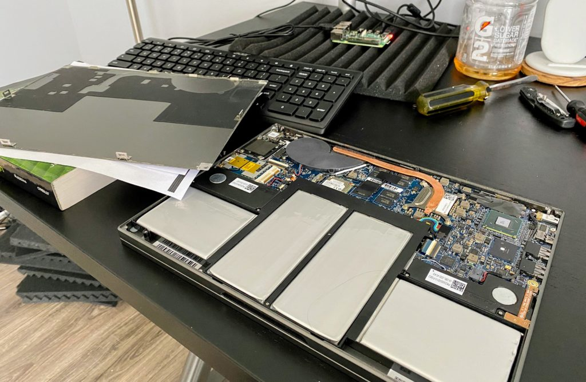
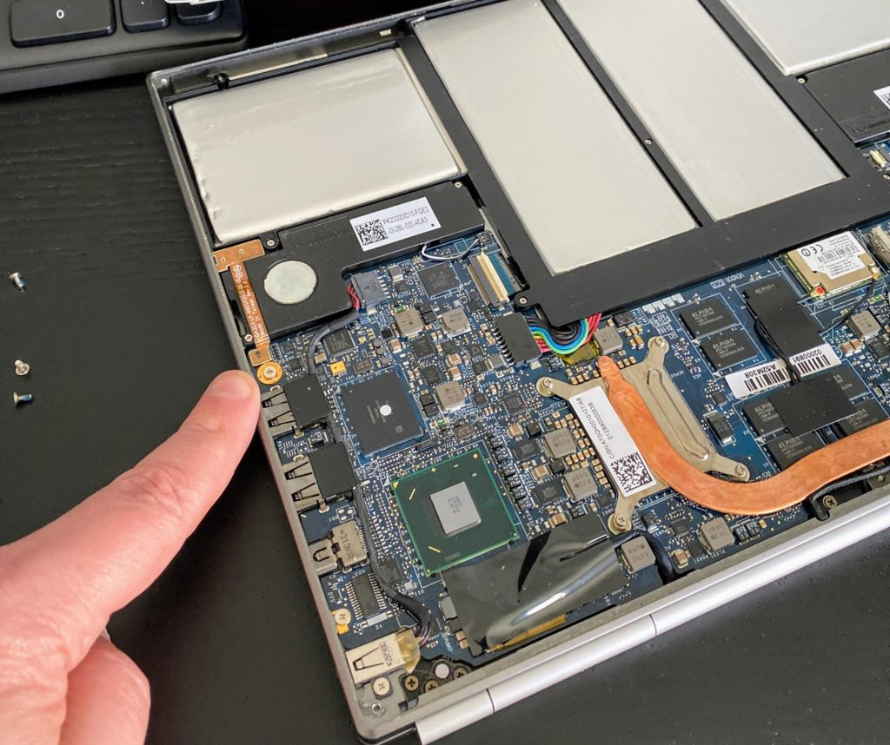
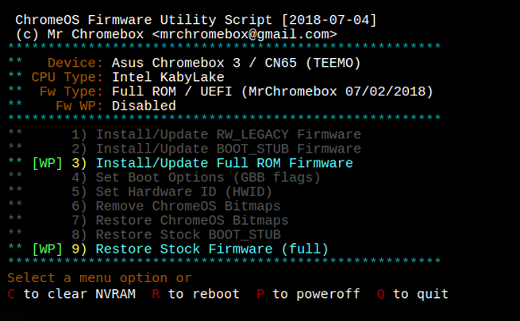
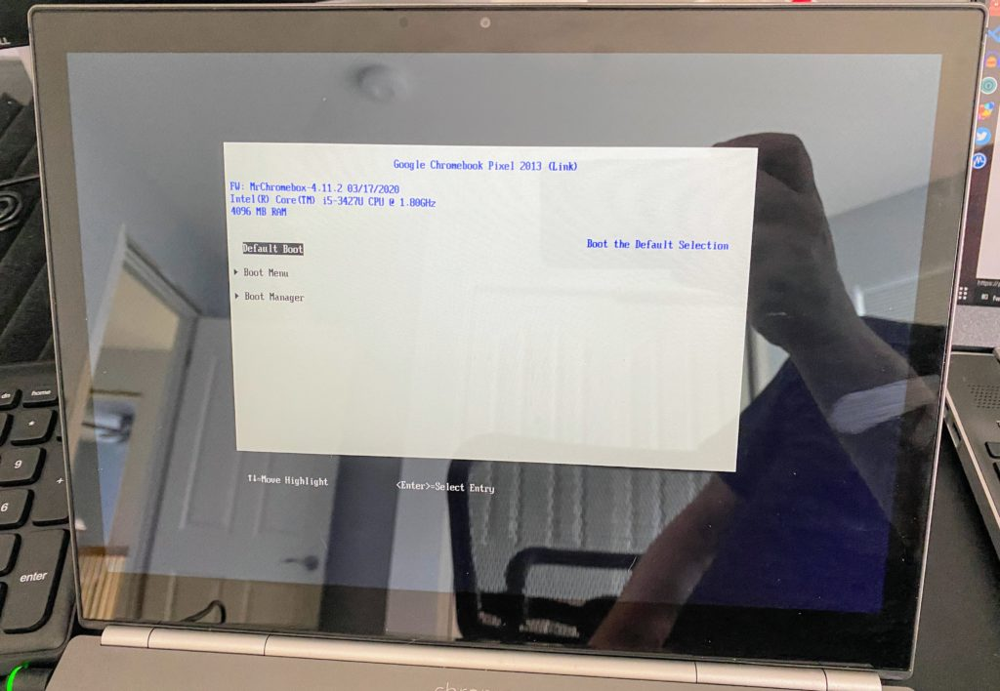
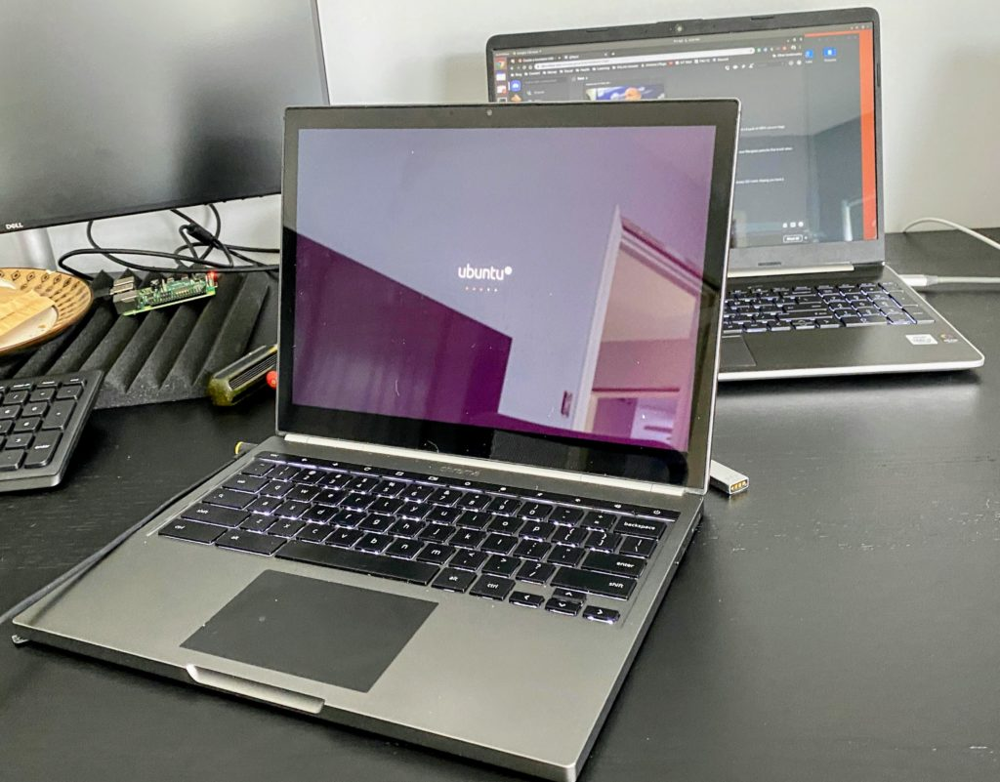

If you've visited the [Chrome OS subReddit](https://www.reddit.com/r/chromeos/), you've surely seen posts by Mr. Chromebox there. For several years, he's been the go-to authority for doing [major operating system and firmware changes to dozens of Chromebook models](https://mrchromebox.tech/) so you can natively install Windows or Linux on your device.

I haven't delved into this type of esoteric but useful project in a while but a CompSci classmate is thinking about switching from Windows 10 to Linux. So I dug around the closet where good Chromebooks go to collect dust and found the 2013 Chromebook Pixel I bought new seven years ago.

This is a perfect candidate for a Linux installation because the last software update pushed to it was Chrome OS 69. So it's _not_ the most secure device for browsing at the moment.

## Disable any write-protection

Before installing any firmware updates to support a different operating system, I had to crack open the Chromebook Pixel. Google put a physical write-protect screw on the motherboard and as long as that screw is in place, Chrome OS is the only game in town.

To open the laptop, I turned it over and carefully removed the four rubber pads that act as the "feet" of the Chromebook Pixel. They're stuck on with some light glue and are pretty easy to remove.

And they hide four screws that attach the bottom of the laptop to the chassis. It took all of ten minutes to remove the feet and the four screws, leaving me with this:

At that point, it took less than another minute to remove the write-protect screw. It would have gone quicker but that sucker was on super tight. Not all Chromebooks have one of these and use another method for protection, so if you ever go down this route, check [Mr. Chromebox's page listing of supported models](https://mrchromebox.tech/#devices) and see which your device uses.

For the 2013 Chromebook Pixel, it's this screw here, next to the USB Type-A ports:

With that screw removed, I simply reversed the disassembly steps: Put the cover back on the device, replace the four screws and finally, the four feet. I didn't even reglue them because they were still quick tacky.

## Enable Developer Mode

Next was to put the Chromebook Pixel in [Developer Mode](https://www.chromium.org/chromium-os/chromiumos-design-docs/developer-mode). Note this is _very_ different than switching to the Dev Channel of Chrome OS.

Developer Mode removes some boot security features and I wouldn't recommend using it for Chrome OS. However, to flash the BIOS and install another operating system, it's required in this case.

After I rebooted into Developer Mode and logged in to Chrome OS, the next step was to open up the old _crosh_ shell with the `CTRL+ALT+T` keyboard shortcut.

## Download and upgrade the firmware

That brings up a terminal-like browser tab, where you then execute the `shell` command. From here, it's a command to download and install Mr. Chromebox's Chrome OS Utility Script:

`cd; curl -LO https://mrchromebox.tech/firmware-util.sh && sudo bash firmware-util.sh`  

A few minutes after the download and install, I rebooted the Chromebook Pixel and was greeted by a menu similar to this:

From here, it's just a matter of choosing which firmware options you want to be installed. I opted for choice 3, was asked if I wanted my Chrome OS image backed up (I said no but you should probably say yes!) and the install begins.

After a reboot, I was greeted with a traditional BIOS settings screen: success!

## Install Linux!

At this point, the device is ready for an OS installation just like nearly any other computer! You're not limited to Chrome OS any longer.

Using another computer, I downloaded the latest Ubuntu LTS image on to an SD card since the 2013 Chromebook Pixel actually has a memory card slot. I changed the Boot Device options in the BIOS and restarted the Chromebook to boot from the memory card.

After that, it was a typical Ubuntu install. And if I had chosen Windows, I'd be off to the races with Microsoft's software from here on out.

Given that the 2013 Chromebook Pixel only came with 4 GB of memory and uses a third-generation Intel Core 5 processor, this won't be a performance powerhouse by any means. Just for kicks after installing Ubuntu, I ran an Octane 2.0 benchmark test and got a score of 9,379. That's probably about the same as or even a little lower than what a modern $250 Chromebook would score today.

But that's OK. This won't likely be a fulltime device for my classmate. She's just curious about the development experience on Linux as compared to Windows. And this will let her see the difference while also giving my trusty Chromebook Pixel a new purpose in life.
