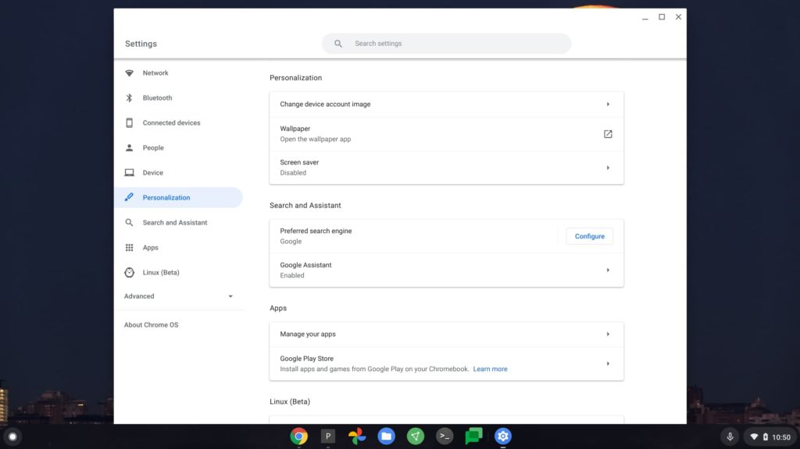
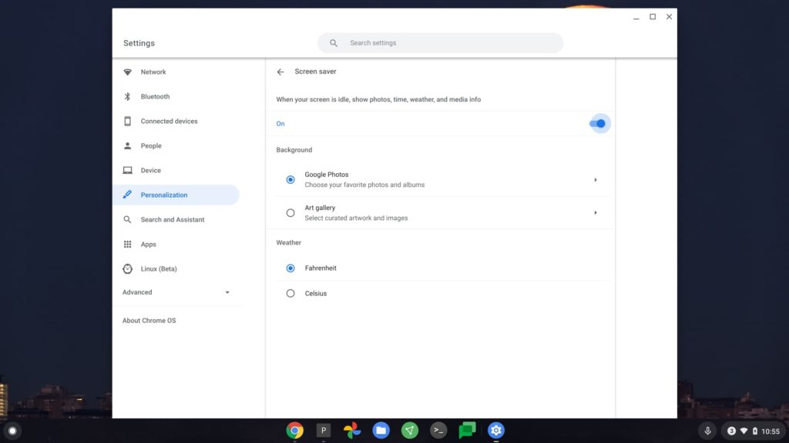
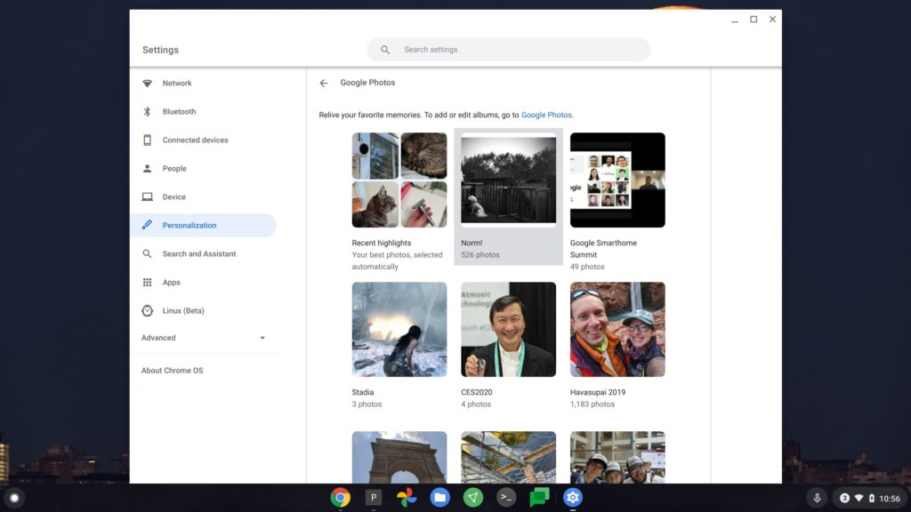
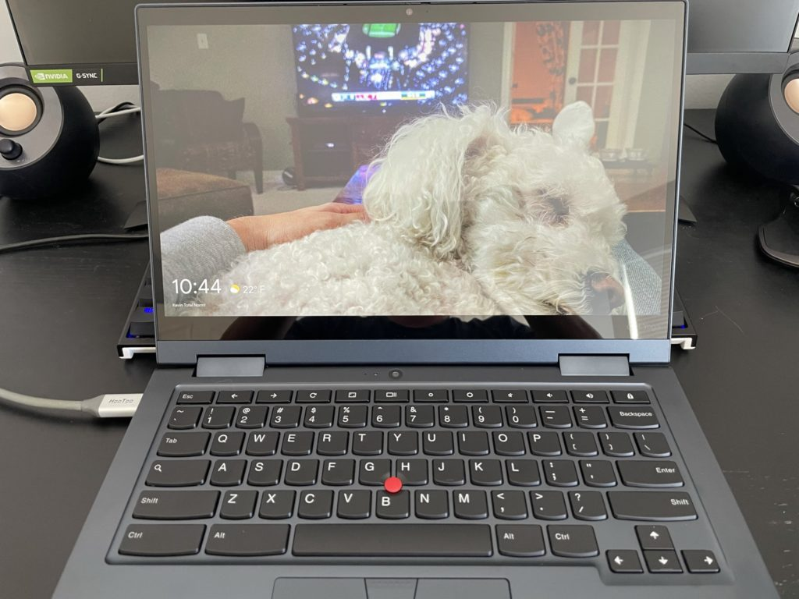

With [Chrome OS 88 having rolled out a few weeks ago](https://chromereleases.googleblog.com/2021/01/stable-channel-update-for-chrome-os_28.html), there are some nifty new features to try out on your Chromebook. One is a more personalized screen saver that ties into the same data Google Nest smart displays use. It's limited for now, but a great way to personalize your Chromebook.

To use it, make sure you have at least Chrome OS 88 installed, which should be available for most supported devices by now.

Then, hop into the Chrome OS Settings, look for the Personalization option, and click it.

You should see an option for your Screen Saver, which I suspect for many people is disabled. Tap it to see your options.

Here is where you'll see what Google added to Chrome OS 88: "When your screen is idle, show photos, time, weather, and media info." Sounds like the basis of a Google Nest smart display, no?

By tapping the "On" switch for your screen saver, you'll see ways to choose Google Photos images to appear when your device is idle. You can also choose if you want your weather to show in Fahrenheit or Celsius, as your Chromebook will display the temperature with the screen saver.

Just like I do with all of my Google Nest smart displays, I chose to use a Google Photos album for the images, which change every 2 minutes or so.

Yes, we have [an album with more than 500 pictures of our Bichon, Norm](https://photos.app.goo.gl/DRv4ARNwvm6We5Ed8). It's public if you want to view or use it. Or you can simply choose any single Google Photos image, or multiple photos if you'd prefer.

Once you've made your image choices, you're all set. Now it's just time for that Chromebook screen saver to kick in. You'll see your chosen image or album, along with the local time and temperature.

Ideally, I'd like to see Google add more Google Home features to the screen saver, even though you can always control Home devices through the Google Assistant on a Chromebook by voice or by typing commands.

My thought is that the screen saver could be used as a fully functional Google Home-like display via touching the screen when in screen saver mode. It wouldn't wake up the Chromebook with a screen tap but would instead wake it up with either the keyboard or trackpad.
