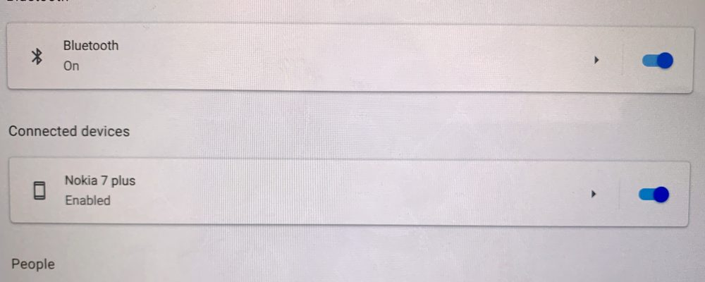

When Google introduced the [Instant Tethering feature that uses a connected Android phone as a Wi-Fi hotspot on Chromebooks](https://www.aboutchromebooks.com/news/better-together-bringing-instant-tethering-voice-calls-and-easy-unlock-to-chromebooks/), it was limited to Pixel devices as part of the "Better Together" functionality. With the latest Dev Channel version of Chrome OS 73, however, Instant Tethering works with some non-Pixel devices. For example, I'm able to use my Nokia 7 Plus Android One phone as a Wi-Fi hotspot with my Pixel Slate.

This feature hasn't been officially announced yet but Keith Myers discovered it in Chrome OS 73.0.3669.0, which was recently released. The [Dev Channel has since been updated to 73.0.3680.0](https://chromereleases.googleblog.com/2019/01/stable-channel-update-for-chrome-os_25.html), but the feature is still there.

To use it -- at least for now -- you may need to enable this flag: _chrome://flags/#instant-tethering_. Once that's done, just visit the Settings of your Chromebook and follow the simple steps to connect and verify your Android phone.

<iframe style="width: 120px; height: 240px;" src="//ws-na.amazon-adsystem.com/widgets/q?ServiceVersion=20070822&amp;OneJS=1&amp;Operation=GetAdHtml&amp;MarketPlace=US&amp;source=ac&amp;ref=qf_sp_asin_til&amp;ad_type=product_link&amp;tracking_id=aboutchromebo-20&amp;marketplace=amazon&amp;region=US&amp;placement=B07HD3QC65&amp;asins=B07HD3QC65&amp;linkId=ca2af4a94e4f47f30093866502775b0e&amp;show_border=true&amp;link_opens_in_new_window=true&amp;price_color=333333&amp;title_color=0066c0&amp;bg_color=ffffff" frameborder="0" marginwidth="0" marginheight="0" scrolling="no" align="right"> </iframe>

Note that this won't add a tethering plan to your handset; you'll need that in place prior before being able to use the Instant Tethering feature. And of course, you can manually set up a hotspot on any phone that supports it in order to connect your Chromebook to the web when there's no other Wi-Fi around. The Instant Tethering feature simply makes the process a little more seamless: When your Chromebook can't find a Wi-Fi network to get online, it will automatically use your phone's data connection for internet access.

There isn't a list of supported Android phones available, so I can't say if your particular device is or will be supported. However, folks have reported success with the Samsung Galaxy S9, the OnePlus 6T, and several other models, so it's worth a try if you're on the Dev Channel.

Keep in mind that the Dev Channel of Chrome OS is a work in progress, so you may encounter bugs that you haven’t see on the Stable Channel. And if you go back from the Dev Channel to the Stable Channel, there’s a good chance that all of your local data will be lost due to a Chrome OS Powerwash reset.
