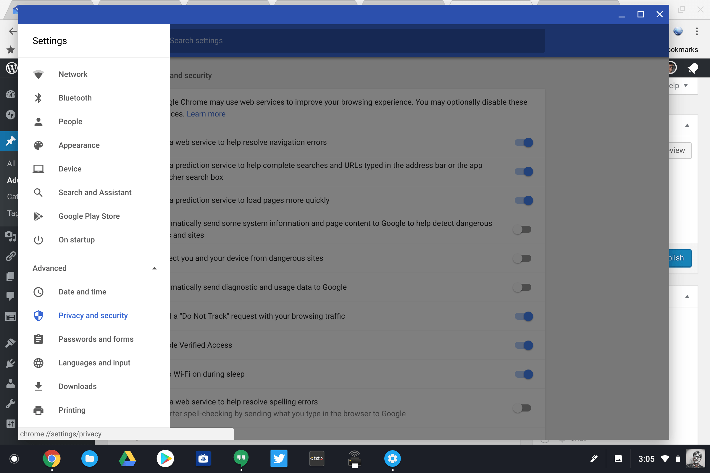
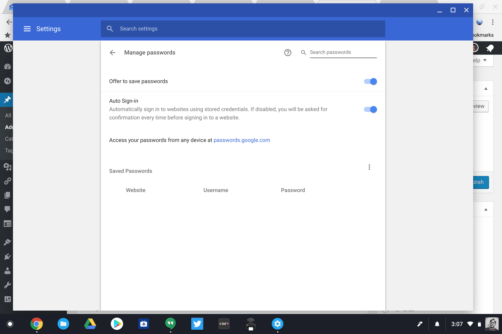
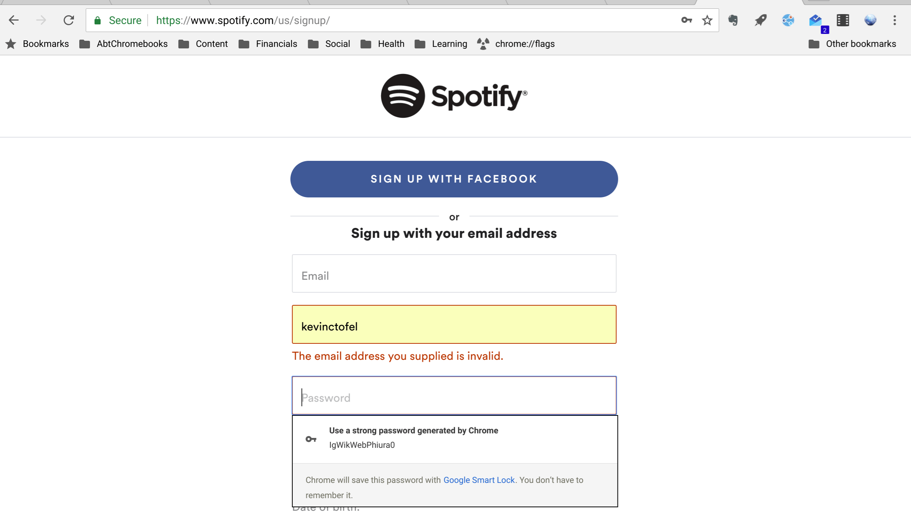

There are plenty of good third-party password managers, such as LastPass and 1Password, on the market and I highly recommend you use one. The idea is that the app or service remembers all of your passwords for you and they're accessible with a single master password. This way you only need to remember a single password. While some folks know that Google Smart Lock can do this for you on a Chromebook, not everyone knows that Smart Lock can actually **_generate_** strong passwords for you.

Obviously, you'll need Smart Lock enabled, which is easy to do. In the Chrome OS settings, scroll down to "Advanced" and then choose the "Privacy and Security" option.

Then look for the "Passwords and Settings" card. Here you'll choose the "Manage Passwords" option and so you can tell Google to manage your passwords.

Once this is turned on, you can have Smart Lock automatically generate a strong password for you on any website.

Typically, when you register a new account for an online service there's both a user ID and a password field. Enter the user ID of your choice but don't enter a password. Instead, right click on the password field and you'll see the option of "Generate password..." Choose that option and Google will both create the password for you and store it with Smart Lock so you don't have to remember it.

The new password will automatically be filled in when you visit that website again. Note that I've also seen Smart Lock automatically pop up on a password field when creating a new account, so in some cases you don't even need to right click.

Of course, if you want to see the password at any point in the future, simply navigate to [https://passwords.google.com](https://passwords.google.com). You'll be prompted to sign in first with your Google account and then you can see the list of cloud-stored passwords associated with Smart Lock.
