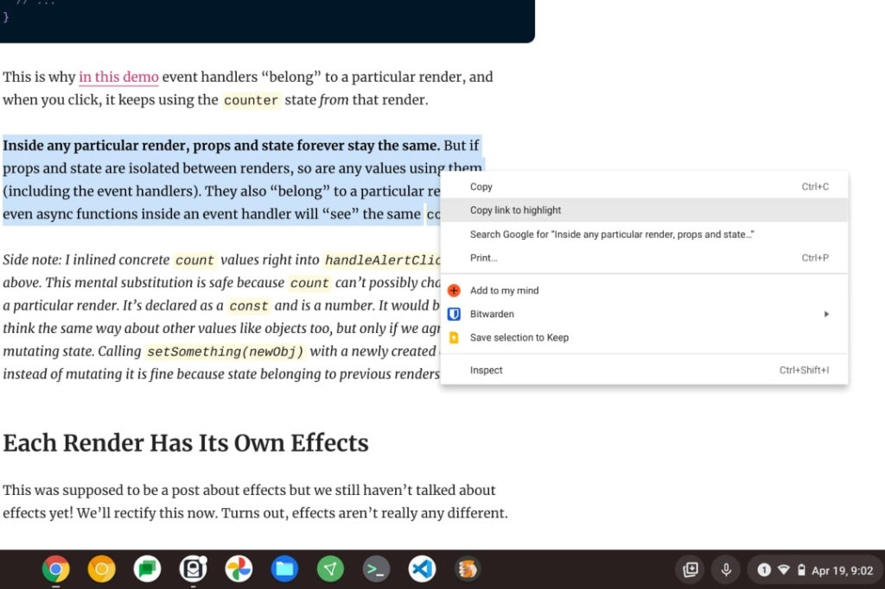

Once [Chrome OS 90](https://www.aboutchromebooks.com/tag/chrome-os-90/) arrives on the Stable Channel, Chromebook users will have a new option when copying web page links. Instead of getting a link to the page, users will be able to highlight any text on the page and [create a link that not only opens the page but also takes you _**right to the highlighted text**_](https://twitter.com/__apf__/status/1383187771271966724). The experimental feature is hidden behind an experimental flag for now. But if you're running either the Dev or Beta Channel of Chrome OS 90 on your Chromebook, you can use this useful function now.

Here's how.

On your Chromebook, navigate to chrome://flags/#copy-link-to-text where you'll see the "Copy link to text" option.

Choose Enabled in the drop down menu for this flag and then click the Restart button at the bottom right of your browser.

Now, whenever you find specific text on a web page you want to share, highlight the text.

Next, right click on the highlighted text to see the context-aware menu options.

Along with the standard "Copy" option, which only copies the text, you'll see a "Copy link to highlight" action. Choose it and you'll add a link to the page **_and_** the specific text you highlighted in your clipboard.

Here's the result of me opening the link that I just saved using the above example:

At this point, you can paste that link in an email or any other app that supports link sharing. When the link is clicked, the web page will open up right to the originally highlighted text, which will still be highlighted in the browser. Easy peasy!

I don't know that every Chromebook user needs this function but I definitely will.

I'm constantly sharing online development resources with my classmates, for example. (Before you ask: Yes, [I use a Chromebook for my Computer Science classes](https://www.aboutchromebooks.com/news/how-my-chromebook-is-getting-me-through-computer-science-college-classes/).) And many of these links point to extremely long articles or guides.

So more often than not, my peers ask me where the specific part that's going to help them with their coding assignment is on the page. Of course, that generates more emails or instant messages, which are distracting.

With the new copy to highlight feature, I can point them to the **exact** information I want them to see. :)
