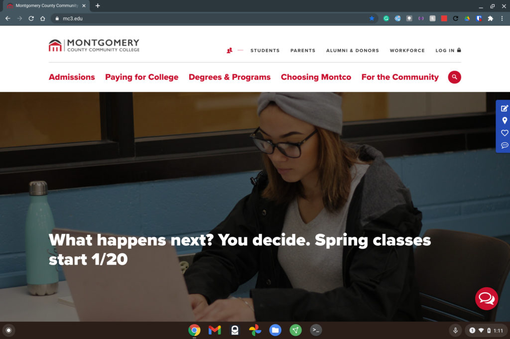
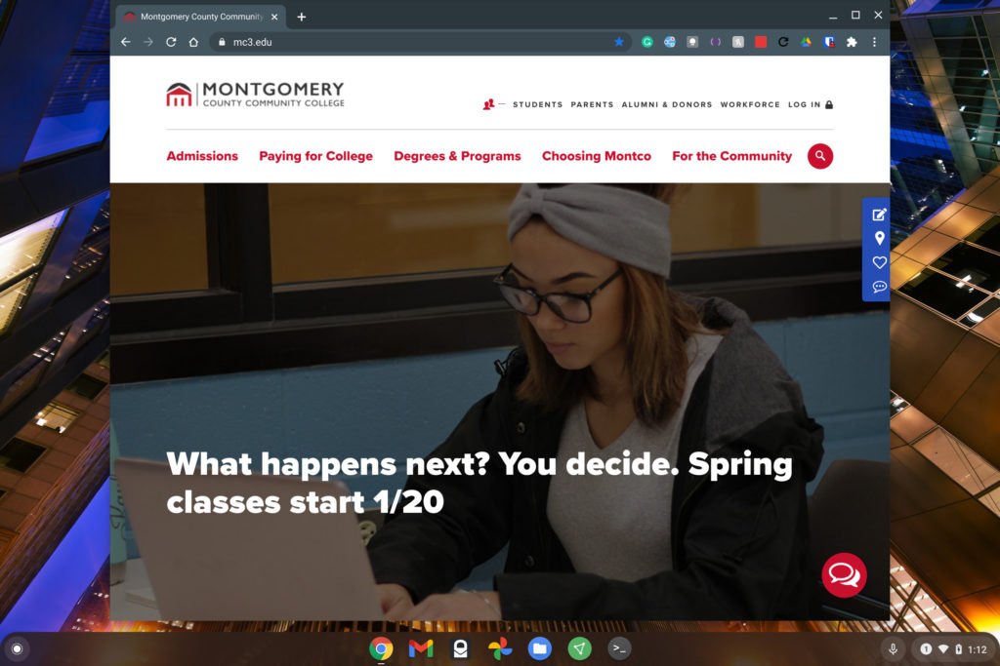
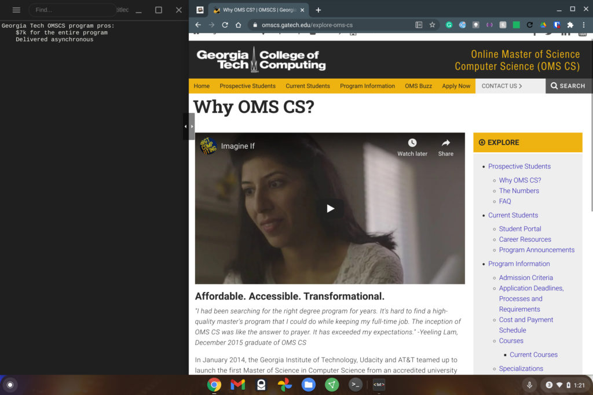

Given how long other operating systems have supported side-by-side app viewing, I'm surprised how many Chromebook users don't realize that Chrome OS supports the same feature. Not a month goes by where I don't get an email asking about this.

In Windows, this approach is typically called "Snap Assist" and it's easy to do on a Chromebook. I find it particularly useful on devices with 3:2 aspect ratios where you get more vertical content but it works on any Chromebook, regardless of the display ratio.

## Don't maximize your windows

First, you want to make sure that you're not using your browser or apps maximized; something I suspect most people asking me about split-screen mode likely do. If you can't see the desktop background or wallpaper on your Chromebook, you've maximized your current window. To undo this, just click the middle icon of the three in the very top right of your current browser or app.

Here's a before and after shot of my Chromebook desktop showing what I mean:

Before

After

## Snap to the left and snap to the right!

At this point, dragging any open browser window or tab to the left or right of the display will "snap" it into place, with it taking up half of the display. You can then drag any other window or browser tab to the other side where it snaps into the remaining half of the screen.

Here's an example of two separate browser tabs of when I was reviewing my current CS grades (3.81 GPA!) and researching requirements for future online Masters programs:

The above example is just that: An example. You could be using a text editor on the left and a browser for research on the right, or maybe be watching a video on one side and working in a Google Doc on the other. The point is, there are unlimited use cases for this type of split-screen experience.

## Customizing the size

Oh and one more tip: If you don't need an even 50-50 split for your windows, you can hover your cursor between the two. After a second, you'll see a left & right arrow icon appear. At that point, you can move the cursor left or right to expand or contract the windows as you see fit.

In the above example, I don't need my text editor to take up half of the display, so I've adjusted the windows to see more of the content I'm researching on the right.

[Click here for more Chromebook how to articles](https://www.aboutchromebooks.com/category/how-to/ "Click here for more Chromebook how to articles")
