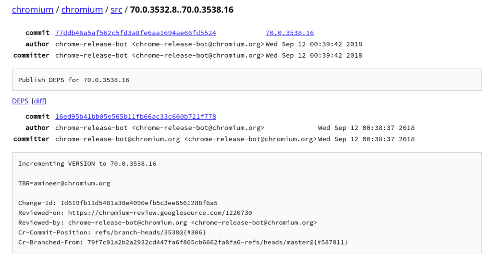
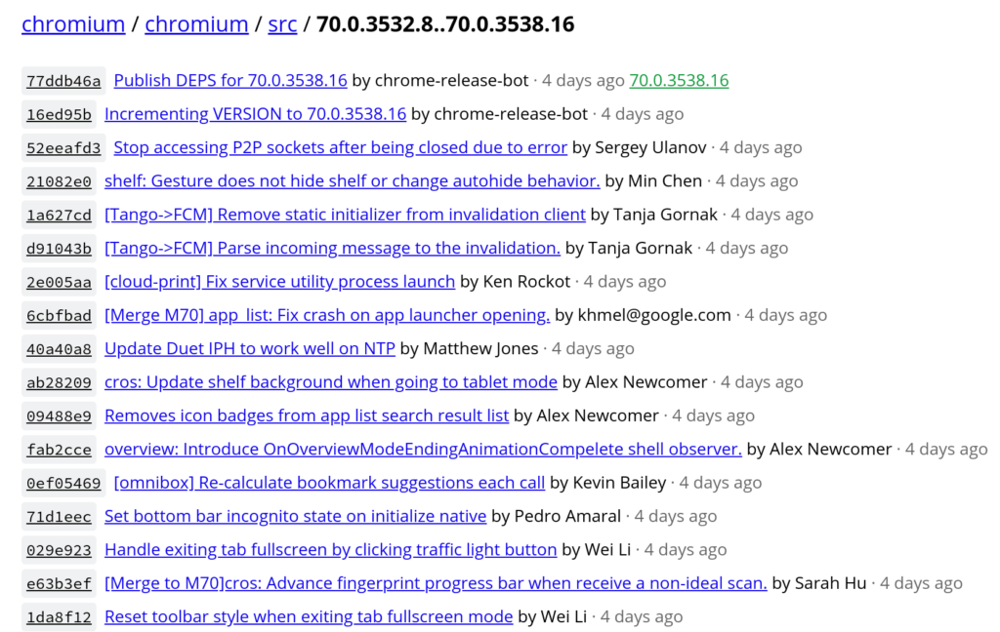

Although the [Chrome Releases blog](https://chromereleases.googleblog.com/) is a great resource to learn when Chrome OS versions are updated, it's a bit lacking when it comes to detailed release notes. That makes it nearly impossible to quickly see exactly what has changed. But there's actually an easy method to see what's different.

When an update is announced, you'll want to make note of the new version number. And you'll also want the current version from your Chromebook before you upgrade.

For example, this past Wednesday, the [Chrome Releases site announced a new Dev version](https://chromereleases.googleblog.com/2018/09/dev-channel-update-for-chrome-os_12.html): 70.0.3538.16. Prior to getting the update, my Pixelbook was running version 70.0.3538.8. So I wanted to see the differences between the two.

It's as simple as hitting this link, which shows only the different (or new) files in the more current version: [https://chromium.googlesource.com/chromium/src/+log/70.0.3532.8..70.0.3538.16?pretty=fuller&n=10000](https://chromium.googlesource.com/chromium/src/+log/70.0.3532.8..70.0.3538.16?pretty=fuller&n=10000):

Note that both the old and new version numbers are part of the URL. By changing those numbers, you can view the differences between _**any**_ two Chrome OS releases on the same channel.

Once you have the differences, you can scroll through to view specifics. If you'd rather see a summary list with clickable links on each change for the details, simply remove the "_?pretty=fuller&n=10000_" from the URL:

Sometimes the version announcements include the diff link for you, but more often than not, they don't. So bookmark the link between two versions and change them for any release so you can see what's new.
