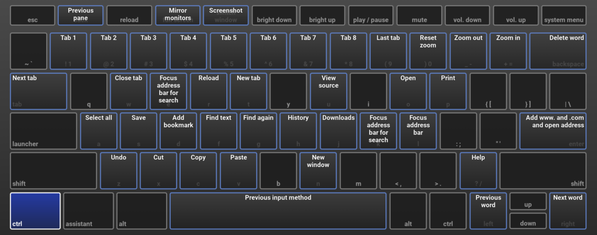
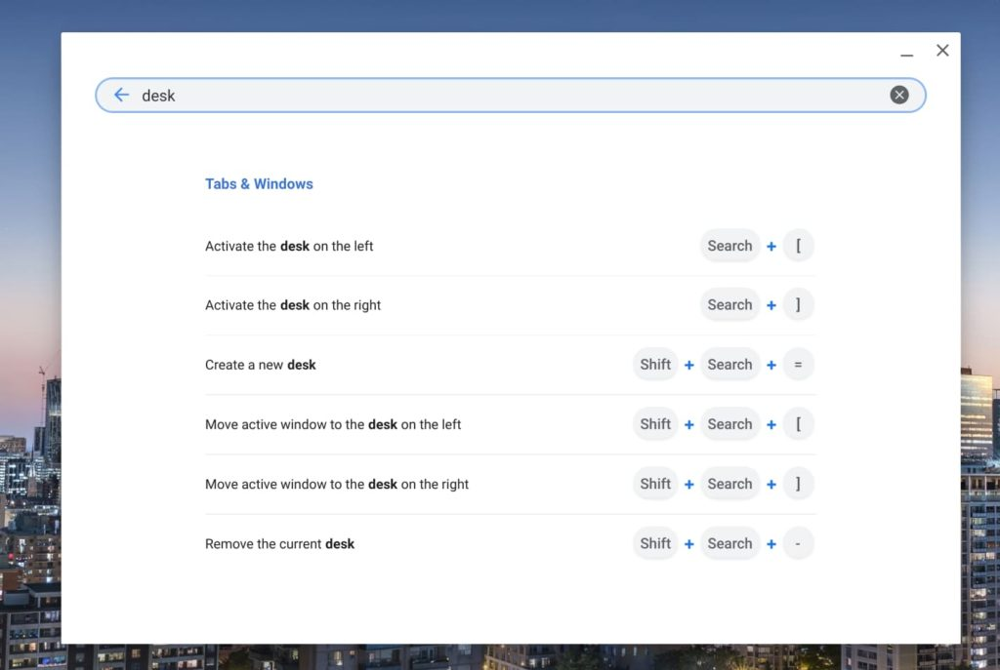

Over the years, viewing the keyboard shortcuts on a Chromebook has changed a little. Prior to 2018, for example, you could get a keyboard overlay to appear on-screen, showing the various time-saving key combos. These days, [the overlay is gone and the tweak to get that view doesn't work any longer](https://www.aboutchromebooks.com/how-to/how-to-get-the-old-on-screen-chrome-os-keyboard-shortcuts-back/). Luckily, it's quite simple to get a searchable list of all current Chrome OS keyboard shortcuts on your Chromebook. Here's how to view keyboard shortcuts on a Chromebook.

You actually **_use_** a keyboard shortcut to view your keyboard shortcuts. Tapping `ctrl + alt + /` does the trick.

I was actually a fan of the old overlay but to be honest, it now looks quite dated as you can see:

And I don't believe it was searchable, meaning you had to visually look for a shortcut, hoping you had the right naming for it.

That's one huge benefit of the current method: You can use the power of Google's search engine locally to find the shortcut you want. Keystroke combos are also grouped, which is another plus.

I recently got a question from an About Chromebooks weekly newsletter subscriber ([you can sign up here](https://mailchi.mp/555032463821/welcome)!) asking how to print the list of shortcuts.

I don't see a way to do that from the current implementation. However, if you hit up this [Google support page showing the list of Chrome OS shortcuts](https://support.google.com/chromebook/answer/183101?hl=en), you should be able to print it as needed. Since these can occasionally change, I personally prefer using the live, Chrome OS listing, but you'd rather have an analog version, you can do that too.

A word of warning: I don't see a "last updated" date on the support page. And the [keyboard shortcuts to use virtual desks aren't there](https://www.aboutchromebooks.com/news/chrome-os-78-will-bring-the-keyboard-shortcuts-to-virtual-desks-on-chromebooks/), for example, while they do appear in the list on my Chromebook running Chrome OS 85. Keep that in mind if you'd rather go with a print-out.
