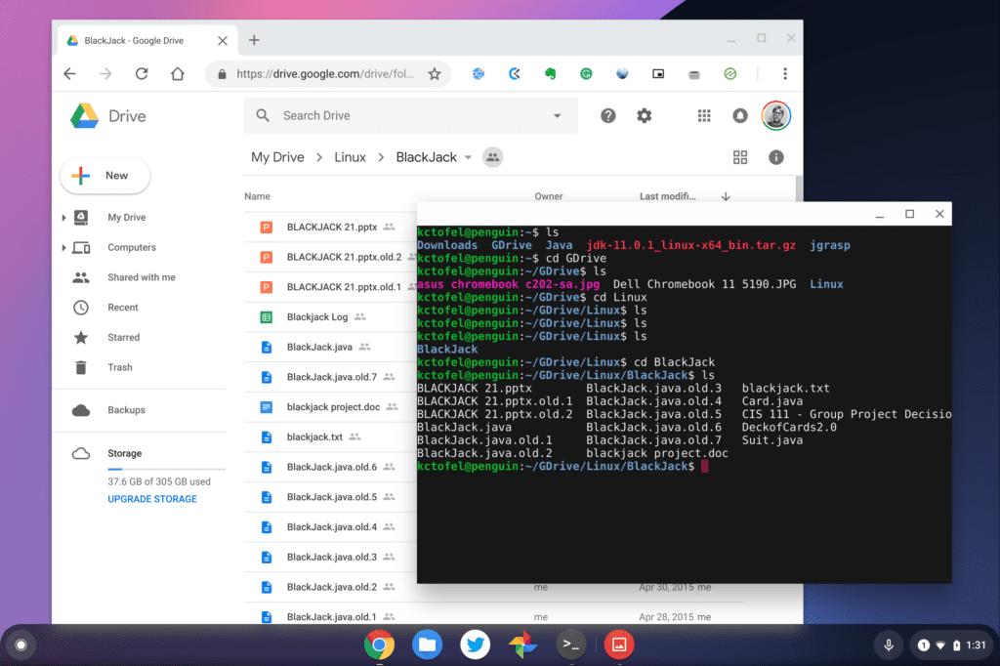

Regular Chromebook users know that the "you can't do anything on a Chromebook without the internet" myth is simply that: A myth. It's true that you may be _limited_ without that Wi-Fi or LTE hotspot connection. But that's the case for any software platform to a degree.

Don't believe me? Try sending a message in Slack on your Windows or macOS laptop without a connection. See, you're limited too. ;)

Working offline with a Chromebook can require a bit of planning, however. And my pal JR Raphael has a [great article with four strategies](https://www.computerworld.com/article/3410608/the-smart-workers-guide-to-using-a-chromebook-offline.html) to assist with that.

I don't want to steal the thunder from his useful and detailed article, but in a nutshell, here's what he proposes:

1. Prep your Google apps for offline usage
2. See what other apps you use provide offline access and functionality
3. Look to Android
4. Download content when you're online for later reading.

The article is definitely worth the read if you want details of how to implement the "offline Chromebook" strategy.

As good as it is, I'd add two more items to the list though.

Lean on Linux desktop apps if you can

[With Chrome OS 69, "Project Crostini" rolled out](https://www.aboutchromebooks.com/news/chrome-os-69-stable-release-project-crostini-linux-apps/) to supported Chromebooks bringing a secure Linux container to Chromebooks. I've written about [Linux on Chromebooks](https://www.aboutchromebooks.com/news/linux-for-chromebooks-101-getting-started-with-the-command-line/) quite a bit since then because I think it's the biggest advancement for the platform in several years. [I rely on it daily myself for development](https://www.aboutchromebooks.com/news/how-to-code-on-a-chromebook-crostini-pixel-slate/) and even if you're not a coder, you can still gain some benefits.

My reason to suggest looking at Linux for offline use is similar to JR's strategy of looking to Android apps: In many cases, offline functionality just works, even if data can't be refreshed without a web connection.

Maybe you want to edit photos or videos while offline. Or perhaps you want to play a desktop-based game. Whatever the reason is, I'm betting there's a Linux app you could download for your purposes. And again, the Linux container and all apps you install within it will run offline.

Share your Google Drive folder with Linux

[Chrome OS 73 added the ability to share your Google Drive folder with Linux](https://www.aboutchromebooks.com/news/chrome-os-73-dev-channel-adds-google-drive-play-files-mount-in-linux-usb-device-management-and-crostini-backup-flag/). It's a simple process to do -- right-click Google Drive in the Files app and choose "Share with Linux" -- and when in Linux, you can find the contents of your Google Drive at _/mnt/chromeOS/Google Drive_.

My Google Drive in Chrome OS and Linux

After enabling this share, any of the Google Drive folders or files that you've previously marked for offline use will sync to Linux, just as they would to the Chrome OS Files app.

This means you can work with the Google Drive files in full Linux apps while offline, perfect for editing those cloud-stored photos in a Linux app, for example. This also provides an offline method for editing documents if you'd rather not use Google Docs: [LibreOffice](https://www.libreoffice.org/) and [OpenOffice](https://www.openoffice.org/) are full-functioned apps.

With a little forethought and prep work, you can actually do quite a bit with a Chromebook offline. That wasn't the case in the early days of Chrome OS but the platform has continued to evolve.

Do you work offline with a Chromebook, and if so, what tips do you have?
