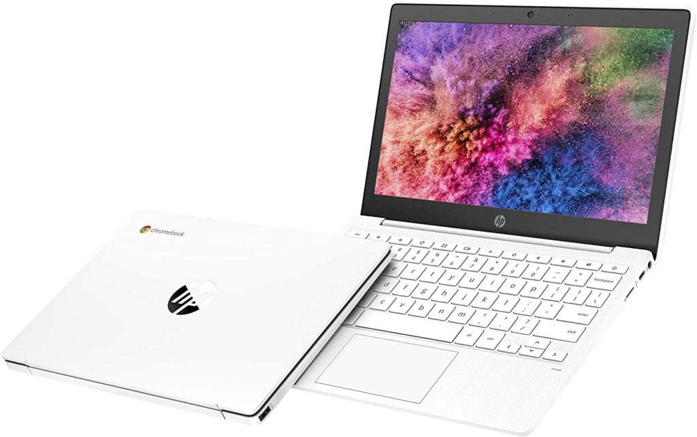
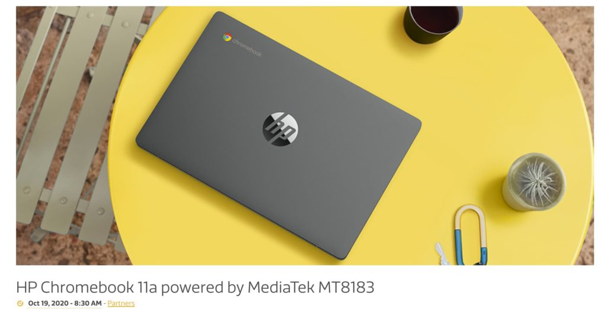
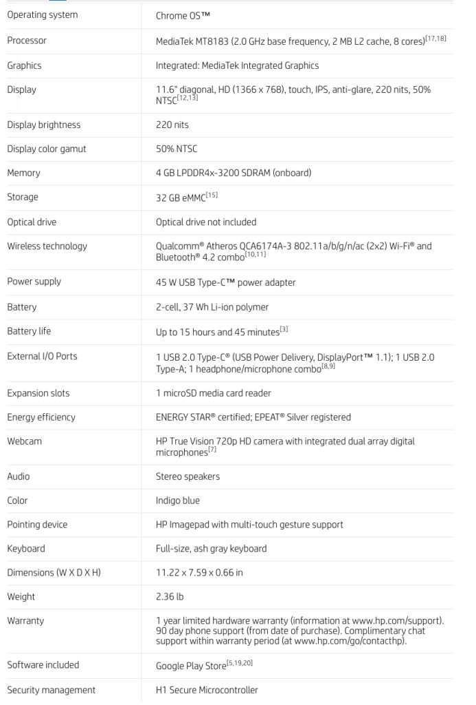
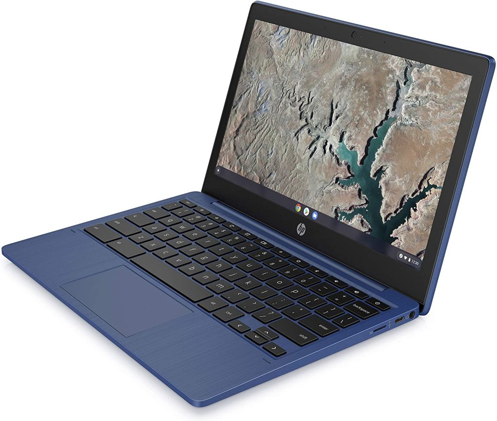

Did you know that a new HP Chromebook running on an ARM processor debuted last week? I didn't and I don't think many other folks did either. On Monday night, [Chrome Unboxed spotted the new HP Chromebook 11a](https://chromeunboxed.com/hp-debuts-companys-first-mediatek-powered-chromebook-for-259/) with a debut price of $259. That's actually a little less expensive than the [Lenovo Duet Chromebook](https://www.aboutchromebooks.com/news/lenovo-ideapad-duet-chromebook-review-2020/), which has the same MediaTek processor inside.

I never saw, and I still don't see, an HP press release announcing this device, even though you can [purchase it on the HP website for $259](https://store.hp.com/us/en/pdp/hp-chromebook-11a-na0060nr). However, [MediaTek actually put out a release on October 19, touting its MT8183 processor](https://www.mediatek.com/blog/hp-chromebook-11a-powered-by-mediatek-mt8183); the same exact chip in the capable Lenovo Duet Chromebook.

So at the base price, the HP Chromebook 11a is cheaper than the Lenovo Duet Chromebook and has a full-sized keyboard and clamshell form factor. It's an insta-purchase, right? _Not so fast._

While the performance of the MediaTek M8183 has proven to be very capable based on the Duet, HP isn't offering all of the same hardware features that make Lenovo's Chrome OS tablet a standout.

For example, you're not getting a bright, fullHD+ display with touchscreen on the HP. Instead, the 11.6-inch panel is 1366 x 768 resolution and only half the brightness as compared to the Duet. And while both MediaTek powered devices come with 4 GB of memory standard, the HP Chromebook 11a only has 32 GB of local storage.

By comparison, the Lenovo Duet Chromebook can be had with either 64 or 128 GB of storage capacity. The one saving grace here for HP's Chromebook is that it has a microSD card for additional storage expansion.

Here's a rundown of the full HP Chromebook 11a specs:

Although HP appears to be selling only an Indigo Blue model of the Chromebook 11a, I see that [Amazon is also selling it in Ash Gray and Snow White](https://amzn.to/2HBfZEm). However, some of the models there don't even have a touchscreen and are priced higher than HP's store since inventory is with a third-party seller. I'd go with HP direct if you're interested in buying.

And that gets me to who might be interested in buying the HP Chromebook 11a over the Lenovo Duet Chromebook since those are the only two Chrome OS devices with this MediaTek chip.

Students stuck with remote learning are be a good audience here. Having a true clamshell laptop is probably easier to manage than a tablet with a detachable (read: The dog ate my keyboard _and_ my homework) input mechanism. There should be enough horsepower for in-class video conferencing, Google Docs, and other educational web portals and video sites.
