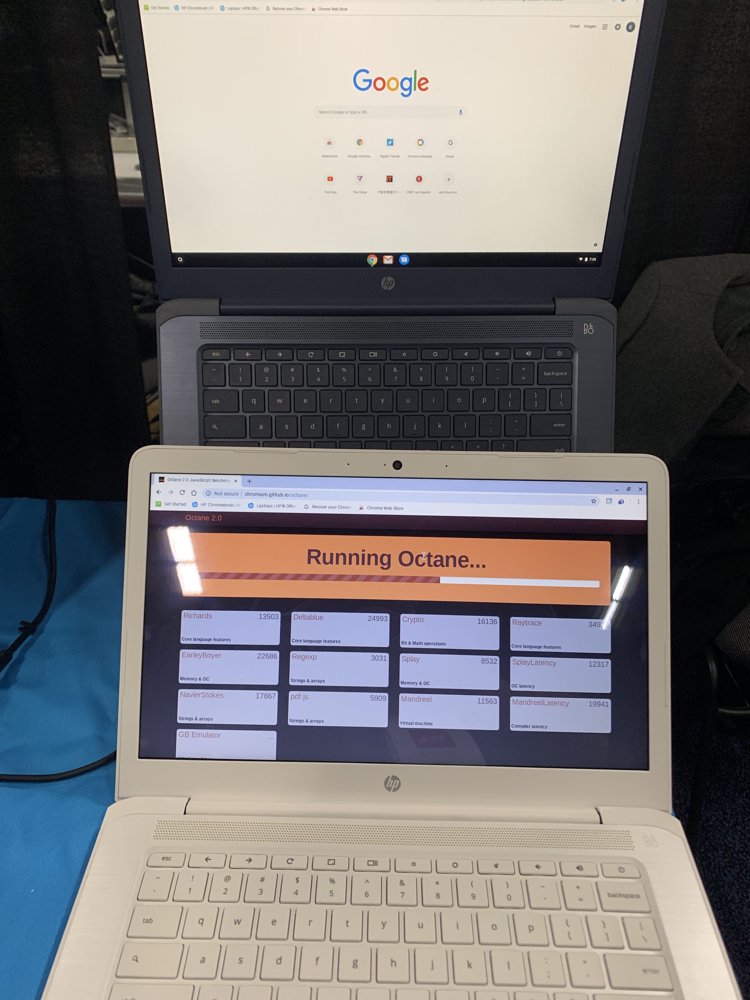

[Acer isn't the only Google hardware partner to add AMD processors to Chromebooks](https://www.aboutchromebooks.com/news/acer-chromebook-315-amd-radeon-r4-specs-price-availability/): The HP Chromebook 14 has one too, with a similar base model price of $269. There are several configuration options with respect to the display: The base model uses a 1366 x 768 screen, which can be had with or without touch and there's a full HD choice as well. For this price, you're getting a plastic chassis though, similar to the first HP Chromebooks, which I didn't mind when I had one about five years ago. Indeed, the edges are smooth and comfortable.

The big deal here is the processor, of course. Instead of choosing an ARM chip or one from Intel, HP worked with AMD to use its [2.2 GHz Dual-Core A4-9120](https://www.amd.com/en/products/a-series-processors-laptop) with Radeon R4 graphics. The GPU shares some of the 4 GB memory inside this device and I'm not yet sure how a dedicated graphics option will improve games; I'm hoping to get a review unit for testing.

I did get a few minutes of hands-on time with the new HP Chromebook 14, which will be available in two color options: A chalkboard gray model and one in off-white ivory.

As you can plainly see, I ran a quick Octane score on one of the devices. As I said yesterday with the AMD-powered Acer devices, don't expect Pixelbook performance. Based on benchmark results, this is more in line with an Intel Celeron Chromebook:

Don't get too worked up about the 13,977 Octane score. I wasn't able to use the HP Chromebook 14 in guest mode after a reboot, which is the ideal testing scenario for maximum scoring. I'd guess this device could see an Octane score of around 16,000 under ideal test conditions. But again, you're getting roughly the performance of an Intel Celeron / Pentium device; perhaps a bit more. However, a similar Chromebook with an Intel chip such as those will likely cost you $50 to $100 more, depending on other hardware specifications.

\[gallery type="slideshow" size="large" ids="2662,2663,2664,2665,2666,2667"\]

As far as the rest of the specs, [HP has a datasheet for the base model](https://press.ext.hp.com/content/dam/hpi/press/press-kits/2018/hp-at-ces-2019/datasheets/CB_14-db0020nr_r2_kc_40730_12-18-18.pdf), which strangely doesn't show the upgraded display or any other options:

- AMD 2.2 GHz Dual-Core A4-9120 with Radeon R4 graphics (fanless)
- 4 GB of memory
- 32 GB of eMMC storage
- 802.11ac Wi-Fi and Bluetooth 4.2
- Front-facing HD webcam
- 180-degree hinge
- Multi-gesture trackpad, no keyboard backlighting
- microSD card reader
- Dual speakers tuned by B&O (I couldn't get a feel for the sound quality due to crowd noise)
- 2 USB Type-C 3.1 ports, 2 USB Type-A ports
- Battery life expected around 9 hours
- A weight of 3.4 pounds
- Support for Android apps in the Google Play Store

If you're in the market for a mid-range or high-end Chromebook, this is not for you. If $300 or so is your budget range and you want a basic device for browsing and Android apps though? The new HP Chromebook 14 with AMD processor is worth the look when it arrives on sale in the coming weeks.
