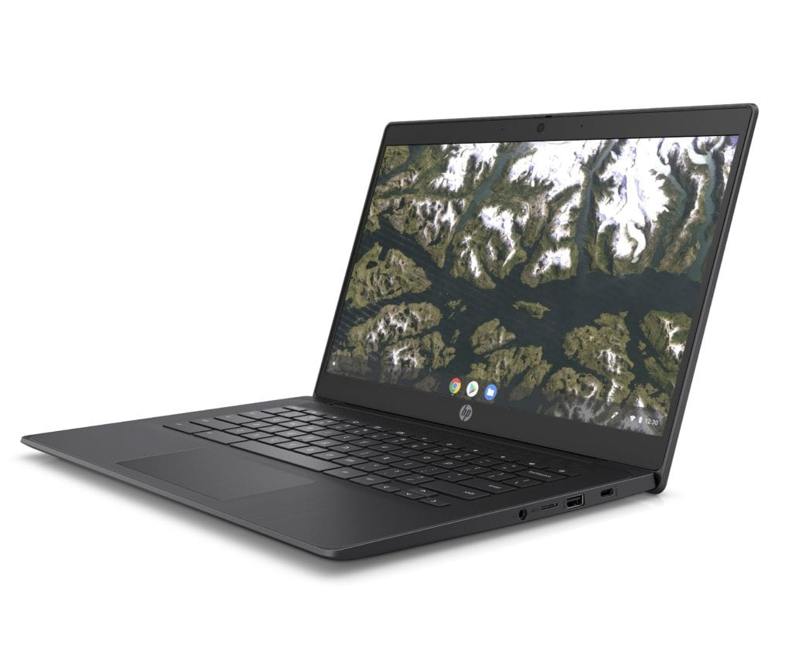
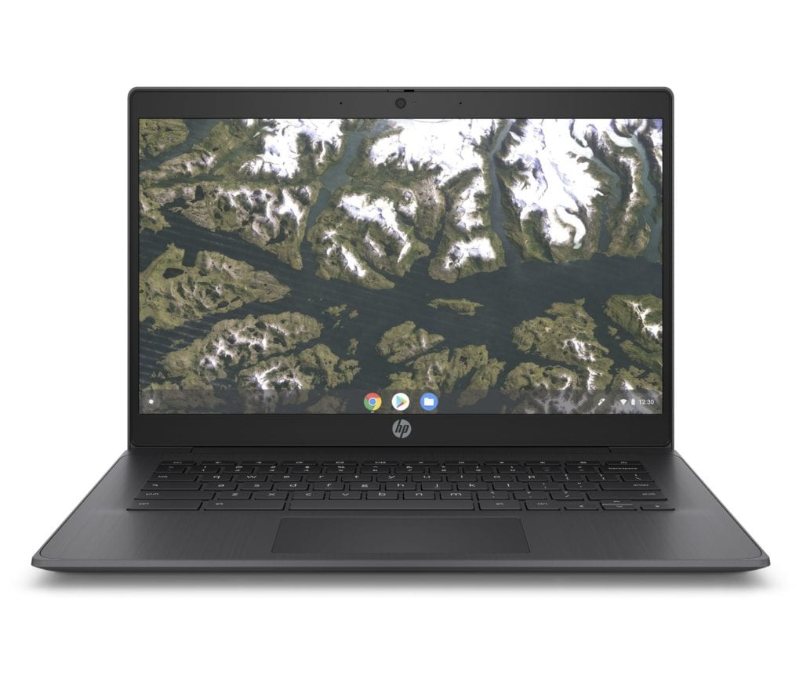
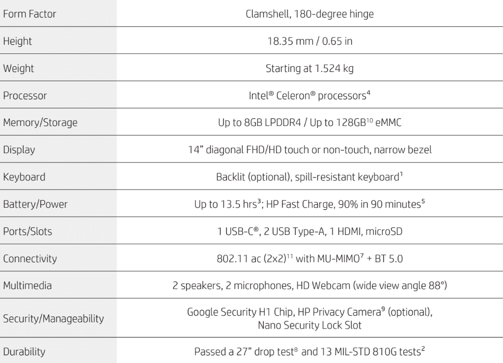
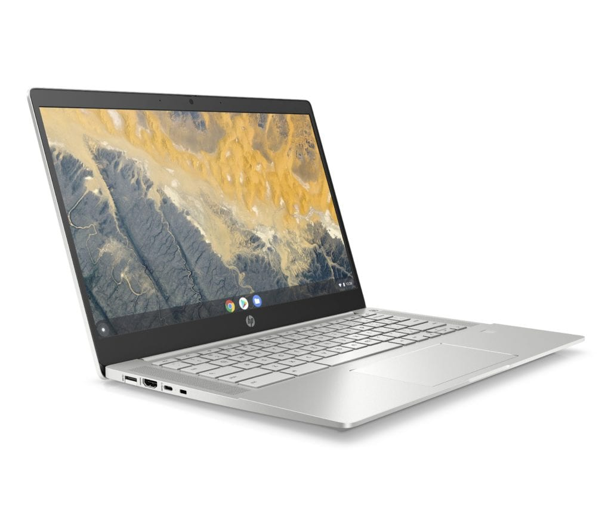
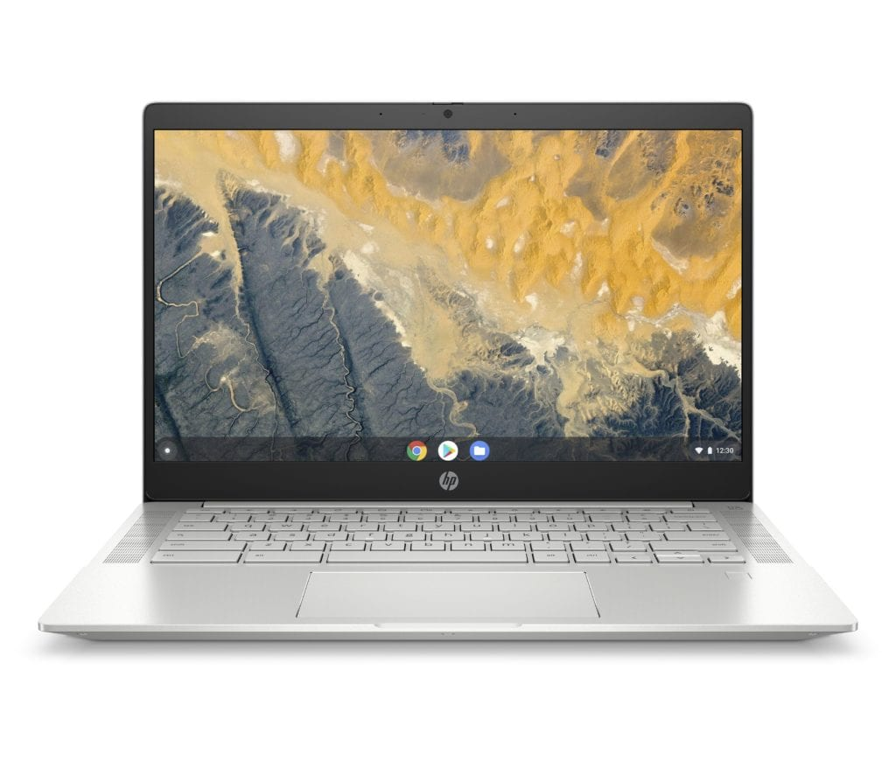
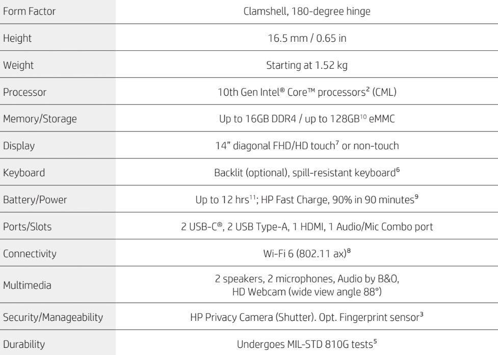
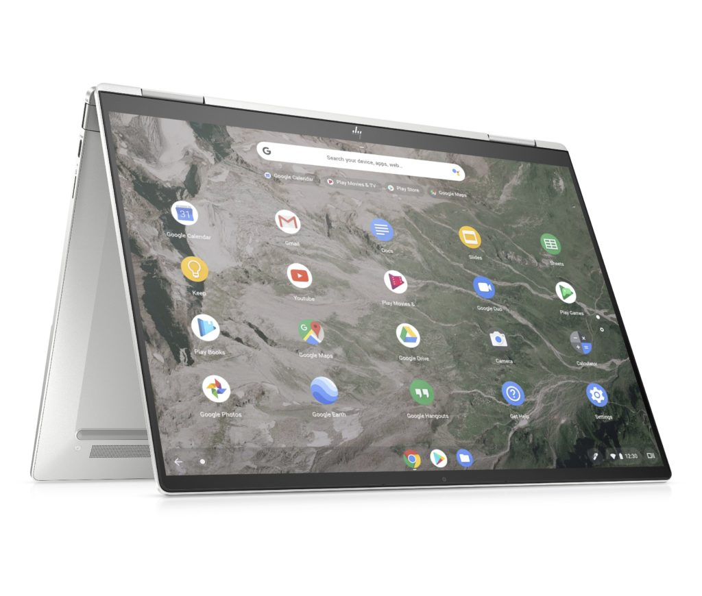
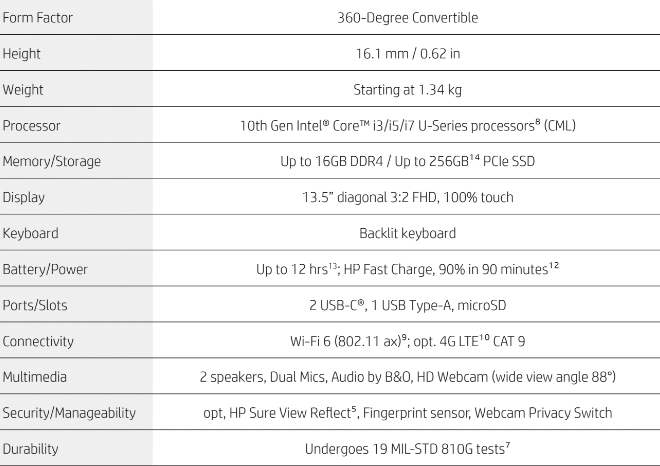
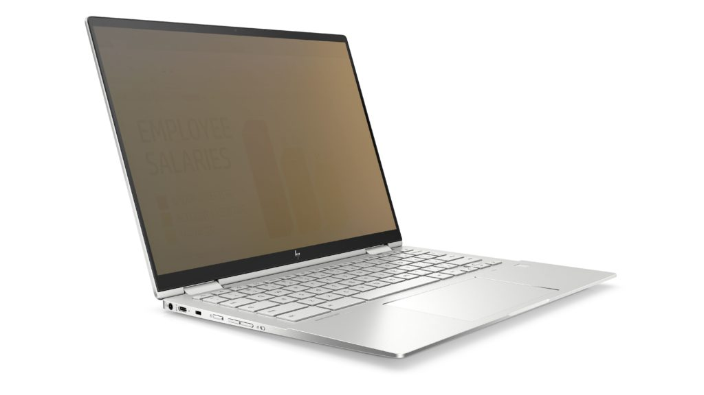

HP is no stranger to the enterprise market for Chromebooks, having launched several including the HP Chromebook G4 back in 2015. Today [the company introduced a trio of Chrome OS laptops](https://press.ext.hp.com/us/en/press-releases/2020/HP-innovative-cloud-based-devices-enable-productivity-anywhere.html), meant for three different types of business workers. Based on the design and hardware, however, I could see some consumer power users wanting to take a look too.

## HP Chromebook Enterprise 14 G6

First up is the HP Chromebook 14 G6, which HP says is available now, starting at $399. This ruggedized clamshell is targeted squarely at front-line workers that need mobility and the ability to share devices seamlessly. The G6 meets MIL-STD 810G standards, has been drop tested at 27-inches by HP, and has a wipeable keyboard.

For $399, businesses aren't getting the most powerful processing power, but then again, front-line workers -- front line heroes, HP calls them -- aren't likely doing computationally intensive tasks. Instead, they're tapping into a few web apps or remotely connecting to a virtual desktop for legacy software.

So the quad-core Intel Celeron inside paired with up to 8 GB of memory ought to be plenty of power. Internal storage can be configured up to 128 GB, which makes sense in the case of multi-user devices; while data can be stored in the cloud, local files for many workers can use up storage capacity.

Other highlights include at 14-inch 720p or 1080p display with either touch or non-touch options available, optional backlit keyboard, Wi-Fi 5 and Bluetooth 5.0, one USB Type-C port, two USB Type-A ports, microSD card slot, HDMI out, and a webcam with optional privacy shutter.

Perhaps the standout spec is the expected 13.5 hours of run-time on a charge. That's supplemented by HP Fast Charge, which the company claims to bring a dead battery to 90% capacity in 90 minutes. Also included is what the company calls HP Extended Range Wireless LAN, which looks to be dual channel MU-MIMO wireless capabilities; HP says it extends the Wi-Fi range by up to 30 percent.

## HP Pro c640 Chromebook Enterprise

Moving up the line is the HP Pro c640 ChromebookEnterprise, which looks comparable to mid- or high-end device, depending on configuration. This too has a 14-inch display with the same resolution and touch options but overall is thinner than the G6. HP says this is the thinnest 14-inch business Chromebook, at 0.65-inches.

Indeed, this device reminds me of the HP Chromebook 14 X360 in ways but is aimed at businesses. Specifically, HP says the Pro c640 is for "Cloud Native" workers who are also "Office Navigators". These are folks who multitask more than most and are often at a desk. Of course, the X360s display rotates 360-degrees; the Pro c640 screen folds back 180-degrees. And the X360 doesn't have those nice speakers alongside the keyboard like the c640.

This model uses 10th-gen Intel Core processors using the higher-performing U-Series chips found in a growing number of high-end Chromebooks today. The Pro c640 can be had with up to 16 GB of memory and 128 GB of storage, plus has a microSD card slot. Port selection is typical for this device class: Two USB Type-C ports, two USB Type-A ports, HDMI out, and a mic/headphone jack.

Unique here, however, is a small fold-down half-cover on the Type-A USB ports, which do offer a cleaner look.

Buyers also get the durability of the MIL-STD 810G testing standard including a spill-resistant keyboard, the improved wireless capability to Wi-Fi 6, an optional fingerprint sensor, and a physical privacy shutter switch for wide-view HD webcam. Also included is a Chrome OS Enterprise upgrade license as well as the HP Fast Charge feature.

Pricing is TBD when the device arrives in June.

## HP Elite c1030 Chromebook Enterprise

Last up may be the most interesting in that the HP Elite c1030 Chromebook Enterprise is a Project Athena device, just like the recently released [Samsung Galaxy Chromebook](https://www.aboutchromebooks.com/news/samsung-galaxy-chromebook-hands-on-yes-its-as-nice-as-it-looks/) and [Asus Chromebook Flip C436](https://www.aboutchromebooks.com/news/official-asus-chromebook-flip-c436-promo-video-confirms-asus-usi-pen/).

This is a fully-convertible device with small bezels and support for a USI stylus. Like the Pro c640, you get a range of 10th-gen Intel Core processors in the U-Series line. You can also include 16 GB of memory but bump the storage up to double that of the c640: Up to 256 GB of SSD storage.

HP says this is for the "cloud natives", i.e.; people who may already be tapping the speed, security and simplicity of Chrome OS and web apps. That sounds about right to me, both on the business and the consumer side.

So this is more akin to the high-end devices currently available on the market, with fewer corners cut. The backlit keyboard is standard, for example, as is a fingerprint sensor and touch display. Oh and that 13.5-inch display is 1080p with a 3:2 aspect ration; something I personally prefer for productivity in Chrome OS.

Just like the other two models, this Chromebook is built tough and includes HP Fast Charge. You'll also get Wi-Fi 6 and.... wait for it.... an option for integrated 4G LTE with either Verizon or AT&T in the U.S. Yay!

You do lose one of the Type-A USB ports and HDMI out found on the c640 but still get a pair of USB-C jacks here. And the Chrome OS Enterprise license is included on the software side.

There's one other interesting option, shown below, a one-press button to activate privacy on the display. While that's definitely a plus for business workers, I'm sure some consumer users of Chromebooks might appreciate it.

As far as pricing and availability? For that we'll have to wait until an August launch date as cost is expected to be made public near that time.

Overall, HP has done a solid job with the three Chromebooks, offering something for everyone in the business world. Given that two of the three devices come with Chrome OS Enterprise licenses, these are clearly meant to be purchased in bulk by companies.

Does that mean consumers won't get a chance to take them for a spin? Probably not, but don't expect these three Chromebooks to be on the shelves at Best Buy. You'll likely have to order from HP directly, which suggests to me that the costs could be higher than similar specified consumer models on the market today.
