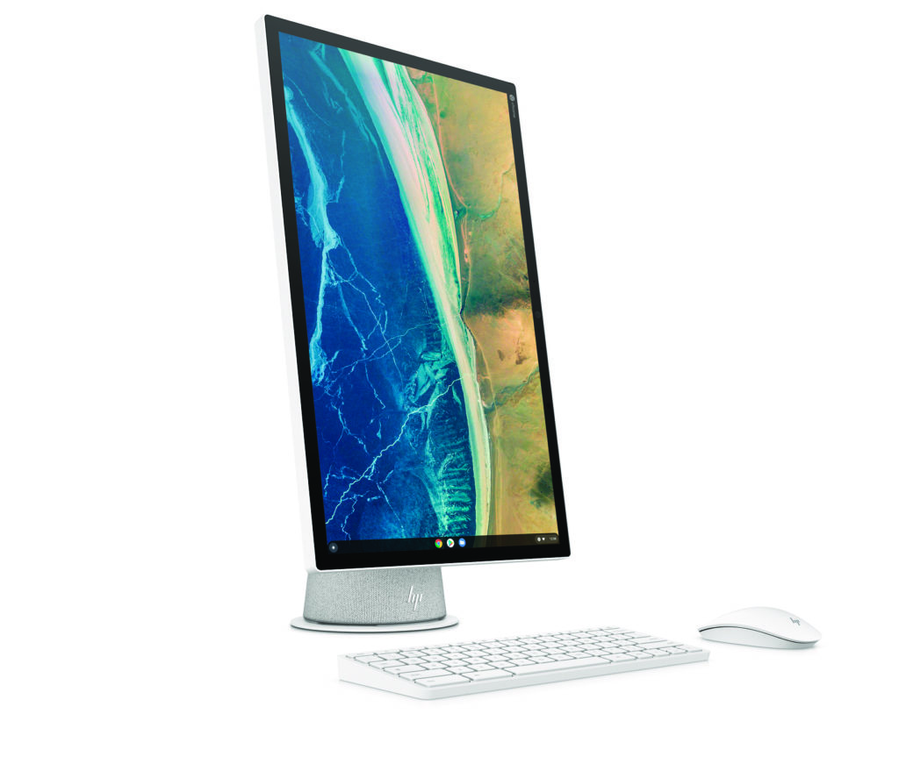

HP on Tuesday announced two new products, the [first detachable Chrome OS tablet with optional LTE and the first all-in-one](https://press.hp.com/us/en/press-releases/2021/hp-delivers-ultimate-chrome-os-experiences.html) Chromebase with a rotating display. The HP Chromebook x2 11 Chrome OS tablet is a modern take on the [original X2 from 2018](https://www.aboutchromebooks.com/news/hp-chromebook-x2-uk-price-availability/) and starts at $599 this month. It features the Qualcomm Snapdragon 7c compute platform and USI stylus. The HP Chromebase 21.5 has a fresh look too with its uniquely styled base and a 21.5-inch touch display that tilts and rotates. It starts at the same $599 price and is available this month directly from HP.

[The original x2](https://www.aboutchromebooks.com/news/hp-chromebook-x2-arrives-as-the-first-detachable-chromebook-tablet/) was a favorite of many as it housed all of its hardware in the removable display. The new HP Chromebook x2 11 does the same but in a thinner, sleeker design. You'd be forgiven if this tablet reminded you of an iPad as a result.

The 11-inch multitouch IPS display provides a 2160 x 1440 resolution in a 3:2 aspect ratio. And it works with any USI digital pen, including the one that comes with the Chrome OS tablet.

That $599 starting price also includes the detachable keyboard, which magnetically attaches to both the bottom edge of the display and the front bezel. That should make for better laptop stability when typing over competing Chrome OS tablets. Inside is the first-generation Qualcomm Snapdragon 7c, 4 GB of memory, and 64 GB of eMMC storage.

Don't sweat it if you want a little more RAM though. I already see that for $30 more, Best Buy is offering a [configuration with 8 GB of memory here at $629](https://www.bestbuy.com/site/hp-11-touch-screen-chromebook-qualcomm-snapdragon-8gb-memory-64gb-emmc-natural-silver-shade-gray/6471017.p?skuId=6471017).

HP included a pair of USB Type-C ports, although both are on the left side. That's also where you'll find a volume rocker and the SIM/microSD slot to use that integrated LTE modem option or expand storage. The right side includes a magnetic attachment to hold the USI stylus. There's also a fingerprint reader for easy login and authentication

There's a 5MP wide-view camera for video calling, and an 8MP wide-view rear camera for traditional image captures. The dual speakers are B&O tuned. With the attached keyboard, the entire package weighs just 2.57 pounds and, according to HP, runs for a tad over 11 hours in mixed usage.

Personally, I would have liked to see the [newer second-gen Qualcomm Snapdragon 7c](https://www.aboutchromebooks.com/news/chromebooks-with-qualcomms-snapdragon-7c-gen-2-to-eke-out-more-performance/) powering this Chrome OS tablet. However, this device has been in the works for well over a year and it likely wasn't feasible to make that hardware change to meet this availability timeframe.

Here's the full spec sheet of the base model:

Next up may be the more interesting product, mainly because we haven't seen a new Chromebase since I was at Google. Back in 2016, I was on the team that brought the Acer Chromebase to market, and now, over four years later, the HP Chromease 21.5 is here. People email me all the time asking when the next all-in-one Chrome OS device is coming; frankly, I didn't think we'd see any more.

Yet, HP is giving it a go and I like what I see.

This product stands out in two ways to me. Besides being something that looks like it's from 2021, the base houses both the B&O speakers, as well as ports, tucked in the back. And that 21.5-inch 1080p touch display can be rotated 90-degrees, which is super handy for reading long pages. Or for writing code, [which I do for school.](https://www.aboutchromebooks.com/news/linux-on-chromebooks-just-might-get-me-through-a-masters-in-computer-science/)

You're starting out with a Pentium Gold 6405U processor in the base model, not the newer Pentium Gold 7505 which I've [already seen is quite performant](https://www.aboutchromebooks.com/news/hands-on-lenovo-ideapad-5i-chromebook-first-impressions/). That also gets you 4 GB of memory and 64 GB of storage. Additionally, this device has a pair of M.2 slots with only one in use by default. You could add more storage with a speedy M.2 SSD card!

HP will offer configurations with a 10th-gen Core i3 and up to 16 GB of memory for people who want more performance.

Ports aplenty are in the back: There are 2 USB Type-A and 2 USB-Type C slots to choose from. The front camera has a large 5MP sensor and includes a privacy shutter, which also deactivates the internal microphone.

Overall, this is a superb design even if the internals feel slightly behind the times. [HP is already offering some configurations directly on its site here](https://www.hp.com/us-en/shop/pdp/hp-chromebase-all-in-one-22-aa0050t-2z1z3av-1) with additional retail availability to follow. Here's a full rundown on the base model to give you an idea of what to expect.

