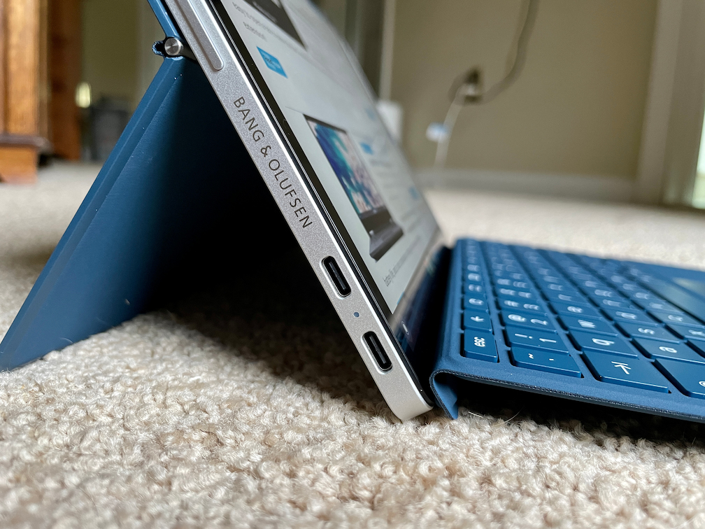

Although it's been [available at retail stores for about a month](https://www.aboutchromebooks.com/news/the-599-hp-chromebook-x2-11-is-already-discounted-33-down-to-399/), I've only just taken a first look at the HP Chromebook X2 11. HP loaned me its newest Chrome OS tablet a few days ago. I haven't spent too much time with it but I do have some first impressions.

Some are really good. And some are... really bad.

Obviously, I'll need more time using the HP Chromebook X2 11 before sharing a full review. So even though my aging eyes are used to Chromebooks with a larger display, I'll be using this Chrome OS tablet as much as possible in the coming days.

For now, though, let's get to my initial thoughts.

## HP Chromebook X2 11 hardware: The good so far

Overall, the hardware looks fantastic. This 11-inch tablet is solidly built and well designed. It's leaps and bounds better than any of the other few Chrome OS tablets on the market to date. I do wish HP had placed one of the two USB Type-C ports on each side of the tablet, but hey, that's life. At least there are two!

From a design standpoint, the X2 reminds me very much of the iPad Pro 11 that I've been using for the last two years. At first glance, it's easy to confuse the two devices. It's not until you look at the placement of ports, speakers, and the camera that you realize this isn't an iPad Pro 11; it's the HP Chromebook X2 11.

Personally, I think that's a good thing as I generally like Apple's iPad design. Actually, Apple should take a cue from HP and put the front-facing camera on the horizontal bezel like it is on the X2. Landscape mode for video chatting, please.

The hardware buttons, including the fingerprint sensor on the power button, are all working fine for me. I do like logging into Chrome OS with the touch of a finger. So far, the speakers are decent but not amazing by any stretch.

The display, however, is excellent. It's a 3:2 aspect ratio with 2160 x 1440 resolution. The panel provides 100% of the RGB color gamut and has 400 nits of brightness. It is a treat to look at anything on the screen.

And the included magnetic kickstand with its fully adjustable angle is useful for watching content hands-free anywhere you are. Note that with the default Chrome OS scaling, you're essentially getting a 1200 x 800 experience. I'll have to compare that to the scaling on the [Lenovo Chromebook Duet](http://duet review) to see which shows more content on the display.

Also included in my loaner is the USI stylus, which attaches magnetically to the display. It charges when attached and so far, is adequate for writing some notes although I wouldn't say it's a zero-latency pen experience.

## HP Chromebook X2 11 hardware: The not so good so far

Sounds good, so far, right? And so far it is good. However, a few early experiences have already left a sour taste in my mouth.

First is the keyboard attachment. HP took the Microsoft Surface approach by adding magnets to let you attach the width of the keyboard to the display. This should eliminate the wobble that Pixel Slate and Lenovo Chromebook Duet owners have experienced when typing on a lap. And it does, but not completely. The extra magnets also aren't as powerful as those used on the kickstand, which may be why I still feel a little instability.

As far as the keyboard itself? This should summarize my experience so far. I used the HP Chromebook X2 11 on my lap with the detachable keyboard for 30 minutes yesterday. I almost threw the device across the room a half-dozen times in that span. The keys are fine and have decent travel, but they're a bit small. That's because they use a square HP design the company has used on some of its other laptops. Expanding the key size might help me feel less cramped.

But that has nothing to do with my 30 minutes of frustration. This keyboard attachment may be the flimsiest I've ever used on any device. As a result, resting my palms on the keyboard on my lap constantly causes false mouse clicks. I can remove the keyboard and flex it with a very small amount of pressure and I can hear the trackpad click. It's really bad so far in my experience. I will do more testing both on lap and on a flat surface but so far, it's aggravating me to no end.

Lastly is the performance. I've read from several owners of the Lenovo Chromebook Duet who have purchased the HP Chromebook X2 11 that they see a performance bump. I'll have to dig up the Duet and make some type of standard comparison because I'm just not seeing it. Or it's barely a noticeable jump. It's too early to tell although we pretty much know what to expect from the Qualcomm Snapdragon 7c compute platform: I[t's in the Acer Chromebook Spin 513 I tested last month](https://www.aboutchromebooks.com/news/acer-chromebook-spin-513-lte-review-a-lot-to-pay-for-that-mobile-broadband/). It's fine if you expect entry-level performance.

## About that pricing...

So this is where my full review will be the most challenging once I get more time with this Chrome OS tablet.

Here is HP's official pricing list by configuration:

I was loaned the middle configuration, which is found at Best Buy. It's WiFi only, so no LTE but does include the USI stylus. If you want LTE, you'll only pay an $80 premium for the hardware but you won't get the stylus. All models get the kickstand and keyboard.

The problem here is the recent Best Buy sales dropping the price of the middle model to [either $379.99](https://www.aboutchromebooks.com/news/patience-rewarded-hp-chromebook-x2-11-sees-a-220-price-drop/) or [$399.99](https://www.aboutchromebooks.com/news/the-599-hp-chromebook-x2-11-is-already-discounted-33-down-to-399/). And it doesn't take a genius to figure out that this Chrome OS tablet is a better value at under $400 than it is at $599. I'm not sure how I'm going to mitigate that aspect in the review. I already feel that $599 is too much to pay for this device based on my initial impressions. Perhaps I'll change my mind after many hours of use.

Anyway, if you have specific questions I should keep in mind while using the HP Chromebook X2 11, leave them in the comments and I'll do my best to answer them in my upcoming review.
