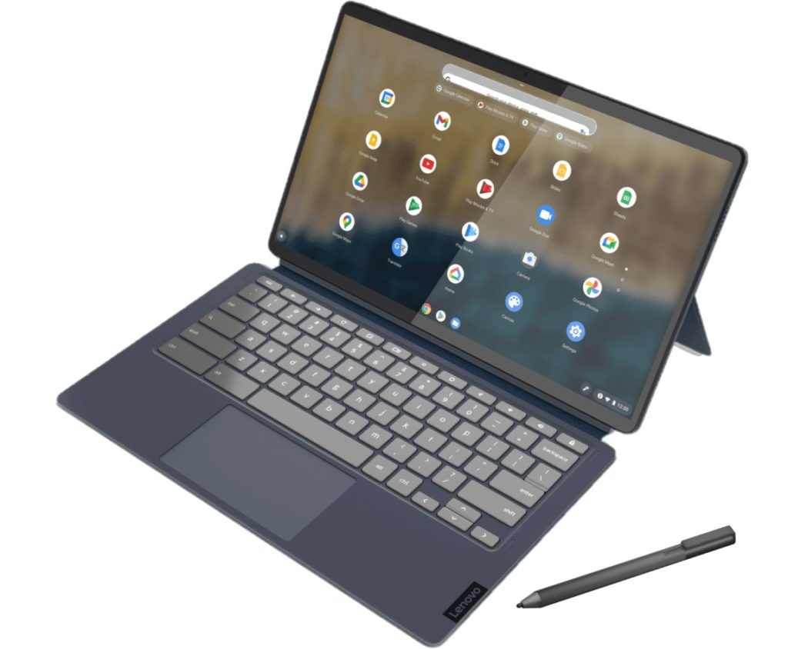

The hottest Chrome OS tablet at the moment is the HP Chromebook X2 11. Of course, there aren't many Chrome OS tablets in the market, but still: This is the latest one to consider. And there are plenty of things I really like about this small 11-inch slate. In fact, I like it more than when [I shared my first impressions](https://www.aboutchromebooks.com/news/hp-chromebook-x2-11-hands-on-and-first-impressions-of-the-newest-chrome-os-tablet/). Is it worth your consideration and budget though? I'd say yes, provided you can find it on sale compared to its $599.99 regular price. I explain why in this HP Chromebook X2 11 review.

_(**Update**: In a stroke of good timing, [the HP Chromebook X2 11 I reviewed is currently on sale at Best Buy for $399](https://www.bestbuy.com/site/hp-11-touch-screen-chromebook-qualcomm-snapdragon-8gb-memory-64gb-emmc-natural-silver-night-teal/6471019.p?skuId=6471019). At that price, I think most buyers will be happy, but read the full review for additional thoughts.)_

## Excellent design, look and feel

I think most of the excitement surrounding the HP Chromebook X2 11 is around the overall design. It's warranted too: Compared to prior Chrome OS tablets, this is a looker. And it has some nice hardware features that are omitted on other, older slates.

For starters, the 11-inch touchscreen is a joy to look at it, thanks to its 2160 x 1440 resolution touch panel. The screen is bright at 400 nits and has excellent color and viewing range as well as reasonably small bezels. I enjoy using this display both for consuming content as well as general web use.

The device itself is made from aluminum, and as I alluded to before, looks like an iPad at first glance. I'd call that a pro, not a con, but that's just me. What it really means is that the tablet feels solid and well made. Without any plastic involved, I can't flex the device and display at all.

Aside from having the two USB Type C ports on the lower left of the side, HP has made great design choices with the rest of the slate. Yes, it's great to have two USB ports but I'd prefer to see them on opposite sides.

The top left power button that doubles as a fingerprint sensor though? It's awesome and is quick to log me into the HP Chromebook X2 11. I'm fine with the volume rocker and microSD card slot next to the USB ports on the left as well. That leaves space for the included HP stylus on the right side where a magnet holds and charges it.

And perhaps the best part are the accessories, with one exception.

These are similar to those included with last year's Lenovo Duet Chromebook, but a smidge better in some ways. The magnetic kickstand strongly attaches to the back of the display and offers a wide range of custom angles, for example. The detachable keyboard is likewise thoughtfully designed, even attaching to the bottom of the display for a better typing angle and for more stability on your lap. I find the keyboard acceptable but not great to type on and the trackpad is also average.

However, this particular component falls short for me personally for one specific reason. I know this is a 2-in-1 Chrome OS tablet with a detachable keyboard and not a laptop. But the point of adding a keyboard to a slate is to create a laptop-like form factor. If you're going to use this device on a flat surface, like a desk or table, you'll be fine. But using it on a lap for me has been a letdown.

The keyboard attachment has _far_ too much flex in it for that purpose. I can't get past the many times that lightly resting a palm triggers a mouse click when using the HP Chromebook X2 11 on my lap.

And it's not just me: I've read [a few reviews](https://www.androidpolice.com/hp-chromebook-x2-11-review/) that [mention the keyboard](https://www.notebookcheck.net/Excellent-HP-Chromebook-x2-11-2-in-1-is-dragged-down-by-its-terrible-detachable-keyboard.574471.0.html) as a con. That's a shame because the idea of a portable device like this is to provide usability on the go in almost any scenario.

## Is the performance representative of a $600 Chrome OS device?

Moving the focus away from the overall design and general usage, let's talk about what's inside the HP Chromebook X2 11.

Due to timing, and likely other issues, HP chose Qualcomm's Snapdragon 7c compute platform to power the X2 11. That chipset was introduced in 2019, so keep your performance expectations in check. Initially didn't see much performance difference between this device and last year's Lenovo Chromebook Duet. After spending more time with both, however, I have seen that the X2 11 runs a little smoother and slightly faster than the Duet when performing the exact same tasks. It's not a huge performance jump, but it's there.

I see a little more pep from the X2 11 when opening apps or browser tabs, for example. Switching between applications in overview mode is consistently smoother too. So is opening and running most Android apps that I tested, although I wouldn't buy this as an Android tablet replacement.

It's possible, likely even, that having double the memory of the Duet is helping the X2 11, but does that matter? You're getting a marginally better experience

Perhaps the best way to offer some tangible insight are benchmark numbers. Just keep in mind these are general performance indicators.

Note that I'm including another Chrome OS tablet you can still buy used for less: [The old Pixel Slate](https://www.aboutchromebooks.com/reviews/google-pixel-slate-review/). And, for reference, the recent [Lenovo IdeaPad 5i with its new Pentium CPU](https://www.aboutchromebooks.com/news/lenovo-ideapad-5i-chromebook-review-a-potent-pentium-powered-laptop/). No, that's not a Chrome OS tablet, however, this is included simply as a reference point between CPUs available in entry-level devices. It's more of a "bang for your buck" inclusion since that Chromebook is priced less than the HP Chromebook X2 11.

<table class="has-fixed-layout"><tbody><tr><th class="has-text-align-center" data-align="center">Test</th><td class="has-text-align-center" data-align="center"><strong>Lenovo Chromebook Duet MediaTek P60T</strong></td><td class="has-text-align-center" data-align="center"><strong>HP Chromebook X2 11 Snapdragon 7c</strong></td><td class="has-text-align-center" data-align="center"><strong>Google Pixel Slate 8th-gen Core i5-Y</strong></td><th class="has-text-align-center" data-align="center">IdeaPad 5i 11th-gen Pentium</th></tr><tr><td class="has-text-align-center" data-align="center">Speedometer 1.0</td><td class="has-text-align-center" data-align="center">48.59</td><td class="has-text-align-center" data-align="center">90.93</td><td class="has-text-align-center" data-align="center">137</td><td class="has-text-align-center" data-align="center">249.8</td></tr><tr><td class="has-text-align-center" data-align="center">Speedometer 2.0</td><td class="has-text-align-center" data-align="center">29.52</td><td class="has-text-align-center" data-align="center">51.4</td><td class="has-text-align-center" data-align="center">84.2</td><td class="has-text-align-center" data-align="center">144.0</td></tr><tr><td class="has-text-align-center" data-align="center">JetStream 2</td><td class="has-text-align-center" data-align="center">37.65</td><td class="has-text-align-center" data-align="center">58.25</td><td class="has-text-align-center" data-align="center">146.52</td><td class="has-text-align-center" data-align="center">130.35</td></tr><tr><td class="has-text-align-center" data-align="center">Basemark 3.0</td><td class="has-text-align-center" data-align="center">210.02</td><td class="has-text-align-center" data-align="center">276.69</td><td class="has-text-align-center" data-align="center">476.86</td><td class="has-text-align-center" data-align="center">1,032.8</td></tr><tr><td class="has-text-align-center" data-align="center">Octane 2.0</td><td class="has-text-align-center" data-align="center">10,518</td><td class="has-text-align-center" data-align="center">22,314</td><td class="has-text-align-center" data-align="center">32,022</td><td class="has-text-align-center" data-align="center">47,152</td></tr></tbody></table>

Higher numbers are better

Clearly, the comparison numbers between the Chromebook Duet and the HP Chromebook X2 11 show the latter has more performance power. Some numbers might suggest it, but don't think it's twice as fast in most use cases.

Make no mistake, however: This is still a lesser performer than most other recent entry-level devices that cost much less. I'd say you're buying the HP Chromebook X2 11 for the portability factor over productivity usage.

That doesn't mean you can't use the device for being productive. I've done it for a full week. And aside from comparative slowness from other devices that cost less, it's fine. But the strength of this tablet is really when you want to watch something or do some light work in bursts in various places.

## What else is on the inside of the HP Chromebook X2 11?

I've covered the display and processor attributes, so here's a rundown on the rest of the hardware in terms of specifications:

<table><tbody><tr><td>CPU</td><td>Eight-core <a href="https://www.qualcomm.com/products/snapdragon-7c-compute-platform" target="_blank" rel="noreferrer noopener">Qualcomm Snapdragon 7c compute platform</a> up to 2.4 GHz</td></tr><tr><td>GPU</td><td>Qualcomm Adreno 618 GPU</td></tr><tr><td>Display</td><td>11-inch IPS 2160 x 1440 display, glossy finish, 3:2 aspect ratio, 400 nits brightness</td></tr><tr><td>Memory</td><td>8 GB DDR4x-2133 MHz memory</td></tr><tr><td>Storage</td><td>64 eMMC storage, microSD card slot for expansion</td></tr><tr><td>Connectivity</td><td>802.11ac (2x2) WiFi 5, Bluetooth 5.0</td></tr><tr><td>Input</td><td>Non-backlit, detachable keyboard, multitouch trackpad 5M wide view webcam and 8 MP wide view rear camera, Dual-array microphones and included stylus</td></tr><tr><td>Ports</td><td>2 USB Type-C SuperSpeed ports with 5 GB transfer speeds, supporting PD, data, and DisplayPort 1.2</td></tr><tr><td>Battery</td><td>32 WHr, expected run-time up to 11 hours</td></tr><tr><td>Weight</td><td>2.57 pounds with accessories</td></tr><tr><td>Software</td><td>Chrome OS automatic updates through June 2029</td></tr></tbody></table>

You're not getting the fastest USB Type-C speeds, memory, connectivity, or storage here. But that's fine for a small, portable Chrome OS tablet. For many buyers, this is more of a secondary device than a primary one. Keep in mind that there's no headphone jack, so you'll need a pair that supports Bluetooth or USB Type-C. The Bang and Olufsen dual speakers don't sound any different than on most entry-level Chromebooks either.

The webcams are like many other aspects: acceptable and functional but not great. And the stylus falls into the same category although that could be due to a lack of optimized writing or drawing apps. I see some annoying pen latency, depending on the application. Still, using the stylus is handy.

And kudos to HP for their battery claims. No, I never saw the "up to 11 hours" of run time. But I did hit 10 hours once and averaged between 8 and 9 hours of usage on most days. The included 45W USB Type-Charger is fairly quick as well, so in just about an hour you can fully recharge your tablet.

## Should you buy the HP Chromebook X2 11?

If you're specifically looking for a light and portable Chrome OS solution, this device is worth considering. No, it's not the fastest by any means but the use case of general web usage on the go is filled here. However, at the full price of $599.99, I'd say wait. Just wait for a sale as [we've seen the price dip down to $379](https://www.aboutchromebooks.com/news/patience-rewarded-hp-chromebook-x2-11-sees-a-220-price-drop/). At that price, you're getting a **_much_** better value. At full price, I think you're overpaying for what you're getting.

Another way to look at this. I've seen many HP Chromebook X2 11 buyers very happy with their purchase. They're not looking for a powerhouse device. But nearly all of them bought this tablet at a discount. I'm sure there are a few people happy with their $599.99 purchase, however, I haven't heard from any of them. If you're in either camp, let me know how you feel about the device and if you purchased it for less than the full retail price.

Keep in mind too: [The Lenovo Duet 5 Chromebook](https://www.aboutchromebooks.com/news/lenovo-duet-5-chromebook-orders-begin-arriving-october-28/) with a next-generation Qualcomm Snapdragon 7c is available now and costs $499. That chip is mainly the same as the first-gen CPU but is clocked slightly higher.

You keep the 8 GB of memory and get double the storage. Yes, this is a larger device with a 13.3-inch OLED 1080p touch panel. But in a laptop scenario, you're less constrained by the keyboard size. This detachable Chrome OS tablet weighs 1.5 pounds without the keyboard and kickstand, so it's likely to weigh a little more than the HP Chromebook X2 11 yet still be nearly as portable.

Or, if a smaller display, better keyboard, and half-step less performance fit the bill, the Lenovo Chromebook Duet can be had for $300 or less. It really depends on how much performance you're looking for in a portable Chrome OS tablet.
