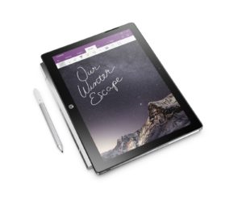
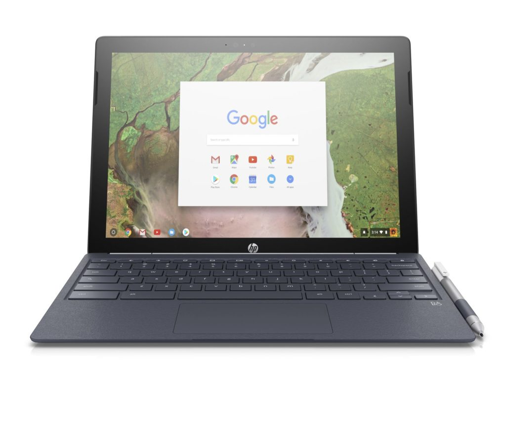

When the [HP Chromebook X2 was announced in April](https://www.aboutchromebooks.com/news/hp-chromebook-x2-arrives-as-the-first-detachable-chromebook-tablet/), the company said it would be available with up to 8GB of memory. And a [service manual for the device shows configurations with several processor choices](https://chromeunboxed.com/news/hp-chromebook-x2-models-surface-core-i5-pentium-4415y), ranging from a Pentium chip to core m5. Nearly four full months later, only the base model with 4 GB of RAM and an Intel Core m3 is available.

I'll preface my thoughts by disclosing that I have **no official information** on different configuration availability. However, I'm becoming leery that we'll ever see widespread (if any) availability of them based on some research.

For starters, I've been in fairly regular communication with HP since the product was announced. I first asked for a review unit and was told I'd be placed on the list, which is pretty standard fare. After the HP Chromebook X2 became available at Best Buy, I followed up with my review request and was told that review units still weren't available. Again, pretty standard: I realized that it can be a challenge to get loaner devices if inventory is low.

Eventually, I gave up on waiting and purchased my own device at Best Buy. I ended up returning it because an 8 GB model would better suit my needs. Again, I communicated that information to HP and asked about availability for configurable models. That's when the responses in the email chain ceased. After another week or so, I followed up on my question. Since then, nearly two weeks now, it's been radio silence. Even a response of "we don't have an official release date but we'll let you know when we do" answer would have been better.

That doesn't mean anything by itself though. Frankly, that situation has happened to me before plenty of times. So I took another approach and had an online chat with HP Support, asking when configurable models of the Chromebook X2 could be purchased.

Here's the response after they spent a few minutes checking for me:

> "Unfortunately, we're not sure if/when any additional models will be available."

Granted, online support may be among the _last_ to know about the future availability of particular devices. Still, it concerns me that they used the words "if/when" these models can be bought. I expected the word "when", but not "if".

Undaunted, I dug around on the [HP Parts store](http://partsurfer.hp.com/WSearch.aspx?Wchar=Y&searchText=chromebook+x2), which is where you can buy replacements for nearly any part of a device, ranging from the display, the keyboard, power cord, wireless module and even the motherboard with processor.

The only motherboard replacement part as of today is... you guessed it, the board with a Core m3 processor and 4 GB of memory. It's possible that if/when there are other device configurations available, the parts for them wouldn't appear until devices are on the market, of course.

Finally, I find it very odd that if you go to Best Buy to purchase an HP Chromebook X2 today, you'll pay $649.99 for the second week in a row; that's $50 higher than the MSRP for the base model. Previously, Best Buy sold the device for $599.99 and on occasion, it was [on sale for slightly less](https://www.aboutchromebooks.com/news/hp-chromebook-x2-sale-for-569-99-at-best-buy/). It could be that the retailer has limited stock -- even HP's site shows the device as out of stock, now for the second time that I've noticed since it launched -- and therefore is trying to eke out more profit margin on sales.

When I put all of this information together, it raises the concern that we may never see anything but the base HP Chromebook X2. It wouldn't be the first time a product was announced with several options only to have those options never to appear. Heck, it basically already happened with the X2 in some sense as originally, it was understood that the laptop would have a backlit keyboard. Good luck finding one of the rare units with the backlighting.

Again, I have no official information to add to this situation, although I have attempted to get some several times. This is just my own research and attempts to get answer on the configuration availability. Hopefully, my concerns are unfounded because I really liked the HP Chromebook X2; my only issue was performance for what I do with the 4 GB memory limitation.
