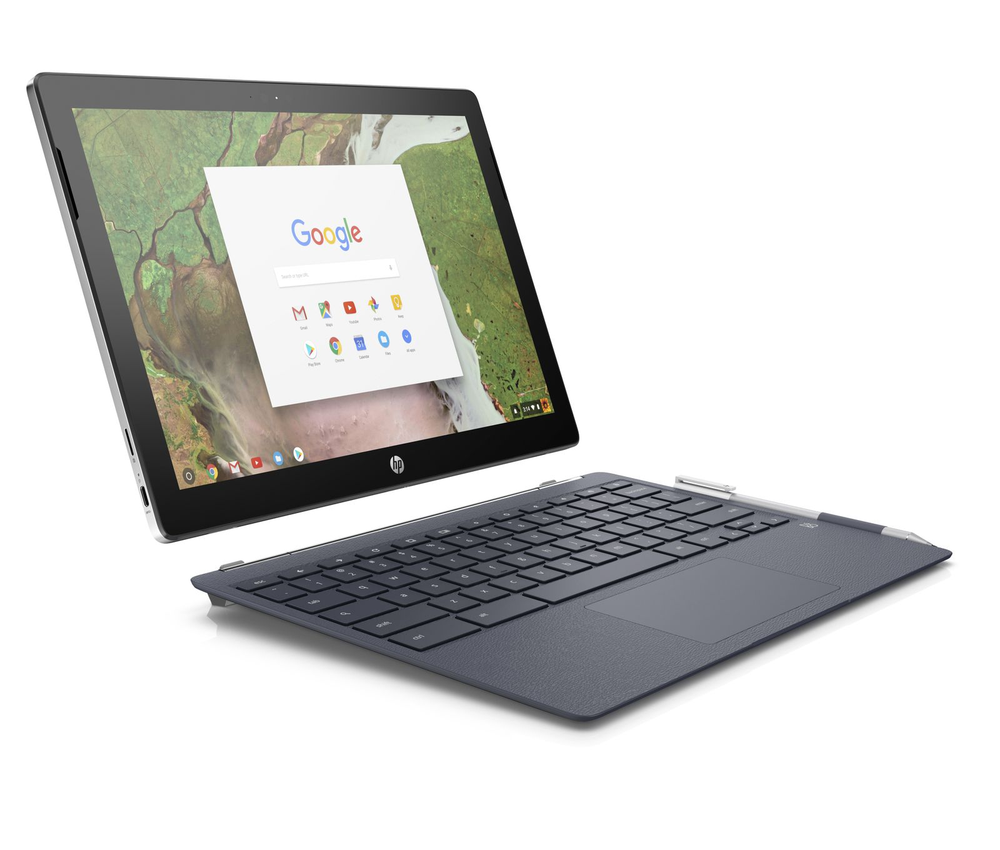

Well that didn't take long. Less than two weeks after the [Acer Chromebook Tab 10](https://www.acer.com/ac/en/US/content/series/acerchromebooktab10) was announced, [HP launched the Chromebook x2](https://press.ext.hp.com/us/en/press-releases/2018/chromebook-x2.html): A Pixelbook-looking Chromebook with a detachable screen. Starting at $599 and expected to be available on June 10, the Chromebook x2 bridges the gap between content consumption and productivity in a single device.

I'm not kidding at all when I say the Chromebook x2 has design cues from the Pixelbook. Just like Google's high-end Chromebook, the HP model also has a 12.3-inch, quad-HD display (which I assume to be the same 2400 x 1600 resolution based on the aspect ratio) and those large-ish bezels around the side. The main difference obviously, is that the display of the Chromebook x2 is removable. All of the hardware -- the processor, storage, memory and battery -- is inside the display, not the keyboard base.

As far as that hardware, you're looking at a 7th generation Intel Core m3 chip and 32 GB of storage for the base price. There's also a microSD card slot. HP says memory configurations are available up to 8 GB, but the base model has 4 GB.

Battery life is rated at up to 10 hours and there's no extra juice from the keyboard because there's no battery inside it. In fact the keyboard is just that: A keyboard with trackpad and magnetic hinges to hold the display as needed. Two USB-C ports a headphone jack and a pair of cameras (5 and 13 megapixels for front and rear, respectively) make up the rest of the tablet package. There's also a digital pen for inking, drawing and marking up documents.

\[gallery type="slideshow" size="large" link="file" ids="203,204,205,206,207,208,209"\]

The display on its own is 8.2 millimeters thick and weighs 1.62 pounds. Adding the keyboard base to your backpack and the total package comes in at 3.14 pounds. As a tablet itself, the display is relatively heavy compared to other true tablets but it still seems reasonably portable.

Although I haven't seen the Chromebook x2 yet, the design is exactly what I've been hoping for: A versatile Chromebook that can be used for productivity in full desktop browser while allowing for the [game changing experience as a tablet](https://aboutchromebooks.com/opinion/why-chrome-tablets-will-be-a-game-changer/) running Android apps. I'm looking forward to spending some time with this one!
