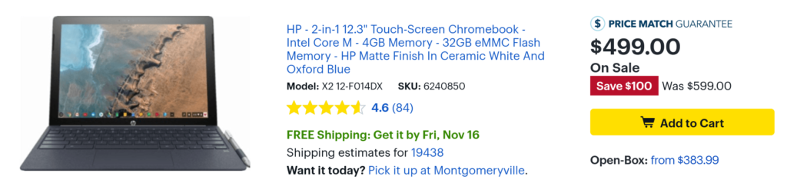

This isn't a Black Friday sale so I don't know how long it will last but today [Best Buy is selling the HP Chromebook X2 for $499.99](https://www.bestbuy.com/site/hp-2-in-1-12-3-touch-screen-chromebook-intel-core-m-4gb-memory-32gb-emmc-flash-memory-hp-matte-finish-in-ceramic-white-and-oxford-blue/6240850.p?skuId=6240850). That's a $100 discount from the regular price.

Frankly, I think that's a steal of a deal.

I bought this device from Best Buy as soon as it was available this past summer and used it full time for two weeks straight. I ended up returning it based on the old "It's not you, it's me...." mentality.

There was really nothing wrong with the Chromebook X2; it worked great for me. But I knew I'd want a little more memory and storage to ensure I had plenty of headroom for some Linux apps I had planned to run. But for everyday browsing and Android apps, the X2 easily handled everything I threw at it, both for work and for entertainment. I felt it was just as quick as my Core i5-powered Pixelbook and informal testing told me that I didn't imagine it.

In fact, if you don't mind the comparative storage and RAM limitations, plus the fact that the device uses a 7th-generation Intel Core m3, you might find this deal more compelling than the $799 Pixel Slate with 8th-gen Core m3. That's the device I recommend for Chromebook users who want to browse and run Android apps in my [Pixel Slate buyers guide,](https://www.aboutchromebooks.com/opinion/which-google-pixel-slate-to-buy-guide/) although if you plan to make heavy use of Linux apps, I'd probably step up to the $999 Core i5 option.

Yes, you'd get a higher resolution display plus double the storage and memory for the additional cost of the Core m3 Pixel Book, but you wouldn't get a keyboard or a pen; the X2 includes both while the Pixel Slate comes with neither.

Simply put, if you can live without some of the Pixel Slate's attractive bells and whistles, the HP Chromebook X2 is a stellar device at this price provided 32GB of storage and 4GB of memory doesn't scare you away.
