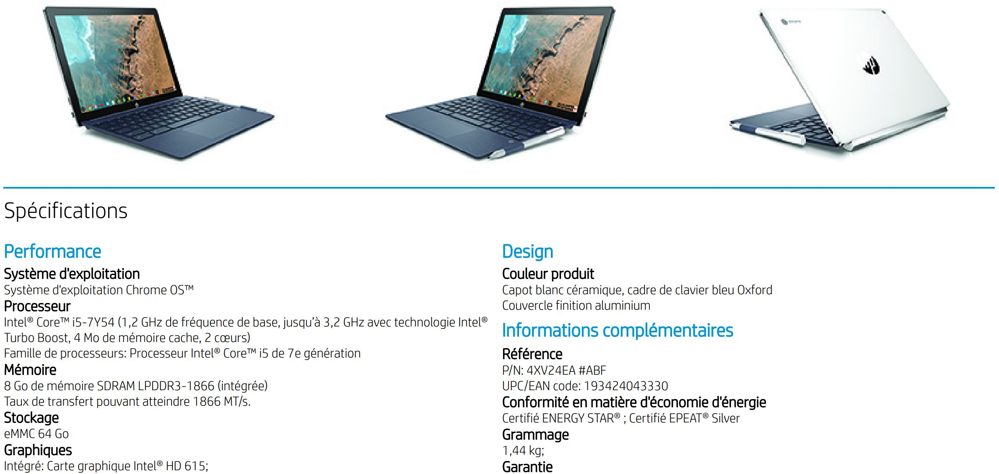

Scanning the HP website, I noticed my search for "Chromebook X2" yielded more than the typical four results I usually see. I don't know when the site was updated, but [today I saw 10 different HP Chromebook X2 model numbers](https://www8.hp.com/us/en/search/search-results.html?ajaxpage=1#/page=1&/action=leftTree&/cat=Laptops&/qt=chromebook%20x2). Digging around, I found that one of them is the elusive model with an Intel Core i5 and 8 GB of memory. From what I can tell, it's available in France for now and costs €799.00.

[Here's a listing of the device specs in French (PDF)](http://www8.hp.com/h20195/v2/GetPDF.aspx/c06125700.pdf) that even without translating you can see the upgraded CPU and memory specifications. Also of note is the 64GB of local storage, which is double the capacity in the $599 model available in the U.S.

Some of the other models are for other EU regions such as the UK and Ireland but this is the first time I've seen the actual fully upgraded model existing. Not long ago I wondered [if we'd ever see the Core i5 and 8GB configuration](https://www.aboutchromebooks.com/news/hp-chromebook-x2-8-gb-core-m5-configuration-availability/), and although you can't get one in the U.S., this is at least promising.

Even if we do see a U.S. version though, might it be too late for meaningful sales? We have a Google hardware event next week where it's expected [Google will launch a Pixelbook 2](https://www.aboutchromebooks.com/news/atlas-chromebook-pixelbook-2-nvme-ssd/) and the "Pixel Slate" if that's the official name of [Nocturne](https://www.aboutchromebooks.com/news/nocturne-chrome-tablet-screen-resolution-specs-pixelbook-3000x2000/).

Sure those will probably be more expensive than a top-of-the-line HP Chromebook X2, but they'll very likely have Intel's _8th-generation_ chips inside. The Chromebook X2 uses the prior generation of chipsets.

I also suspect Google's devices will have more memory and local storage than the X2; possibly even a range of choices which is something we've have to wait for -- well, we're _still_ waiting for -- in the Chromebook X2.
