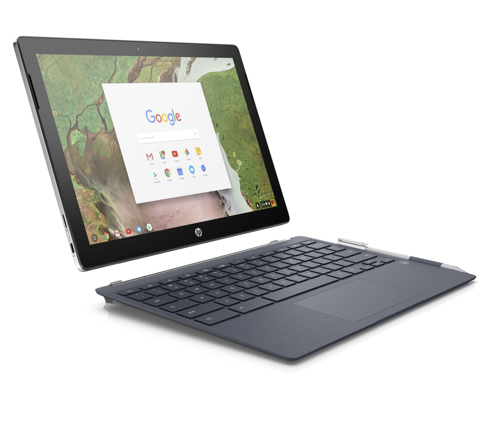

We're one step closer to the release of the first Chrome OS detachable tablet: [Best Buy is now listing the HP Chromebook X2 online at the expected price of $599.99](https://www.bestbuy.com/site/hp-2-in-1-12-3-touch-screen-chromebook-intel-core-m-4gb-memory-32gb-emmc-flash-memory-hp-matte-finish-in-ceramic-white-and-oxford-blue/6240850.p?skuId=6240850). Nope, you can't order it yet and this is just the base model, but it appears HP is on track to debut the device in time to meet its expected delivery date of June.

Those who missed the news on this unique device might need a refresh. [HP announced the Chromebook X2](https://www.aboutchromebooks.com/news/hp-chromebook-x2-arrives-as-the-first-detachable-chromebook-tablet/) in April, showing off what will be the [first Chrome OS tablet with a detachable keyboard base](https://press.ext.hp.com/us/en/press-releases/2018/chromebook-x2.html). That base doesn't have a processor, battery or any other compute components. Instead, it just provides a keyboard and trackpad to augment the 12.3-inch 2400 x 1600 resolution touch screen. All of the components are in the display section, making this a detachable tablet.

Best Buy is only listing the base model of the Chromebook X2, which uses an Intel Core m3 processor paired with 4GB of memory and 32GB of local flash storage; you can expand the storage capacity through an integrated microSD card slot. There are also a pair of USB-C ports for power and peripherals, two cameras -- 5 and 13 megapixels -- headphone jack and digital stylus included.

HP said it would offer a range of configurations although it didn't disclose pricing for them. I expect the costs to roughly reflect those of the HP Chromebook 13 G1, which also started at $599.99 for the base model and had several configurations ranging in price up to just over $1,000 for the top model. No, these won't come cheap but there's [no requirement that Chromebooks have to be inexpensive](https://www.aboutchromebooks.com/opinion/why-people-wrongly-assume-chromebooks-have-to-be-inexpensive/).

Also, although the Best Buy listing just appeared, I haven't found any evidence yet of an early release this month. I'll keep checking with my sources but for now, I think we're still at least three weeks away from availability.
