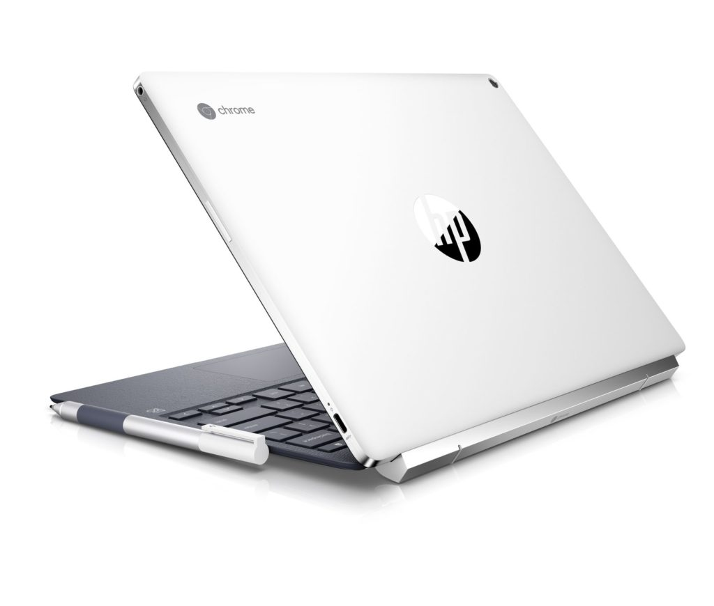

I suspect Best Buy is cleaning out some inventory as the normally priced $599 [HP Chromebook X2 is currently reduced to $349](https://www.bestbuy.com/site/hp-2-in-1-12-3-touch-screen-chromebook-intel-core-m-4gb-memory-32gb-emmc-flash-memory-white/6240850.p?skuId=6240850). This was the [first detachable display Chromebook that debuted last April](https://www.aboutchromebooks.com/news/hp-chromebook-x2-arrives-as-the-first-detachable-chromebook-tablet/) and first went on sale the following June.

I purchased one immediately and although I felt there were some small quirks, I was very impressed by the device overall. Among those quirks were the very light keyboard with a very heavy metal hinge; the balance just felt off when using the Chromebook on my lap.

However, from a performance standpoint and overall experience, it met all of my needs at the time.

I ended up returning it only because I felt my needs would grow beyond the hardware capabilities: I had planned to take programming courses at my local community college and figured I'd need more memory and storage. I opted for a used Pixelbook instead and later replaced that with a [Core i5 Pixel Slate, which is working great for my Java and Python education](https://www.aboutchromebooks.com/news/how-to-code-on-a-chromebook-crostini-pixel-slate/).

Here's a rundown of the HP Chromebook X2 specs:

- Fanless Intel Core m3-7Y30 processor
- Intel HD Graphics 615
- 4 GB of memory
- 32 GB of eMMC storage, memory slot for expansion
- 12.3-inch detachable display with 2400 x 1600 resolution
- Touch and pen support (pen included)
- 2 USB Type-C ports
- HD front webcam, 13 MP rear camera
- 802.11ac Wi-Fi and Bluetooth 4.2
- Expected run-time of 12.5 hours

Granted, the seventh-gen Core m3 is a step behind currently available eighth-gen Core processors found in more recent Chromebooks. And both the memory & storage are bare-bones minimum in what I'd consider in a Chromebook these days.

However, at this price you're getting a daily driver with detachable, high-resolution screen - the same as the Pixelbook - for much less than most newer options on the market today.

Put another way: If I could afford something for $399 or less today, I'd pick this over a less-expensive, entry-level Chromebook, with the sole exception of the [Dell Inspiron Chromebook 14, which is currently on sale for $50 more than the X2](https://www.aboutchromebooks.com/news/dell-inspiron-chromebook-14-sale-discount-150-off-price/).
