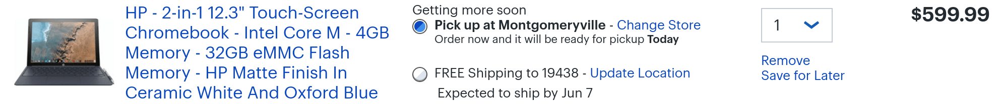

Well here's a welcome surprise for those of you interested in the [HP Chromebook X2](https://www.aboutchromebooks.com/news/hp-chromebook-x2-arrives-as-the-first-detachable-chromebook-tablet/): The device is appearing earlier than expected in some Best Buy stores. Originally, there was a June 7 ship date for online orders but my local Best Buy says there are a few units available in-store now.

 I didn't even think to check for local availability until [I saw the news on Android Police](https://www.androidpolice.com/2018/05/31/hp-chromebook-x2s-sold-best-buy-far-ahead-june-10th-release/), which also posted a hands-on video from one of the first HP Chromebook X2 buyers. It's worth the watch if you're considering the $599.99 purchase:

\[embed\]https://youtu.be/APXO3KFVlGA\[/embed\]

Thanks to the video we get a better idea of how the Chromebook X2 display attaches to the keyboard. There are pogo pins for transmitting power to and data from the keys, which is how [the upcoming detachable Chromebook known as Nocturne](https://www.aboutchromebooks.com/news/nocturne-chromebook-to-power-its-detachable-keyboard-like-apples-smart-keyboard-for-ipad/) will work. It also looks like the keyboard base is stable enough to hold up the display, even when the screen is tilted as far back as possible.

With the X2 available now, at least in some locations, I'd expect the regular round of benchmark tests to start appearing online. Keep in mind that this configuration uses an Intel Core m3 processor with 4 GB of memory and 32 GB of flash storage. HP said there would be other configurations available but hasn't shared any details on them yet.
