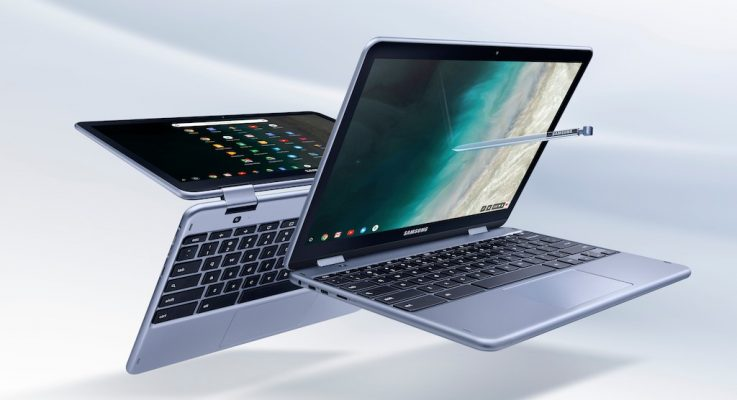

While there are plenty of Chromebooks in the $200 to $400 range to choose from right now, I'd say the best deal at the moment is the HP Chromebook X2 for a few reasons. That's partially because [the first detachable Chromebook is $200 off at Best Buy, down to $399](https://www.bestbuy.com/site/hp-2-in-1-12-3-touch-screen-chromebook-intel-core-m-4gb-memory-32gb-emmc-flash-memory-white/6240850.p?skuId=6240850).

You'll have to nab this device today since it has actually been part of a 4-day sale and today is the final day; several readers have written in to me sharing the discount information but I've been swamped with a final coding project for my CompSci class.

Even at the full price, I raved about the Chromebook X2 when I bought one last year. I was concerned about the Intel Core m3 processor but it performed like a champ in every instance of my usage. I was concerned about the 4 GB of memory but even that wasn't really a hindrance. However, expectations and use cases vary: If you're more of a power user with two dozen tabs open simultaneously, you'd probably want a Chromebook with 8 GB of memory. And while only 32 GB of eMMC storage is available, you can expand it with a memory card.

If I could sum up the HP Chromebook X2, I'd say it will meet the needs of at least 80 to 90 percent of mainstream Chrome OS users. And it does that in style with a fantastic 12.3-inch 2400 x 1600 IPS touch and pen-enabled display that can be removed from the keyboard.

When attached to the keyboard, the typing and trackpad experience is quite good, with very little display wobble. The HP Chromebook X2 is a little "back heavy" due to the metal hinge mechanism, something I quickly got used to. It adds stability for the laptop mode, so it is a compromise.

What other Chromebooks have the versatility of a detachable display, the same screen resolution and clarity as the Google Pixelbook, stylus support and solid performance at $400 or less? I can't think of one but I'd say the closest are the two Samsung Chromebook Plus v2 models.

Neither have a detachable display, although that may not be a key requirement for many. Both have high resolution displays and an equal amount or more storage.

The currently priced [$399.99 Samsung Chromebook Plus v2](https://www.samsung.com/us/computing/chromebooks/12-14/samsung-chromebook-plus-xe520qab-k01us/) includes the same memory and storage capacities as the HP Chromebook X2 but drops you to a Celeron processor. The [$499.99 Samsung Chromebook Plus v2](https://www.samsung.com/us/computing/chromebooks/12-14/samsung-chromebook-plus-xe520qab-k02us/) has a comparable Core m3 processor and 64 GB of storage but costs $100 more than the X2 right now and like its less expensive sibling [has a lower resolution 1080p display](https://www.aboutchromebooks.com/news/samsung-chromebook-plus-v2-release-date-price/).

Any of these would be decent choices for the price, but if I was buying now and my budget was $400 or less, it would the HP Chromebook X2 for me. I know many readers have purchased this device for the full $599 price; I'd be curious to hear how they're getting on with the X2 and if it's worth the purchase for $200 less.
