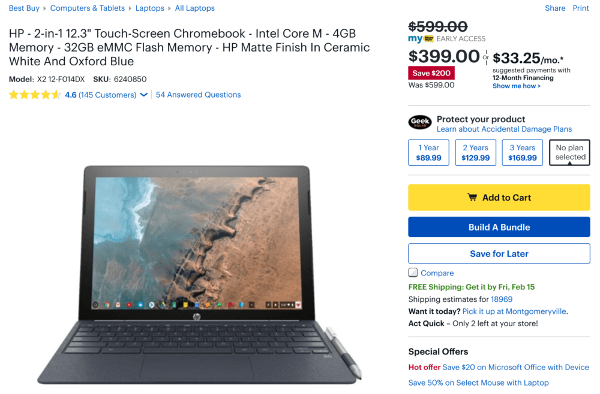

Wow. I just heard from Scott, an About Chromebooks reader, who tipped me off to a $200 savings on the HP Chromebook X2. This is specifically for my Best Buy members as part of an early access President's Day sale, which is open to all consumers starting Friday. Normally priced at $599.00, the [HP Chromebook X2 is down to $399](https://www.bestbuy.com/site/hp-2-in-1-12-3-touch-screen-chromebook-intel-core-m-4gb-memory-32gb-emmc-flash-memory-hp-matte-finish-in-ceramic-white-and-oxford-blue/6240850.p?skuId=6240850) until midnight tonight, central time.

Sure, the X2 doesn't have the latest and greatest Intel processor inside. It's a 7th-generation Intel Core m3. And you only get 4GB of memory and 32 GB of storage. But you still get a lot based on my time with the device when it launched last year.

In particular, I loved the 12.3-inch 2400 x 1600 touch screen that also works with the included stylus. The keyboard and trackpad are above average in my opinion and when the detachable display is connected to the keyboard, the entire device is more "laptop like" than my Pixel Slate with Google's keyboard; there's no left or right wobble on your lap, for example.

As far as performance, I was surprisingly impressed because I could easily have a dozen tabs open, run the occasional Android app and even use early versions of [Project Crostini](https://www.aboutchromebooks.com/tag/project-crostini) at that time to run Linux apps on the X2.

Dollar for dollar, this is a great value for folks that don't plan to rely on Linux apps more often than using Chrome OS for browsing, content consumption, and productivity. Heck, for $399, I'm thinking of getting one of these as a backup or testing system. Thanks, Scott!

_Updated on 2/15/2019: This deal is now available for all customers._
