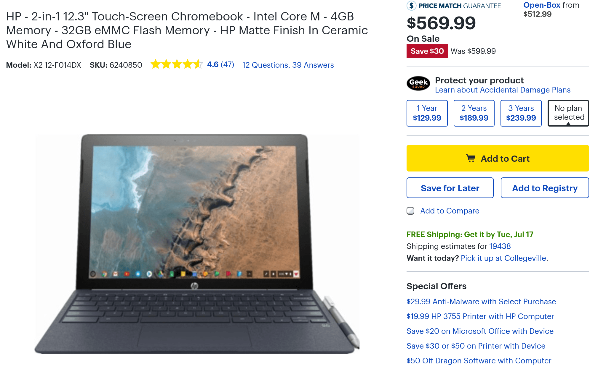

Now's a good time to nab an [HP Chromebook X2](https://www.aboutchromebooks.com/tag/hp-chromebook-x2/) if you were hoping for a small sale: [Best Buy is offering the detachable Chromebook for $30 off](https://www.bestbuy.com/site/hp-2-in-1-12-3-touch-screen-chromebook-intel-core-m-4gb-memory-32gb-emmc-flash-memory-hp-matte-finish-in-ceramic-white-and-oxford-blue/6240850.p?skuId=6240850&ref=212&loc=1&gclid=CjwKCAjw4avaBRBPEiwA_ZetYsxNcTmVd4aMuH74xJvQWVnnTYM9YwiyB3iZQnUlidJi0OwVnGY5uhoCBskQAvD_BwE&gclsrc=aw.ds), bringing the cost down to $569.99. That price gets you the base model, which is still the only one available, powered by an Intel Core m3 processor and paired with 4 GB of memory and 32 GB of local storage.

I bought an X2 last week at Best Buy and to say I'm impressed is an understatement. Compared to my base Pixelbook, the laptop runs nearly as fast. Based on benchmarks and every day use, I'd say you're getting around 85 percent of the Pixelbook's performance for several hundred dollars less.

Of course, with the HP Chromebook X2 you get the added benefit of a removable display with the same 2400 x 1600 resolution. I use it in detached mode about half of the time for content consumption -- the X2 has the best speakers I've ever heard on a Chromebook -- and light browsing, social media or Android app usage. The detachable keyboard is quite good, although it's not backlit, as is the trackpad.

I could probably get $30 back from Best Buy due to the price drop, but instead, I'll likely be returning the unit. The only reason is the 4 GB of memory, which I find constraining when I run [Linux apps using Project Crostini](https://www.aboutchromebooks.com/tag/project-crostini). When I compile Java code in a development environment, for example, it takes around twice as long as it does on my Pixelbook, which has double the memory.

However, 4 GB of RAM, paired with swap memory, which is on by default for Chromebooks, ought to be fine for typical users. So if you've been on the fence about that, I'd recommend heading into a Best Buy to test the device this week and save $30 if the device seems to meet your performance needs.
