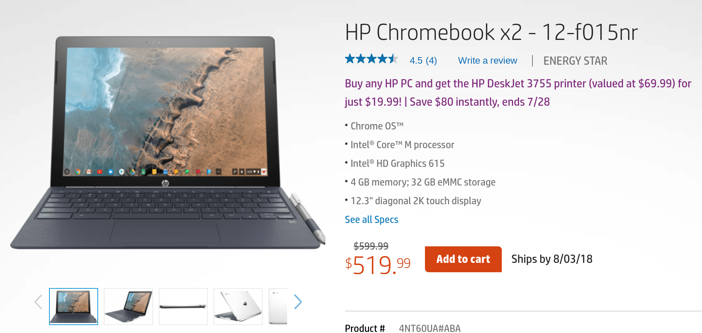

Scouring online pricing this morning yielded two interesting price points for the HP Chromebook X2. Best Buy has suddenly raised the cost to $50 more than the MSRP: [Stop in and you'll pay $649.99 for some reason](https://www.bestbuy.com/site/hp-2-in-1-12-3-touch-screen-chromebook-intel-core-m-4gb-memory-32gb-emmc-flash-memory-hp-matte-finish-in-ceramic-white-and-oxford-blue/6240850.p?skuId=6240850). But there is better news: HP started selling the [Chromebook X2 directly on its website for $519.99 today](https://store.hp.com/us/en/pdp/hp-chromebook-x2-12-f015nr), with orders currently set to ship by August 3, giving you an $80 savings from the suggested retail price.

I can't understand the Best Buy price increase at all. Typically Best Buy sells at or below MSRP, which is $599.99 for the only model available: There's an Intel Core m3 processor, 4 GB of memory and 32 GB of storage inside the detachable Chromebook. Although I won't likely find out the reason for this increase, I will be going in to Best Buy and will ask today.

Why? I bought an X2 from Best Buy and today is the last day of the return period.

Don't get me wrong, I absolutely love this device. Unfortunately, I'm not comfortable with the standard 4GB of memory when using certain Linux apps via [Project Crostini](https://www.aboutchromebooks.com/tag/project-crostini). They run just fine but I've noticed that when I'm compiling some Java code, it generally takes twice as long as it does on my Pixelbook, which has 8 GB of memory. Chrome OS uses some of the local storage as swap memory to compensate on the X2, but that's not ideal for my particular needs.

Your needs will certainly vary though and I think most people will be just fine with the one and only HP Chromebook X2 model currently available. It doesn't hurt that you can save $80 right now too.

Heck, if I could get by with 4 GB of RAM inside the X2, I'd _still_ probably return it to Best Buy and re-purchase it from HP. Or better yet, I'd see if I could use Best Buy's price match to get the difference in the form of a refund. If you can't wait for HP to ship you one of these, Best Buy says it will match prices from HP.com, so be sure to show them the linked page above.
