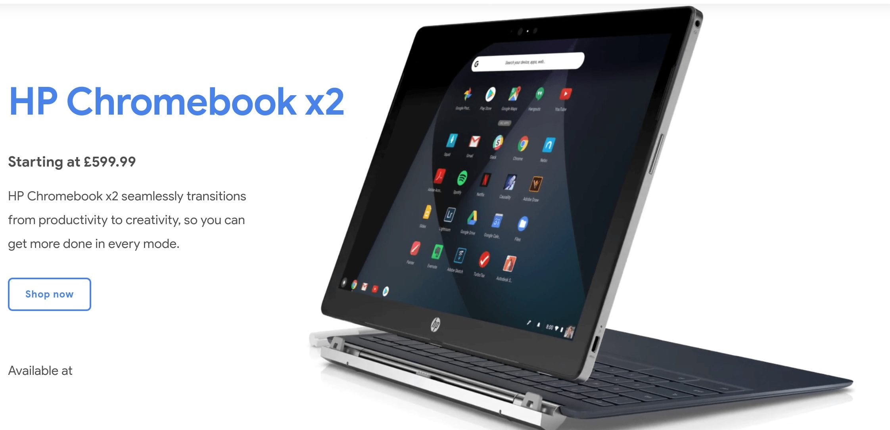

One of the most common -- and very valid -- complaints I hear from readers is the lack new Chromebook availability in regions outside of the U.S. So I'm happy to see [the HP Chromebook X2 on Google's Chromebook site for the UK](https://www.google.com/intl/en_uk/chromebook/device/hp-chromebook-x2/). You can't order it quite yet, but this is a great sign since this is the [first detachable Chromebook](https://www.aboutchromebooks.com/news/hp-chromebook-x2-arrives-as-the-first-detachable-chromebook-tablet/) to hit the market.

[Eagle-eyed Redditor -nbsp- first spotted the landing page](https://www.reddit.com/r/chromeos/comments/8ryz7u/hp_chromebook_x2_gets_a_uk_landing_page_on/) which also shows the price of £599.99. There isn't a list of the specs, but based on the like-for-like price -- with a currency change only, that is -- I would expect folks in the UK will get the same model we have here:

- 12.3-inch display with 2400 x 1600 resolution
- 7th generation Intel Core m3 chip
- 4 GB of memory and 32 GB of integrated storage
- Two USB Type-C ports
- 5MP front camera, 13MP rear camera
- Included digital stylus

Early indications show that the overall performance of the HP Chromebook X2 is roughly the same as Google's own Pixelbook, which is available in the UK, so if potential buyers are concerned about performance between the two, it shouldn't be an issue.
