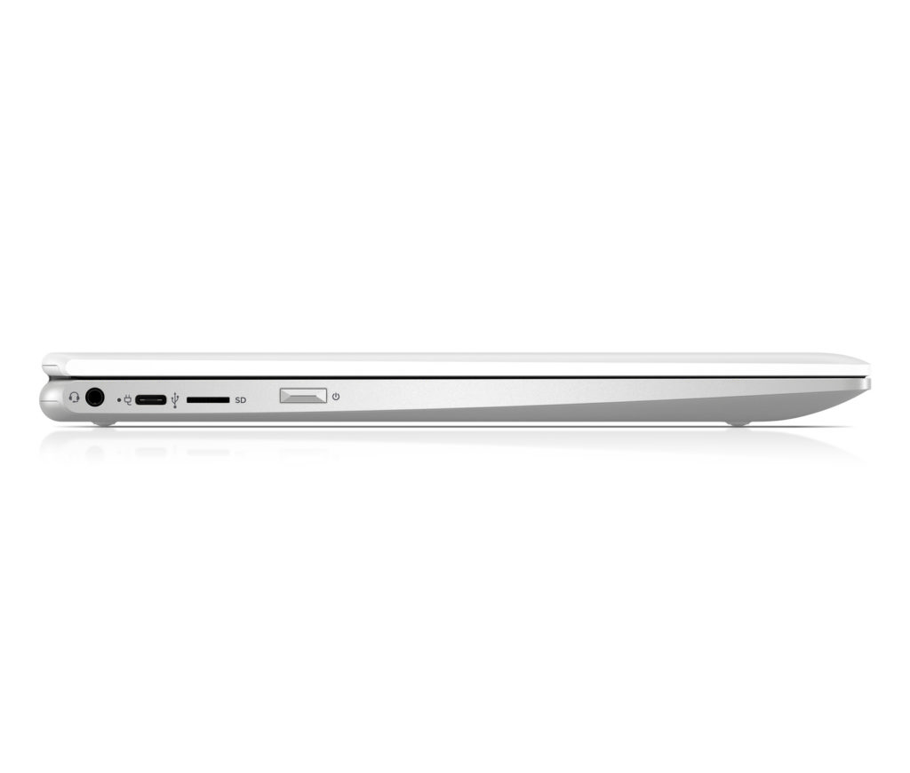
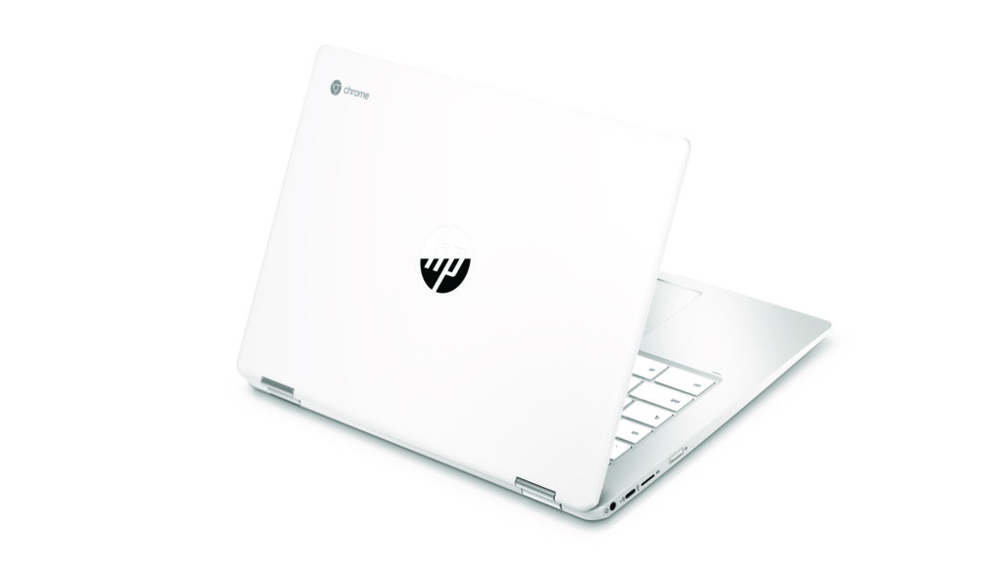
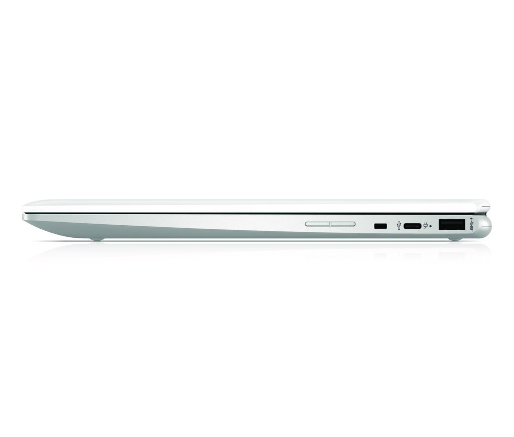
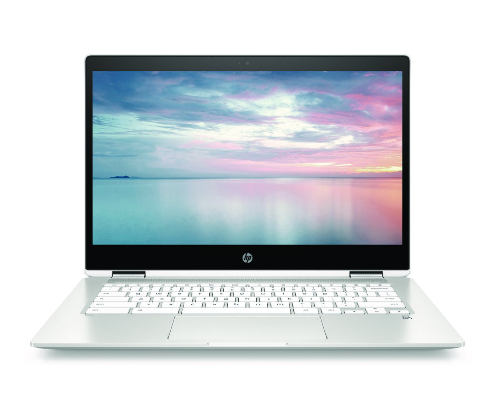
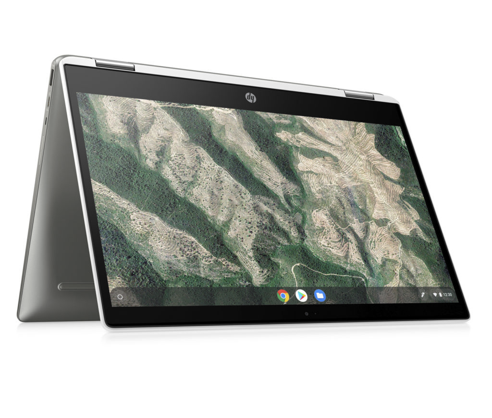
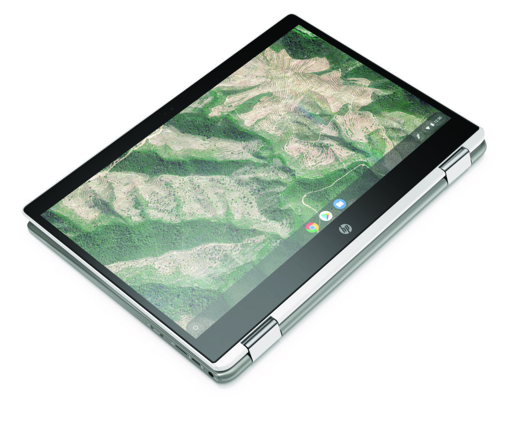
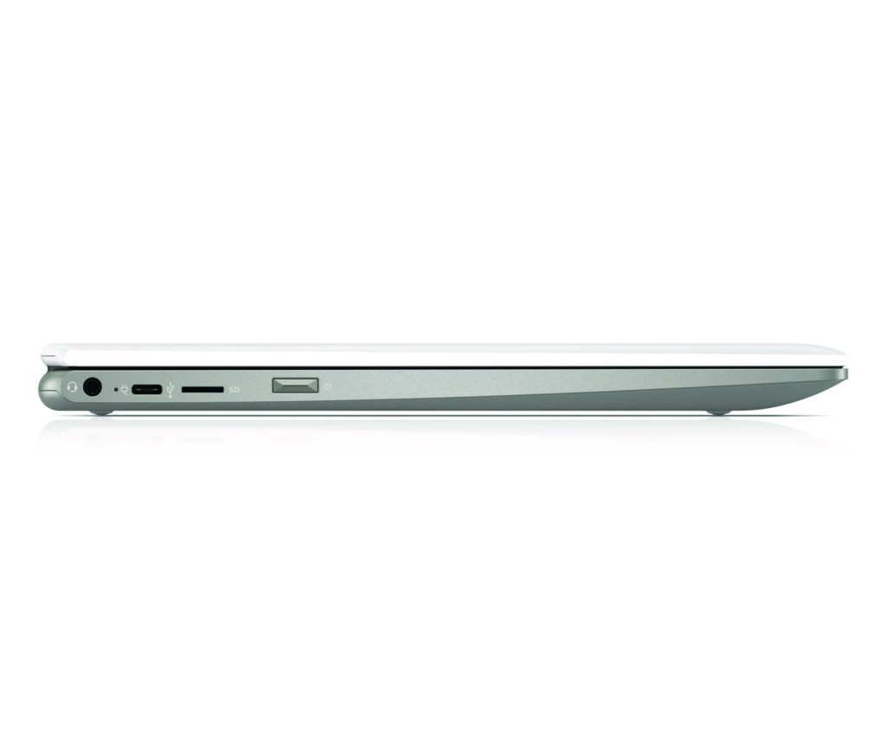
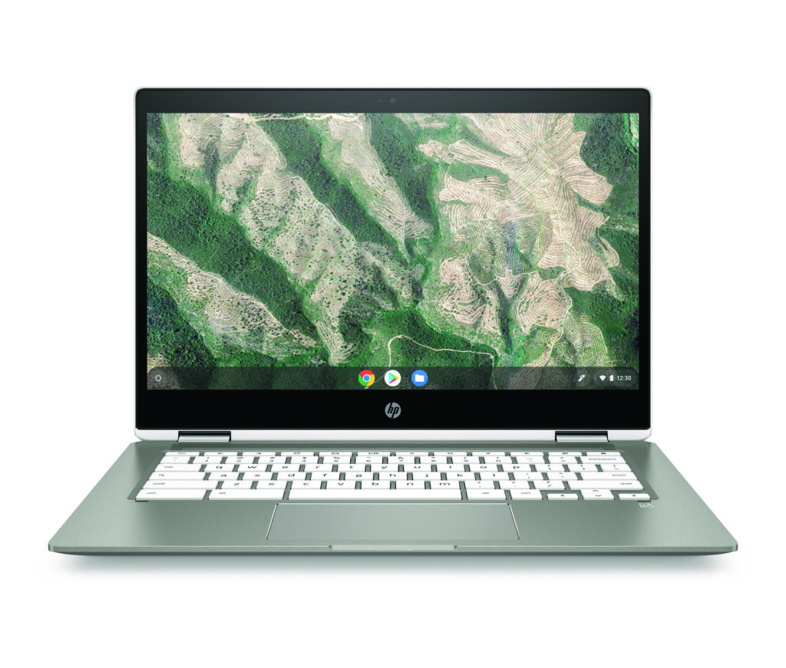

Earlier this month we saw [leaked information about a new 12-inch HP Chromebook x360 model](https://www.aboutchromebooks.com/news/new-hp-chromebook-x360-12-design-specifications/). HP today officially confirmed the Chromebook X360 12b and a larger HP Chromebook X360 14b model. Both 2-in-1 devices are expected to go on sale this week for $359 and $379, respectively.

Aside from the two different screen sizes of 12- and 14-inches and varied display resolutions, both models share nearly all other specifications.

Here are the common attributes of both models at the base level and full PDF spec sheets of the [12b](https://www.aboutchromebooks.com/wp-content/uploads/2019/09/HP-Chromebook-x360-12b.pdf) and [14b](https://www.aboutchromebooks.com/wp-content/uploads/2019/09/HP-Chromebook-x360-14b.pdf):

- Intel dual-core Celeron N4000 CPU at 1.1 GHz
- Intel UHD Graphics (620 for the 12b, 600 for the 14b)
- 4 GB of memory
- 32 GB of eMMC storage and a microSD card reader
- B&O dual speakers
- Wi-Fi 5 and Bluetooth 5.0
- Wide view HD video camera and dual array microphone
- Two USB Type-C ports, one USB Type-A
- Support for a [USI 1.0 Active Stylus](https://universalstylus.org/first-wave-of-usi-1-0-active-stylus-products-hit-the-market/) (sold separately: $69.99)

Note that HP indicates more powerful options as well:

> With Intel Celeron Dual Core or Pentium Quad Core processors, integrated Intel UHD Graphics, up to 128GB of eMMC storage, nearly 12 hours of battery life for the 12” offering, and up to 10 hours for the 14” offering, and a more efficient fan-less design, users will be doing homework, watching movies, or just surfing the web with the performance they need, when they need it.

About the screens on the base models. The 12-inch display resolution is 1366 x 912, 50% NTSC color gamut 235 nits of brightness. The 14-inch version uses a 1366 x 768 touch panel with 45% NTSC color gamut and 220 nits of brightness. High-end displays these are not but the pricing reflects this and other hardware components.

Aside from those components, the design looks pleasing with smaller display bezels, a trifecta of USB ports, island keyboard, and generous trackpad. If your budget is around $350, the new HP Chromebook X360 models may be worth a look as compared to similar options from Acer, Asus, and Lenovo.

