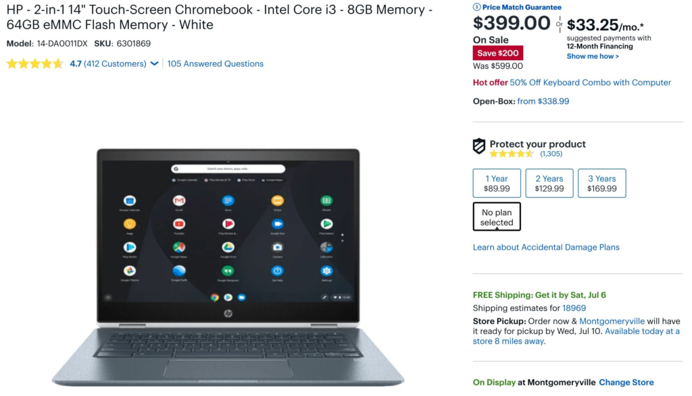

Normally priced at $599, [Best Buy is selling the HP Chromebook X360 14 for $399](https://www.bestbuy.com/site/hp-2-in-1-14-touch-screen-chromebook-intel-core-i3-8gb-memory-64gb-emmc-flash-memory-white/6301869.p?skuId=6301869) over this holiday weekend in the US. You can also [purchase this model directly from HP](https://store.hp.com/us/en/ConfigureView?catalogId=10051&langId=-1&storeId=10151&urlLangId=&catEntryId=3074457345619122818&quantity=1) but that will set you back a whopping $626.43 as of this morning and you'll wait until August for the shipment.

The HP Chromebook X360 14 can be configured down from a Pentium all the way up to a Core i7, so this Core i3 model is just a single step up from the base model. And at $399 it's a steal by comparison to most other Chromebooks at this price.

Here's a rundown of what you get: An 8th-gen [Intel Core i3-8130U](https://ark.intel.com/products/137977/Intel-Core-i3-8130U-Processor-4M-Cache-up-to-3-40-GHz-) with a 2.2 GHz base frequency, turbo-boost up to 4GHz; a 14-inch full HD touch display with thin bezels on the sides, 8GB of memory, 64GB of eMMC storage, 802.11ac Wi-Fi and Bluetooth. There are a pair of USB Type-C ports and one Type-A, plus a headphone/microphone jack and microSD card reader. HP says to expect 13.5 hours of run-time per charge.

I've only had a little bit of hands on time with this device, but I was impressed. So much so that at one time I was considering the top-end Core i7 configuration with 16GB of memory; unfortunately, that model has never dropped below $1,200 which is more than I'd like to spend.

Need a trusted review before you drop $399 on the HP Chromebook X360 14? Check out what Chrome Unboxed had to say in this video review:

https://youtu.be/U7mwqA7e\_A4
