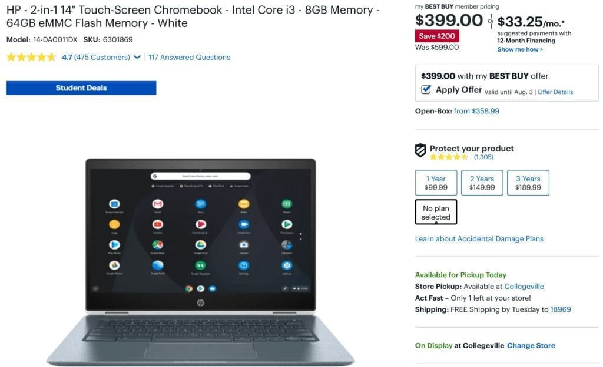
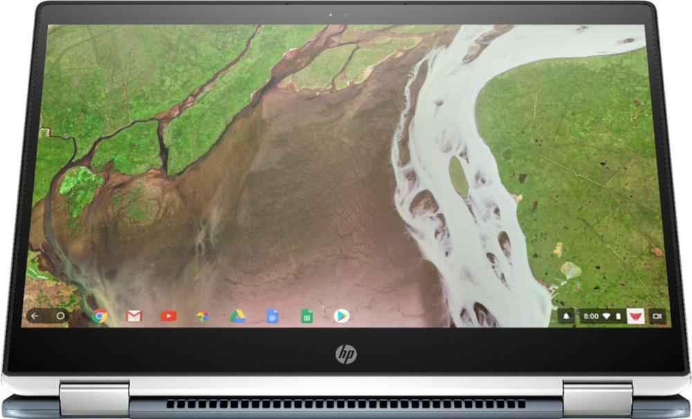

Best Buy is [offering the capable HP Chromebook X360 14 for $450 this week](https://www.bestbuy.com/site/hp-2-in-1-14-touch-screen-chromebook-intel-core-i3-8gb-memory-64gb-emmc-flash-memory-white/6301869.p?skuId=6301869), which has been a recurring $150 discount. But with a few minutes of small effort, you can get another $50 off and buy this 2-in-1 for $399.

The trick is to sign up for a [free My BestBuy account](https://www.bestbuy.com/site/clp/my-best-buy/pcmcat309300050007.c?id=pcmcat309300050007), which gives you various discounts, special offers and free shipping throughout the year. There's no cost to having the account, nor do you need to tie it to a credit card or any other banking details.

Essentially, it's a Best Buy frequent buyer rewards program: For every $250 you spend, you get a $5 rewards discount certificate.

As you can see above, all I had to do to get the additional $50 discount was to check the "Apply Offer" box when signed in to the Best Buy site.

In terms of the HP Chromebook X360 14, I'd call it squarely in the mid-range Chromebook market: Plenty of performance for everyday basic use and enough to have a good 10 to 15 browser tabs open simultaneously.

You can also throw some full-time Android apps - I run Messages and Spotify pretty much all the time - into the mix. The device should handle light Linux use as well but if you plan to run Linux for hours a day, every day, you'd probably want to invest in something a little better.

Here’s what you get: An 8th-gen [Intel Core i3-8130U](https://ark.intel.com/products/137977/Intel-Core-i3-8130U-Processor-4M-Cache-up-to-3-40-GHz-) with a 2.2 GHz base frequency, turbo-boost up to 4GHz; a 14-inch full HD touch display with thin bezels on the sides, 8GB of memory, 64GB of eMMC storage, 802.11ac Wi-Fi and Bluetooth. There are a pair of USB Type-C ports and one Type-A, plus a headphone/microphone jack and microSD card reader. HP says to expect 13.5 hours of run-time per charge.

Because the chip inside is a U-Series model, it can run longer at full capacity, unlike Y-Series chips found in the Pixel Slate, for example. The one possible downside? U-Series chips require fans to reduce the heat produced during those heavy-duty CPU cycles, so the HP Chromebook X360 does have a fan.

Typically, low-end Chromebooks are in the sub-$200 to $350 price range and come with relatively less capable Pentium processors and 4 GB of RAM. If your budget puts you in that price range and you can stretch a little further on price, the HP Chromebook X360 14 at $399 is a great buy.
