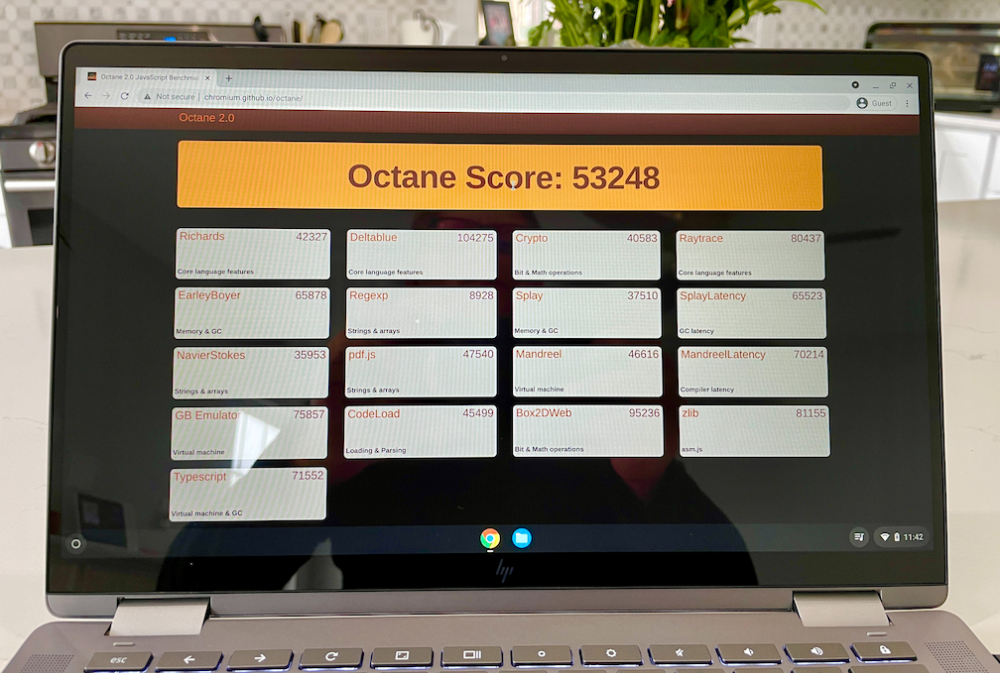
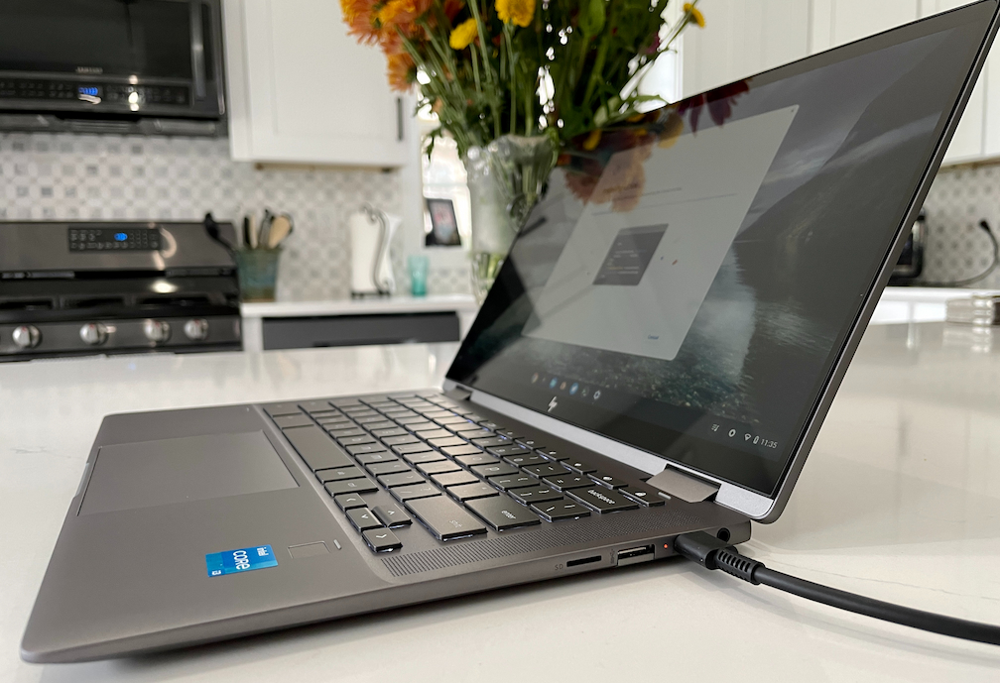
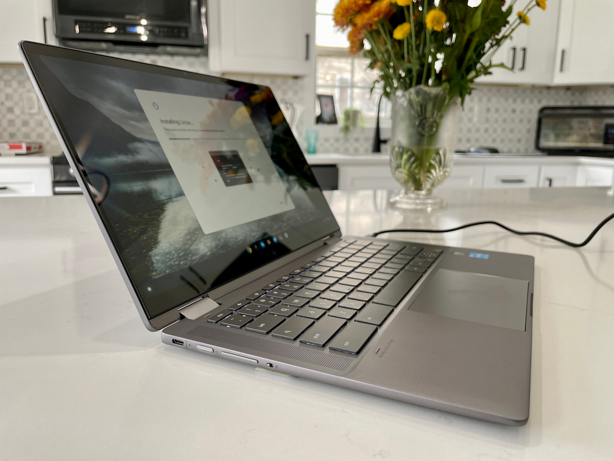
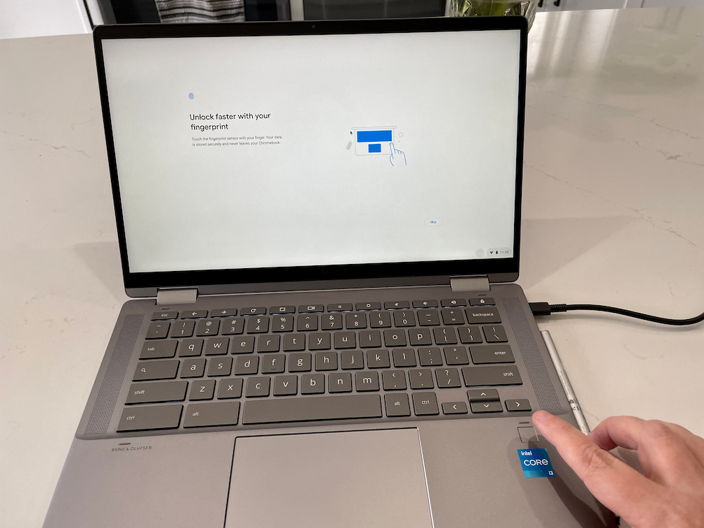

Although I [recently reviewed the HP Chromebook X2 11](https://www.aboutchromebooks.com/news/hp-chromebook-x2-11-review-a-good-value-when-on-sale/), I haven't used a mainstream HP Chromebook in a few years. I now have the 2021 HP Chromebook x360 14c on loan to change that. This model has the 11th-gen Intel Core i3 processor, 8 GB of memory, and 128 GB of fast NVME SSD storage, all of which retails for $699. I'm mostly impressed by what I've seen so far with this device.

I'm not yet sold on it at full price though: You can currently [buy this model directly from HP on sale for $479.99](https://www.hp.com/us-en/shop/pdp/hp-chromebook-x360-14c-cc0047nr), which might be the more appropriate price. And I know from [my review of the Lenovo Flex 5 Chromebook](https://www.aboutchromebooks.com/news/lenovo-flex-5i-chromebook-review/) that it offers an extremely similar configuration with a [slightly slower Intel Core i3 for $549.99 at full retail](https://www.costco.com/lenovo-flex-5-13.3%22-2-in-1-touchscreen-chromebook---11th-gen-intel-i3-1115g4---1080p.product.100744753.html). I've seen the Lenovo on sale for $439.99, so given the pricing and very similar hardware, I'll likely be comparing these two devices in my full review.

Here's a high-level overview of the basic specifications:

<table><tbody><tr><td>CPU</td><td>Quad-core (eight-threads) Intel Core i3-1125G4 CPU (up to 3.7 GHz boost)</td></tr><tr><td>GPU</td><td>Intel Integrated UHD Graphics</td></tr><tr><td>Display</td><td>14-inch IPS 1920 x 1080 display, glossy finish, 16:9 aspect ratio, 250 nits brightness, 45% NTSC color gamut</td></tr><tr><td>Memory</td><td>8 GB DDR4x-3200 MHz memory</td></tr><tr><td>Storage</td><td>128GB SSD M.2 PCIe 3.0x4 NVMe, microSD card slot for expansion</td></tr><tr><td>Connectivity</td><td>802.11ax (2x2) WiFi 6, Bluetooth 5</td></tr><tr><td>Battery</td><td>58 WHr battery, up to 10.75 hours of claimed run-time Quick charge support: 0 to 50% in 45 minutes</td></tr><tr><td>Software</td><td>Chrome OS automatic updates through June 2029</td></tr></tbody></table>

## Immediate performance from that 11th-gen Intel Core i3

Normally, I start my impressions with the overall build quality and outside of a device. Today, I'm mixing it up a little, mainly because this is a fast Chromebook. Just about everything happens immediately, even with a handful, or three, browser tabs open. I've already tinkered around in Linux and run a few Android apps too: The system is performing really well. If I didn't know any better, I would have guessed there's a Core i5 inside, but there's not.

I'll run standardized benchmarks in the full review, of course. For now, here's a quick Octane 2.0 test run in Guest Mode on the latest Chrome OS Stable Channel.

A score of over 53,000 means this is no slouch. And for comparison purposes, the similar Lenovo Flex 5i Chromebook earned an Octane score of 55,360 on the prior version of Chrome OS.

## A decent 14-inch display, if a little dim, in a small package

Ok, on to the hardware itself. The first thing I noticed was that HP crammed a 14-inch 1080p touch display in the chassis of a 13-inch Chromebook here. Small bezels help here, particularly on the bottom. The device supports a USI stylus as well, which HP included in my review package.

The 1920 x 1080 IPS display isn't as bright as I might like: It tops out at 250 nits of brightness. So this may not be the best choice for working outdoors if that matters to you. And the colors are just OK. Not bad, but not great. I may be spoiled by the [Lenovo Duet 5 Chromebook detachable I recently reviewed](https://www.aboutchromebooks.com/news/lenovo-duet-5-chromebook-review-a-better-laptop-than-tablet-but-great-for-the-money/) though. That shouldn't be surprising since that tablet uses an OLED panel with up to 400 nits of brightness. Still, the HP Chromebook x360 14c has what I'd call an above-average screen with good viewing angles.

Getting back to the size for a minute: This Chromebook measures 12.66 x 8.11 x 0.71 inches and weighs 3.35 pounds. The Lenovo Flex 5 Chromebook has a smaller, 13.3-inch display and measures 12.2 by 8.4 x 0.67 inches, and weighs just under 3 pounds. These two laptops are pretty equal in terms of footprint and thickness. Kudos to HP for designing a 14-inch Chromebook that's more the size of one with a smaller display.

## Overall build and design of the HP Chromebook x360 14c is top notch

HP has really upped its game over the last few years when it comes to build quality and design. I can't think of a single thing that I don't like about the physical hardware. It feels premium and seems thinner than it actually is. HP is using aluminum on the keyboard deck and frame here.

Port placement is good with one USB Type-C port on each side, along with a USB Type-A port on the right. Due to how the solid chassis is designed, that Type-A port actually has a small door for access, which I don't mind. You'll also find a microSD card slot and combo headphone/microphone jack on the right.

Aside from the USB Type-C on the left, that's where you find the power and volume buttons. There's also a physical switch to enable or disable the 720 wide view webcam. I disabled the webcam when using the Camera app and it works as advertised. When disabled a red light appears next to the webcam, but from what I can see, only when you're in an app that is trying to use the camera. I'd love to see that light appearing all the time when the switch is used to disable the camera.

The keyboard is backlit and has the fairly ubiquitous squared shapes that HP is using these days. I thought I wouldn't like the typing experience because of that. I was wrong; at least so far. I can fly on this keyboard, which has some fairly deep key travel and comfortable spacing.

Likewise, the trackpad has been excellent so far as well. I find it very responsive and quieter than most. But my favorite feature here is the small but accurate fingerprint sensor to the right of the trackpad. The setup was fast and the sensor has been spot on every time I've tried it so far.

I haven't done any extensive listening to the Bang & Olufsen speakers to the left and right of the keyboard just yet. However, the playback of one YouTube gaming trailer was louder than I expected. I'll try different audio sources in my full review for sound quality. I don't think volume will be an issue though.

Aside from the speakers, I'll have to test the battery life, of course. With a quad-core processor inside, this isn't going to last for 12 hours or more hours on a charge. HP said 10 hours and 45 minutes is to be expected and I'm thinking that means between 8 and 9 in typical use. I'll verify that and everything else, including the USI stylus experience in my full review of the HP Chromebook x360 14c.
